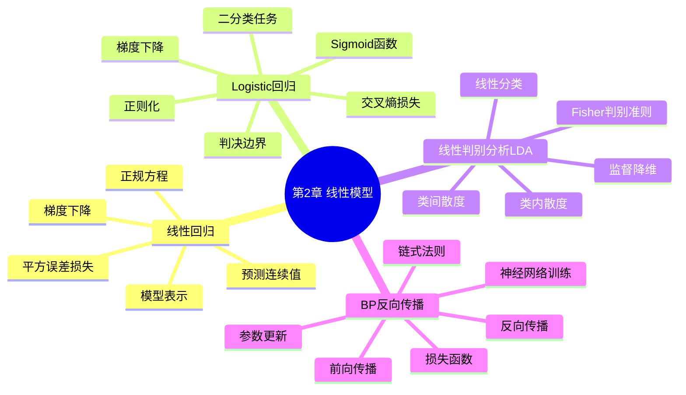

# 第2章 线性模型

## 学习目标
- 能够区分线性回归、Logistic 回归与 LDA 的任务目标和输出含义。
- 能够解释线性模型为何常作为高可解释性的机器学习基线模型。
- 能够根据损失函数与优化目标推导参数更新方向并分析收敛行为。
- 能够在 sklearn 中完成线性模型建模、评估与参数分析。

## 关键词
- 线性回归（Linear Regression）
- Logistic 回归（Logistic Regression）
- 线性判别分析（LDA, Linear Discriminant Analysis）
- 交叉熵损失（Cross-Entropy Loss）
- 梯度下降（Gradient Descent）
- 正则化（Regularization）
- 判决边界（Decision Boundary）
- 反向传播（Backpropagation, BP）

## 核心概念与原理
### 关键定义
- **线性模型**：预测函数可写为输入特征的线性组合。
- **回归 vs 分类**：回归输出连续值，分类输出类别或类别概率。
- **判别式方法 vs 生成式方法**：Logistic 回归偏判别式，LDA具有生成式建模思想。

### 方法直觉
- 线性模型先做“加权求和”，再通过任务相关函数映射到输出空间。
- 在特征工程合理时，线性模型训练稳定、解释清晰、部署成本低。

### 与相近方法的区别
- 与树模型相比：线性模型边界更平滑、可解释性更强，但非线性表达较弱。
- 与深层神经网络相比：线性模型参数更少，过拟合风险更可控，但容量有限。

## 关键公式与解释
- 线性回归：
\[
\hat{y}=w^Tx+b,\quad
J=\frac{1}{2m}\sum_{i=1}^{m}(\hat{y}^{(i)}-y^{(i)})^2
\]
- Logistic 回归：
\[
p(y=1|x)=\sigma(w^Tx+b)=\frac{1}{1+e^{-(w^Tx+b)}}
\]
\[
J=-\frac{1}{m}\sum_{i=1}^{m}\left[y^{(i)}\log p^{(i)}+(1-y^{(i)})\log(1-p^{(i)})\right]
\]
- 符号解释：\(w\) 为权重，\(b\) 为偏置，\(m\) 为样本数，\(\sigma\) 为 Sigmoid。
- 作用与前提：公式分别用于回归拟合与概率分类，前提是特征与目标关系可由线性判别近似描述。
- 常见误用点：把 Logistic 输出当离散类别而非概率；忽略特征缩放导致优化不稳定。

## 算法流程 / 方法步骤
1. **任务建模**：输入业务问题，输出回归或分类建模方案；目的为确定损失函数。
2. **特征处理**：输入原始特征，输出标准化/编码后特征；目的为提升优化稳定性。
3. **参数学习**：输入训练数据，输出权重参数；目的为最小化经验损失。
4. **阈值与决策**：输入概率输出，输出类别判定；目的为满足业务误差偏好。
5. **评估迭代**：输入验证结果，输出正则化与参数调整建议；目的为提升泛化。

## 实践示例（Python/sklearn）
```python
from sklearn.datasets import load_breast_cancer
from sklearn.model_selection import train_test_split
from sklearn.preprocessing import StandardScaler
from sklearn.linear_model import LogisticRegression
from sklearn.pipeline import Pipeline
from sklearn.metrics import roc_auc_score

X, y = load_breast_cancer(return_X_y=True)
X_train, X_test, y_train, y_test = train_test_split(
    X, y, test_size=0.2, random_state=42, stratify=y
)

model = Pipeline([
    ("scaler", StandardScaler()),
    ("clf", LogisticRegression(C=1.0, max_iter=1000))
])
model.fit(X_train, y_train)
proba = model.predict_proba(X_test)[:, 1]
print("roc_auc:", roc_auc_score(y_test, proba))
```
- 关键参数：`C` 越小正则越强；`max_iter` 影响收敛；标准化影响梯度尺度。
- 结果观察：除准确率外，建议看 ROC-AUC、混淆矩阵和分类报告。

## 常见易错点
- 错因：把 Logistic 回归视为“回归模型”。纠正建议：明确其主要用于分类概率建模。
- 错因：训练前不做特征缩放。纠正建议：对梯度法优化模型先标准化。
- 错因：只报告训练集指标。纠正建议：同时给出验证/测试集指标。
- 错因：把参数符号与样本索引混淆。纠正建议：统一符号约定并在推导前定义。

## 练习
1. **概念题**：线性回归与 Logistic 回归在输出空间上的本质区别是什么？  
   参考要点：前者输出连续实数；后者输出概率并可阈值化为类别。
2. **理解题**：为何 Logistic 回归常用交叉熵而非均方误差？  
   参考要点：概率建模更一致、优化性质更好、梯度信号更稳定。
3. **应用题**：如果类别极不平衡，阈值仍设为 0.5 可能出现什么问题？  
   参考要点：召回率偏低，需按业务成本调整阈值并看 PR/F1。
4. **综合题（代码参数）**：将示例中的 `C` 从 1.0 调到 0.01，模型边界和泛化可能怎样变化？  
   参考要点：正则增强，边界更平滑，过拟合风险降但可能欠拟合。

## 小结
- 线性模型是可解释、可控、可复现的核心基线方法。
- 损失函数与任务类型必须严格匹配。
- 特征缩放和正则化是线性模型实践成败关键。
- Logistic 回归、LDA 与 BP 之间存在连续的知识迁移链路。


## 0. 章节元信息

```yaml
chapter_id: "02_linear_models"
chapter_title: "第2章 线性模型"
course: "机器学习"
difficulty: "基础到中等"
prerequisites:
  - Python 基础
  - 向量与矩阵基础
  - 函数、导数与链式法则
  - 概率与分类任务基础
keywords:
  - 线性回归
  - Logistic回归
  - Sigmoid函数
  - 交叉熵损失
  - 梯度下降
  - 线性判别分析
  - LDA
  - BP反向传播
  - 链式法则
resource_types:
  - 个性化讲解文档
  - 思维导图
  - 练习题
  - Python代码案例
  - OpenMAIC课堂生成Prompt
  - PBL实践任务
```

---

## 1. 本章学习目标

学完本章后，学生应能够：

1. 理解线性模型的基本思想：用特征的线性组合表示输入到输出的映射关系。
2. 区分回归任务和分类任务：回归输出连续值，分类输出离散类别。
3. 掌握线性回归的模型表示、平方误差损失和梯度下降优化。
4. 掌握 Logistic 回归的分类思想、Sigmoid 函数、判决边界、交叉熵损失和参数更新。
5. 理解线性判别分析（LDA）的核心思想：投影后类内距离尽量小、类间距离尽量大。
6. 理解 BP 反向传播的基本流程：前向传播计算预测，反向传播利用链式法则计算梯度，再用优化算法更新参数。
7. 能够使用 Python / scikit-learn 实现线性回归、Logistic 回归、LDA 和简单 MLP 分类模型。

---

## 2. 本章知识结构



---

## 3. 2.1 线性回归

### 3.1 问题背景

线性回归用于预测连续型目标值。典型例子是根据房屋面积、卧室数量、楼层数、房龄等属性预测房价。

在线性回归中，训练数据通常表示为：

\[
D = \{(x^{(i)}, y^{(i)})\}_{i=1}^{m}
\]

其中：

- \(m\)：训练样本数量；
- \(x^{(i)}\)：第 \(i\) 个样本的输入特征；
- \(y^{(i)}\)：第 \(i\) 个样本的真实目标值；
- \(h_\theta(x)\) 或 \(f_w(x)\)：模型预测值。

### 3.2 一元线性回归

一元线性回归只使用一个输入特征：

\[
h_\theta(x) = \theta_0 + \theta_1 x
\]

其中：

- \(\theta_0\)：截距项；
- \(\theta_1\)：斜率，表示输入特征变化时预测值的变化趋势。

### 3.3 多元线性回归

多元线性回归使用多个输入特征：

\[
h_\theta(x) = \theta_0 + \theta_1x_1 + \theta_2x_2 + \cdots + \theta_nx_n
\]

向量形式：

\[
h_\theta(x) = \theta^T x
\]

其中通常令 \(x_0=1\)，把截距项合并进向量计算。

### 3.4 损失函数：平方误差损失

线性回归常用均方误差形式的代价函数：

\[
J(\theta)=\frac{1}{2m}\sum_{i=1}^{m}(h_\theta(x^{(i)})-y^{(i)})^2
\]

加入 \(\frac{1}{2}\) 是为了求导时抵消平方项产生的系数 2，方便推导。

直观理解：

- 预测值和真实值越接近，损失越小；
- 预测值和真实值偏差越大，损失越大；
- 训练目标就是找到一组参数 \(\theta\)，让整体损失尽可能小。

### 3.5 优化方法一：正规方程

线性回归的平方误差损失是关于参数的二次函数，在满足一定条件时可以通过解析解求得最优参数：

\[
\theta = (X^TX)^{-1}X^Ty
\]

优点：

- 不需要选择学习率；
- 不需要迭代；
- 对小规模数据简单直接。

缺点：

- 需要计算矩阵逆；
- 当特征数量很大时计算成本高；
- 如果 \(X^TX\) 不可逆，需要使用伪逆或正则化方法。

### 3.6 优化方法二：梯度下降

梯度下降的基本思想是：

> 梯度方向是函数增长最快的方向，负梯度方向是函数下降最快的方向。

参数更新公式：

\[
\theta_j := \theta_j - \alpha \frac{\partial J(\theta)}{\partial \theta_j}
\]

对于线性回归：

\[
\frac{\partial J(\theta)}{\partial \theta_j}
=
\frac{1}{m}\sum_{i=1}^{m}(h_\theta(x^{(i)})-y^{(i)})x_j^{(i)}
\]

所以更新公式为：

\[
\theta_j := \theta_j - \alpha \frac{1}{m}\sum_{i=1}^{m}(h_\theta(x^{(i)})-y^{(i)})x_j^{(i)}
\]

其中：

- \(\alpha\)：学习率；
- 学习率太小，收敛慢；
- 学习率太大，可能震荡甚至发散。

### 3.7 线性回归常见易错点

1. 把相关性误认为因果关系。
2. 忘记对特征进行标准化，导致梯度下降收敛慢。
3. 学习率设置过大，导致损失函数不下降。
4. 只看训练误差，不看测试集泛化能力。
5. 混淆模型参数、输入特征和训练样本编号。
6. 忽略异常值对线性回归的影响。

### 3.8 Python 实现：线性回归

```python
import numpy as np
from sklearn.linear_model import LinearRegression
from sklearn.model_selection import train_test_split
from sklearn.metrics import mean_squared_error, r2_score

# 示例数据：面积、卧室数、楼层数、房龄
X = np.array([
    [2104, 3, 2, 20],
    [1416, 2, 1, 15],
    [1534, 3, 2, 30],
    [852, 2, 1, 10],
    [1940, 4, 2, 8],
    [1200, 2, 1, 12],
])
y = np.array([460, 232, 315, 178, 400, 240])

X_train, X_test, y_train, y_test = train_test_split(
    X, y, test_size=0.3, random_state=42
)

model = LinearRegression()
model.fit(X_train, y_train)

pred = model.predict(X_test)

print("coef:", model.coef_)
print("intercept:", model.intercept_)
print("MSE:", mean_squared_error(y_test, pred))
print("R2:", r2_score(y_test, pred))
```

---

## 4. 2.2 Logistic 回归【重点】

### 4.1 Logistic 回归解决什么问题？

Logistic 回归虽然名字里有“回归”，但主要用于分类任务，尤其是二分类任务。

典型二分类任务包括：

- 垃圾邮件检测：Spam / Not Spam；
- 信用卡欺诈检测：Fraud / Not Fraud；
- 肿瘤判定：Malignant / Benign；
- 学生是否通过考试：Pass / Fail。

在线性回归中，输出是连续值；在分类任务中，输出是类别。Logistic 回归通过 Sigmoid 函数把线性输出转换为 \(0\) 到 \(1\) 之间的概率。

### 4.2 从线性分类器到 Logistic 回归

线性分类器的基本形式为：

\[
z = \theta^T x
\]

如果直接用 \(z\) 进行分类，可以设置阈值：

\[
\theta^Tx \geq 0 \Rightarrow y=1
\]

\[
\theta^Tx < 0 \Rightarrow y=0
\]

但这个线性输出 \(z\) 不是概率，取值范围是 \((-\infty, +\infty)\)。因此 Logistic 回归引入 Sigmoid 函数，将线性输出映射到 \(0\) 到 \(1\)：

\[
g(z)=\frac{1}{1+e^{-z}}
\]

Logistic 回归模型为：

\[
h_\theta(x)=g(\theta^Tx)=\frac{1}{1+e^{-\theta^Tx}}
\]

可以解释为：

\[
h_\theta(x)=P(y=1|x;\theta)
\]

即在输入 \(x\) 和参数 \(\theta\) 已知的条件下，样本属于正类的概率。

### 4.3 Sigmoid 函数的性质

Sigmoid 函数具有以下特点：

1. 输出范围在 \(0\) 到 \(1\) 之间，适合作为概率解释。
2. 当 \(z=0\) 时，\(g(z)=0.5\)。
3. 当 \(z\) 很大时，\(g(z)\) 接近 1。
4. 当 \(z\) 很小时，\(g(z)\) 接近 0。
5. 函数可导，方便进行梯度下降优化。

导数为：

\[
g'(z)=g(z)(1-g(z))
\]

这个导数在 Logistic 回归和 BP 反向传播中都非常常见。

### 4.4 判决函数与判决边界

Logistic 回归通常使用阈值 0.5 进行分类：

\[
h_\theta(x) \geq 0.5 \Rightarrow \hat{y}=1
\]

\[
h_\theta(x) < 0.5 \Rightarrow \hat{y}=0
\]

因为 Sigmoid 函数在 \(z=0\) 处取值为 0.5，所以有：

\[
h_\theta(x) \geq 0.5 \Leftrightarrow \theta^Tx \geq 0
\]

因此判决边界由以下方程决定：

\[
\theta^Tx = 0
\]

对于二维特征：

\[
\theta_0 + \theta_1x_1 + \theta_2x_2 = 0
\]

这是一条直线。若加入多项式特征，例如 \(x_1^2, x_2^2, x_1x_2\)，Logistic 回归也可以形成非线性判决边界。

### 4.5 为什么不能用线性回归的平方损失？

如果把 Logistic 回归的 Sigmoid 输出带入平方误差损失：

\[
J(\theta)=\frac{1}{2m}\sum_{i=1}^{m}(h_\theta(x^{(i)})-y^{(i)})^2
\]

由于 Sigmoid 函数的非线性，损失函数可能不是凸函数，优化时容易出现局部极小值，不利于稳定训练。

因此 Logistic 回归通常使用交叉熵损失，也叫对数损失。

### 4.6 Logistic 回归的单样本损失

当 \(y=1\) 时：

\[
Cost(h_\theta(x),y)=-\log(h_\theta(x))
\]

含义：如果真实类别是 1，但模型预测 \(h_\theta(x)\) 接近 0，则损失会非常大。

当 \(y=0\) 时：

\[
Cost(h_\theta(x),y)=-\log(1-h_\theta(x))
\]

含义：如果真实类别是 0，但模型预测 \(h_\theta(x)\) 接近 1，则损失会非常大。

这两个式子可以合并为：

\[
Cost(h_\theta(x),y)
=
-y\log(h_\theta(x))-(1-y)\log(1-h_\theta(x))
\]

### 4.7 Logistic 回归的整体代价函数

对所有训练样本求平均：

\[
J(\theta)
=
-\frac{1}{m}\sum_{i=1}^{m}
[
y^{(i)}\log(h_\theta(x^{(i)}))
+
(1-y^{(i)})\log(1-h_\theta(x^{(i)}))
]
\]

其中：

- \(y^{(i)}\in\{0,1\}\)；
- \(h_\theta(x^{(i)})\) 是模型预测为正类的概率；
- 训练目标是最小化 \(J(\theta)\)。

### 4.8 梯度下降优化

Logistic 回归的梯度下降更新形式与线性回归很相似：

\[
\theta_j :=
\theta_j
-
\alpha
\frac{1}{m}
\sum_{i=1}^{m}
(h_\theta(x^{(i)})-y^{(i)})x_j^{(i)}
\]

注意：

- 形式上与线性回归相似；
- 区别在于 \(h_\theta(x)\) 的定义不同；
- 线性回归中 \(h_\theta(x)=\theta^Tx\)；
- Logistic 回归中 \(h_\theta(x)=g(\theta^Tx)\)。

### 4.9 正则化

Logistic 回归常加入正则化项来防止过拟合。

L2 正则化形式：

\[
J(\theta)
=
-\frac{1}{m}\sum_{i=1}^{m}
[
y^{(i)}\log(h_\theta(x^{(i)}))
+
(1-y^{(i)})\log(1-h_\theta(x^{(i)}))
]
+
\frac{\lambda}{2m}\sum_{j=1}^{n}\theta_j^2
\]

其中通常不惩罚 \(\theta_0\)。

作用：

- 限制参数过大；
- 降低模型复杂度；
- 改善泛化能力。

### 4.10 Logistic 回归与线性回归对比

| 对比项 | 线性回归 | Logistic 回归 |
|---|---|---|
| 任务类型 | 回归 | 分类 |
| 输出含义 | 连续值 | 属于正类的概率 |
| 模型形式 | \(h_\theta(x)=\theta^Tx\) | \(h_\theta(x)=g(\theta^Tx)\) |
| 常用损失 | 平方误差 | 交叉熵 / 对数损失 |
| 判决边界 | 不强调分类边界 | \(\theta^Tx=0\) |
| 输出范围 | 任意实数 | \(0\) 到 \(1\) |
| 典型应用 | 房价预测 | 垃圾邮件分类、疾病预测 |

### 4.11 Logistic 回归常见易错点

1. 认为 Logistic 回归是回归任务。实际上它主要用于分类。
2. 把 \(h_\theta(x)\) 当作类别，而不是概率。
3. 混淆判决阈值 0.5 和判决边界 \(\theta^Tx=0\)。
4. 忘记交叉熵损失中 \(y=0\) 与 \(y=1\) 的不同惩罚方式。
5. 以为 Logistic 回归只能产生线性边界。加入多项式特征后也可以形成非线性边界。
6. 忽略特征缩放对梯度下降收敛速度的影响。
7. 忽略类别不平衡问题，导致准确率看似很高但召回率很低。

### 4.12 Python 实现：scikit-learn Logistic 回归

```python
from sklearn.datasets import load_breast_cancer
from sklearn.model_selection import train_test_split
from sklearn.preprocessing import StandardScaler
from sklearn.linear_model import LogisticRegression
from sklearn.metrics import accuracy_score, classification_report, confusion_matrix

X, y = load_breast_cancer(return_X_y=True)

X_train, X_test, y_train, y_test = train_test_split(
    X, y, test_size=0.2, random_state=42, stratify=y
)

scaler = StandardScaler()
X_train_scaled = scaler.fit_transform(X_train)
X_test_scaled = scaler.transform(X_test)

model = LogisticRegression(max_iter=1000)
model.fit(X_train_scaled, y_train)

pred = model.predict(X_test_scaled)
prob = model.predict_proba(X_test_scaled)

print("accuracy:", accuracy_score(y_test, pred))
print("confusion matrix:")
print(confusion_matrix(y_test, pred))
print("classification report:")
print(classification_report(y_test, pred))
print("first sample probability:", prob[0])
```

### 4.13 Python 实现：从零实现二分类 Logistic 回归

```python
import numpy as np

def sigmoid(z):
    return 1 / (1 + np.exp(-z))

def binary_cross_entropy(y, p, eps=1e-12):
    p = np.clip(p, eps, 1 - eps)
    return -np.mean(y * np.log(p) + (1 - y) * np.log(1 - p))

class LogisticRegressionScratch:
    def __init__(self, lr=0.1, epochs=1000):
        self.lr = lr
        self.epochs = epochs
        self.w = None
        self.b = 0.0

    def fit(self, X, y):
        n_samples, n_features = X.shape
        self.w = np.zeros(n_features)
        self.b = 0.0

        for epoch in range(self.epochs):
            z = X @ self.w + self.b
            p = sigmoid(z)

            loss = binary_cross_entropy(y, p)

            dw = (1 / n_samples) * (X.T @ (p - y))
            db = np.mean(p - y)

            self.w -= self.lr * dw
            self.b -= self.lr * db

            if epoch % 100 == 0:
                print(f"epoch={epoch}, loss={loss:.4f}")

    def predict_proba(self, X):
        return sigmoid(X @ self.w + self.b)

    def predict(self, X):
        return (self.predict_proba(X) >= 0.5).astype(int)
```

---

## 5. 2.3 线性判别分析 LDA

### 5.1 LDA 的基本思想

线性判别分析（Linear Discriminant Analysis, LDA）由 Fisher 提出，可用于线性分类和监督降维。

核心思想：

> 找到一个投影方向 \(w\)，把样本投影到该方向后，同类样本尽可能接近，不同类样本尽可能远。

换句话说：

- 类内距离越小越好；
- 类间距离越大越好。

### 5.2 二分类 LDA

给定两类样本 \(X_0\) 和 \(X_1\)，分别计算均值向量：

\[
\mu_0, \mu_1
\]

计算类内散度矩阵：

\[
S_w = \sum_{x\in X_0}(x-\mu_0)(x-\mu_0)^T
+
\sum_{x\in X_1}(x-\mu_1)(x-\mu_1)^T
\]

计算类间散度矩阵：

\[
S_b = (\mu_0-\mu_1)(\mu_0-\mu_1)^T
\]

优化目标：

\[
J(w)=\frac{w^T S_b w}{w^T S_w w}
\]

目标是最大化 \(J(w)\)。

### 5.3 最优投影方向

二分类情况下，LDA 的投影方向可以写作：

\[
w = S_w^{-1}(\mu_0-\mu_1)
\]

分类时，将样本投影到方向 \(w\) 上，再根据阈值判断类别。

### 5.4 LDA 与 Logistic 回归对比

| 对比项 | Logistic 回归 | LDA |
|---|---|---|
| 类型 | 判别模型 | 生成式思想较强 |
| 核心目标 | 直接学习分类概率或判决边界 | 寻找最能区分类别的投影方向 |
| 优化方式 | 最小化交叉熵损失 | 最大化类间散度 / 类内散度 |
| 输出 | 概率与类别 | 投影方向与类别 |
| 适合场景 | 通用二分类、多分类 | 类分布近似高斯、线性可分较明显 |
| 额外用途 | 分类 | 分类 + 降维 |

### 5.5 Python 实现：LDA

```python
from sklearn.datasets import load_iris
from sklearn.discriminant_analysis import LinearDiscriminantAnalysis
from sklearn.model_selection import train_test_split
from sklearn.metrics import accuracy_score

X, y = load_iris(return_X_y=True)

X_train, X_test, y_train, y_test = train_test_split(
    X, y, test_size=0.2, random_state=42, stratify=y
)

lda = LinearDiscriminantAnalysis(n_components=2)
lda.fit(X_train, y_train)

pred = lda.predict(X_test)
X_train_lda = lda.transform(X_train)

print("accuracy:", accuracy_score(y_test, pred))
print("transformed shape:", X_train_lda.shape)
```

---

## 6. 2.4 BP 反向传播【重点补充】

> 注：BP 反向传播通常属于神经网络章节，但它与本章的“损失函数 + 梯度下降 + 参数更新”逻辑一脉相承，因此适合作为第2章线性模型向神经网络过渡的扩展内容。

### 6.1 为什么需要 BP 反向传播？

在线性回归和 Logistic 回归中，模型结构较简单，参数梯度可以直接推导。

但在多层神经网络中，输出是多个函数复合后的结果：

\[
\hat{y}=f_L(f_{L-1}(\cdots f_2(f_1(x))))
\]

如果手动对每个参数求导，会非常复杂。BP 反向传播的作用是：

> 利用链式法则，从输出层向输入层逐层高效计算每个参数对损失函数的梯度。

### 6.2 神经网络的基本结构

一个简单前馈神经网络通常包括：

1. 输入层：接收特征 \(x\)；
2. 隐藏层：通过线性变换和激活函数提取特征；
3. 输出层：输出预测结果；
4. 损失函数：衡量预测结果和真实标签之间的差距。

对于第 \(l\) 层：

\[
z^{[l]}=W^{[l]}a^{[l-1]}+b^{[l]}
\]

\[
a^{[l]}=g(z^{[l]})
\]

其中：

- \(W^{[l]}\)：第 \(l\) 层权重；
- \(b^{[l]}\)：第 \(l\) 层偏置；
- \(z^{[l]}\)：线性输出；
- \(a^{[l]}\)：激活值；
- \(g\)：激活函数。

### 6.3 前向传播

前向传播就是从输入到输出逐层计算：

```text
输入 x
↓
线性变换 z1 = W1x + b1
↓
激活 a1 = g(z1)
↓
线性变换 z2 = W2a1 + b2
↓
输出 y_hat
↓
计算损失 Loss(y_hat, y)
```

前向传播的目标是得到模型预测值和损失值。

### 6.4 链式法则

BP 的数学基础是链式法则。

如果：

\[
L = f(g(h(x)))
\]

那么：

\[
\frac{dL}{dx}
=
\frac{dL}{df}
\cdot
\frac{df}{dg}
\cdot
\frac{dg}{dh}
\cdot
\frac{dh}{dx}
\]

在神经网络中，每一层都是一个函数，整个网络就是函数复合。反向传播本质上就是从后向前重复使用链式法则。

### 6.5 以二层神经网络为例

假设网络为：

\[
z^{[1]} = W^{[1]}x + b^{[1]}
\]

\[
a^{[1]} = g(z^{[1]})
\]

\[
z^{[2]} = W^{[2]}a^{[1]} + b^{[2]}
\]

\[
\hat{y} = \sigma(z^{[2]})
\]

使用二分类交叉熵损失：

\[
L = -[y\log(\hat{y})+(1-y)\log(1-\hat{y})]
\]

对于 Sigmoid 输出层和交叉熵损失，有一个常用简化结论：

\[
dz^{[2]} = \hat{y} - y
\]

输出层参数梯度：

\[
dW^{[2]} = dz^{[2]}(a^{[1]})^T
\]

\[
db^{[2]} = dz^{[2]}
\]

隐藏层误差信号：

\[
dz^{[1]} = (W^{[2]})^T dz^{[2]} \odot g'(z^{[1]})
\]

隐藏层参数梯度：

\[
dW^{[1]} = dz^{[1]}x^T
\]

\[
db^{[1]} = dz^{[1]}
\]

其中 \(\odot\) 表示逐元素相乘。

### 6.6 BP 反向传播流程

```text
1. 初始化参数 W, b
2. 前向传播，计算每一层 z 和 a
3. 计算损失函数 L
4. 从输出层开始计算误差项
5. 使用链式法则逐层向前传播梯度
6. 计算每一层参数 W, b 的梯度
7. 使用梯度下降或 Adam 更新参数
8. 重复迭代直到损失收敛或达到最大轮数
```

### 6.7 参数更新

使用梯度下降时：

\[
W^{[l]} := W^{[l]} - \alpha dW^{[l]}
\]

\[
b^{[l]} := b^{[l]} - \alpha db^{[l]}
\]

其中：

- \(\alpha\)：学习率；
- \(dW^{[l]}\)：损失对权重的梯度；
- \(db^{[l]}\)：损失对偏置的梯度。

### 6.8 BP 与 Logistic 回归的关系

Logistic 回归可以看作没有隐藏层的单层神经网络：

\[
\hat{y}=\sigma(w^Tx+b)
\]

二分类交叉熵损失下，输出层误差为：

\[
\hat{y}-y
\]

这和 Logistic 回归梯度中的 \(h_\theta(x)-y\) 是一致的。

因此可以这样理解：

> Logistic 回归是理解神经网络输出层和 BP 反向传播的基础。

### 6.9 BP 常见易错点

1. 认为 BP 是一种模型。实际上 BP 是训练神经网络时计算梯度的算法。
2. 混淆前向传播和反向传播：前向传播算预测，反向传播算梯度。
3. 忘记激活函数导数。
4. 矩阵维度不匹配。
5. 学习率过大导致训练发散。
6. Sigmoid 饱和区梯度很小，可能出现梯度消失。
7. 没有保存前向传播中的中间变量，导致反向传播无法计算梯度。
8. 把反向传播和梯度下降混为一谈：BP 负责算梯度，梯度下降负责用梯度更新参数。

### 6.10 Python 实现：简单 MLP 分类器

```python
from sklearn.datasets import load_breast_cancer
from sklearn.model_selection import train_test_split
from sklearn.preprocessing import StandardScaler
from sklearn.neural_network import MLPClassifier
from sklearn.metrics import accuracy_score, classification_report

X, y = load_breast_cancer(return_X_y=True)

X_train, X_test, y_train, y_test = train_test_split(
    X, y, test_size=0.2, random_state=42, stratify=y
)

scaler = StandardScaler()
X_train = scaler.fit_transform(X_train)
X_test = scaler.transform(X_test)

mlp = MLPClassifier(
    hidden_layer_sizes=(16, 8),
    activation="relu",
    solver="adam",
    max_iter=1000,
    random_state=42
)

mlp.fit(X_train, y_train)

pred = mlp.predict(X_test)

print("accuracy:", accuracy_score(y_test, pred))
print(classification_report(y_test, pred))
```

### 6.11 Python 实现：手写一个极简二层神经网络

```python
import numpy as np

def sigmoid(z):
    return 1 / (1 + np.exp(-z))

def sigmoid_derivative(a):
    return a * (1 - a)

def binary_cross_entropy(y, y_hat, eps=1e-12):
    y_hat = np.clip(y_hat, eps, 1 - eps)
    return -np.mean(y * np.log(y_hat) + (1 - y) * np.log(1 - y_hat))

class SimpleTwoLayerNN:
    def __init__(self, input_dim, hidden_dim=8, lr=0.1, epochs=1000):
        self.lr = lr
        self.epochs = epochs
        self.W1 = np.random.randn(input_dim, hidden_dim) * 0.01
        self.b1 = np.zeros((1, hidden_dim))
        self.W2 = np.random.randn(hidden_dim, 1) * 0.01
        self.b2 = np.zeros((1, 1))

    def fit(self, X, y):
        y = y.reshape(-1, 1)
        m = X.shape[0]

        for epoch in range(self.epochs):
            # forward
            Z1 = X @ self.W1 + self.b1
            A1 = sigmoid(Z1)
            Z2 = A1 @ self.W2 + self.b2
            A2 = sigmoid(Z2)

            loss = binary_cross_entropy(y, A2)

            # backward
            dZ2 = A2 - y
            dW2 = (A1.T @ dZ2) / m
            db2 = np.mean(dZ2, axis=0, keepdims=True)

            dA1 = dZ2 @ self.W2.T
            dZ1 = dA1 * sigmoid_derivative(A1)
            dW1 = (X.T @ dZ1) / m
            db1 = np.mean(dZ1, axis=0, keepdims=True)

            # update
            self.W2 -= self.lr * dW2
            self.b2 -= self.lr * db2
            self.W1 -= self.lr * dW1
            self.b1 -= self.lr * db1

            if epoch % 100 == 0:
                print(f"epoch={epoch}, loss={loss:.4f}")

    def predict_proba(self, X):
        A1 = sigmoid(X @ self.W1 + self.b1)
        A2 = sigmoid(A1 @ self.W2 + self.b2)
        return A2.ravel()

    def predict(self, X):
        return (self.predict_proba(X) >= 0.5).astype(int)
```

---

## 7. 本章对比总结

| 内容 | 任务类型 | 模型核心 | 损失/目标 | 优化方式 | 输出 |
|---|---|---|---|---|---|
| 线性回归 | 回归 | \(\theta^Tx\) | 平方误差 | 正规方程 / 梯度下降 | 连续值 |
| Logistic 回归 | 分类 | \(\sigma(\theta^Tx)\) | 交叉熵 | 梯度下降 / 拟牛顿等 | 概率 / 类别 |
| LDA | 分类 / 降维 | 投影方向 \(w\) | 类间大、类内小 | Fisher准则 | 类别 / 低维表示 |
| BP反向传播 | 神经网络训练 | 多层函数复合 | 由任务决定 | 链式法则求梯度 + 优化器 | 梯度 |

---

## 8. 面向不同画像的学习建议

### 8.1 数学基础较弱的学生

推荐路径：

```text
线性回归直观理解
→ 平方误差损失
→ 梯度下降方向
→ Logistic 回归概率解释
→ 交叉熵直观含义
→ BP 前向传播和反向传播流程
```

资源建议：

- 图文讲解；
- 生活化例子；
- 简单计算题；
- 少量公式推导；
- 可视化动画。

### 8.2 有 Python 基础但公式弱的学生

推荐路径：

```text
线性回归代码案例
→ Logistic 回归 sklearn 实现
→ 从零实现 Logistic 回归
→ BP 代码流程
→ MLPClassifier 实践
```

资源建议：

- 代码案例；
- 逐行注释；
- 参数变化实验；
- 训练损失曲线。

### 8.3 准备考试的学生

推荐路径：

```text
核心概念记忆
→ 模型公式
→ 损失函数
→ 梯度下降更新
→ 易错点
→ 选择题与简答题训练
```

资源建议：

- 公式卡片；
- 对比表格；
- 选择题；
- 简答题模板。

### 8.4 想做项目实践的学生

推荐路径：

```text
Logistic 回归分类项目
→ LDA 降维可视化
→ MLP 分类模型
→ 模型评估
→ 项目报告
```

资源建议：

- 真实数据集；
- scikit-learn 实战；
- 混淆矩阵；
- 分类报告；
- 参数调优。

---

## 9. 练习题库

### 9.1 选择题

**1. 线性回归主要用于什么任务？**

A. 聚类  
B. 回归预测  
C. 图像生成  
D. 强化学习  

答案：B

**2. Logistic 回归通常用于什么任务？**

A. 连续值预测  
B. 二分类或多分类  
C. 无监督聚类  
D. 文本生成  

答案：B

**3. Sigmoid 函数的输出范围是？**

A. \((-\infty,+\infty)\)  
B. \([0,+\infty)\)  
C. \((0,1)\)  
D. \([-1,1]\)  

答案：C

**4. Logistic 回归常用的损失函数是？**

A. 平方误差  
B. 交叉熵损失  
C. Hinge Loss  
D. KL散度作为唯一形式  

答案：B

**5. LDA 的核心目标是？**

A. 最大化类内距离，最小化类间距离  
B. 最小化类内距离，最大化类间距离  
C. 随机选择投影方向  
D. 只降低训练误差  

答案：B

**6. BP 反向传播的主要作用是？**

A. 直接生成数据  
B. 计算神经网络中各参数的梯度  
C. 替代损失函数  
D. 删除隐藏层  

答案：B

### 9.2 判断题

1. Logistic 回归输出的是样本属于正类的概率。  
答案：正确。

2. BP 反向传播本身是一种神经网络模型。  
答案：错误。BP 是计算梯度的算法。

3. 线性回归和 Logistic 回归的梯度更新形式完全一样，因此二者模型也完全一样。  
答案：错误。二者形式相似，但 \(h_\theta(x)\) 的定义不同，任务类型和损失函数也不同。

4. LDA 可以用于监督降维。  
答案：正确。

### 9.3 简答题

**1. 为什么 Logistic 回归要使用 Sigmoid 函数？**

参考答案：因为线性输出 \(\theta^Tx\) 的取值范围是任意实数，不适合作为概率解释。Sigmoid 函数可以把任意实数映射到 \(0\) 到 \(1\) 之间，使模型输出可以解释为属于正类的概率。

**2. 线性回归和 Logistic 回归的主要区别是什么？**

参考答案：线性回归用于连续值预测，模型输出是实数，常用平方误差损失；Logistic 回归用于分类任务，模型输出是概率，常用交叉熵损失，并通过阈值将概率转化为类别。

**3. BP 反向传播为什么需要链式法则？**

参考答案：神经网络是多层函数复合，损失函数对某一层参数的影响需要经过后续多层传递。链式法则可以把复杂复合函数的梯度拆解成逐层梯度相乘，从而高效计算各层参数的梯度。

### 9.4 计算题

**1. 给定 \(y=1\)，模型预测 \(h_\theta(x)=0.8\)，计算 Logistic 回归单样本损失。**

\[
Cost=-\log(0.8)
\]

约为：

\[
0.223
\]

**2. 给定 \(y=0\)，模型预测 \(h_\theta(x)=0.8\)，计算单样本损失。**

\[
Cost=-\log(1-0.8)=-\log(0.2)
\]

约为：

\[
1.609
\]

解释：真实类别为 0，但模型强烈预测为 1，因此惩罚较大。

### 9.5 编程题

**题目：使用 Logistic 回归完成乳腺癌二分类任务。**

要求：

1. 加载 `load_breast_cancer` 数据集；
2. 使用 `train_test_split` 划分训练集和测试集；
3. 使用 `StandardScaler` 标准化；
4. 使用 `LogisticRegression` 训练模型；
5. 输出准确率、混淆矩阵和分类报告。

参考代码见 4.12 节。

---

## 10. OpenMAIC 课堂生成 Prompt

```text
请基于以下内容生成一节面向机器学习初学者的互动课堂。

【课程】
机器学习

【章节】
第2章 线性模型

【学习主题】
Logistic 回归与 BP 反向传播

【学生画像】
学生有 Python 基础，但数学公式理解较弱；正在准备期末考试，希望通过图文讲解、代码案例和练习题掌握 Logistic 回归、交叉熵损失、梯度下降和 BP 反向传播。

【知识库范围】
1. 线性回归：模型表示、平方误差损失、梯度下降
2. Logistic 回归：Sigmoid 函数、判决边界、交叉熵损失、梯度下降
3. LDA：类内散度、类间散度、Fisher 判别准则
4. BP 反向传播：前向传播、链式法则、反向传播、参数更新

【生成要求】
1. 生成 6-8 页 slides；
2. 使用图示解释 Sigmoid 函数和判决边界；
3. 使用表格对比线性回归和 Logistic 回归；
4. 使用流程图解释 BP 反向传播；
5. 生成 5 道选择题、2 道计算题、1 道编程题；
6. 生成一个 Python Logistic 回归实战案例；
7. 生成一个简单 MLP 的 BP 反向传播代码演示；
8. 课堂难度控制在本科机器学习入门水平；
9. 避免扩展到与本章无关的复杂深度学习内容。
```

---

## 11. PBL 实践任务

### 任务名称

基于 Logistic 回归和 MLP 的二分类模型比较实验

### 任务背景

学生需要使用乳腺癌数据集完成一个二分类任务，比较 Logistic 回归和简单神经网络在同一数据集上的表现。

### 任务要求

1. 加载 `load_breast_cancer` 数据集；
2. 完成训练集 / 测试集划分；
3. 对特征进行标准化；
4. 使用 Logistic 回归训练分类模型；
5. 使用 MLPClassifier 训练简单神经网络；
6. 比较两个模型的准确率、召回率、F1 值；
7. 分析两个模型的优缺点；
8. 思考：为什么复杂模型不一定总是优于简单模型？

### 输出成果

- 实验代码；
- 模型评估结果；
- 混淆矩阵；
- 简短实验报告；
- 对 Logistic 回归和神经网络的对比分析。

---

## 12. 知识库检索关键词

```text
线性回归
Linear Regression
平方误差
均方误差
代价函数
梯度下降
正规方程
多元线性回归
Logistic回归
Sigmoid函数
二分类
判决边界
交叉熵损失
对数损失
正则化
线性判别分析
LDA
Fisher判别准则
类内散度
类间散度
BP反向传播
Backpropagation
链式法则
前向传播
神经网络
MLP
```

---

## 13. 参考来源说明

本知识库依据以下资料整理：

1. 课程 PPT：`2.1 线性回归.pdf`
2. 课程 PPT：`2.2 Logistic回归.pdf`
3. 课程 PPT：`2.3 线性判别分析.pdf`
4. scikit-learn 官方文档：LinearRegression
5. scikit-learn 官方文档：LogisticRegression
6. scikit-learn 官方文档：LinearDiscriminantAnalysis
7. scikit-learn 官方文档：Neural network models supervised / MLPClassifier
8. Stanford CS231n：Backpropagation 与链式法则相关资料
9. Deep Learning Book：Deep Feedforward Networks 与 Back-Propagation 相关内容
