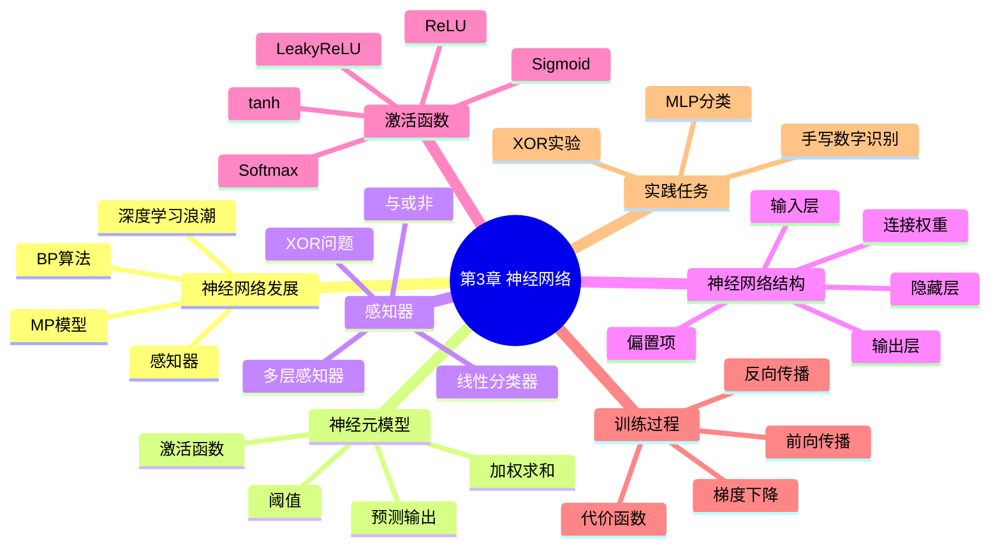

# 第3章 神经网络

## 学习目标
- 能够解释从感知器到多层感知器的发展动机及其对非线性问题的意义。
- 能够根据前向传播与反向传播公式说明神经网络如何学习参数。
- 能够比较 Sigmoid、tanh、ReLU、Softmax 的适用场景与局限。
- 能够使用 sklearn 或 NumPy 实现基础神经网络分类并分析训练现象。

## 关键词
- 感知器（Perceptron）
- 多层感知器（MLP, Multi-Layer Perceptron）
- 前向传播（Forward Propagation）
- 反向传播（Backpropagation, BP）
- 激活函数（Activation Function）
- 梯度消失（Vanishing Gradient）
- 交叉熵（Cross Entropy）
- XOR 非线性可分

## 核心概念与原理
### 关键定义
- **神经元**：线性变换与非线性激活的组合计算单元。
- **隐藏层**：输入与输出之间的中间表示层，用于学习非线性特征。
- **损失函数**：衡量预测与真实标签差异的目标函数。

### 方法直觉
- 多层结构相当于连续的特征变换器，把难分问题映射到更可分空间。
- BP 通过链式法则高效分配“误差责任”，实现端到端训练。

### 与相近方法的区别
- 与 Logistic 回归：神经网络可包含多个隐藏层和更强非线性表示。
- 与决策树：神经网络可处理连续高维复杂模式，但解释性较弱。

## 关键公式与解释
- 前向传播（第 \(l\) 层）：
\[
z^{[l]}=W^{[l]}a^{[l-1]}+b^{[l]},\quad a^{[l]}=g(z^{[l]})
\]
- 二分类输出层误差（Sigmoid + BCE）：
\[
\delta^{[L]}=\hat{y}-y
\]
- 参数更新：
\[
W^{[l]}\leftarrow W^{[l]}-\alpha\frac{\partial L}{\partial W^{[l]}}
\]
- 作用：完成从“预测误差”到“参数修正”的闭环。
- 使用前提：激活函数可导且前向中间量已缓存。
- 常见误用点：把 BP 当模型；忽略维度匹配和学习率稳定区间。

## 算法流程 / 方法步骤
1. **初始化参数**：输入网络结构，输出初始权重；目的为打破对称性。
2. **前向传播**：输入样本批次，输出预测值；目的为计算任务损失。
3. **反向传播**：输入损失和缓存，输出各层梯度；目的为定位误差来源。
4. **参数更新**：输入梯度和学习率，输出新参数；目的为降低损失。
5. **评估与早停**：输入验证集表现，输出训练终止决策；目的为防过拟合。

## 实践示例（Python/sklearn）
```python
from sklearn.datasets import load_digits
from sklearn.model_selection import train_test_split
from sklearn.preprocessing import StandardScaler
from sklearn.neural_network import MLPClassifier
from sklearn.pipeline import Pipeline
from sklearn.metrics import accuracy_score

X, y = load_digits(return_X_y=True)
X_train, X_test, y_train, y_test = train_test_split(
    X, y, test_size=0.2, random_state=42, stratify=y
)

model = Pipeline([
    ("scaler", StandardScaler()),
    ("mlp", MLPClassifier(hidden_layer_sizes=(64, 32), max_iter=500, random_state=42))
])
model.fit(X_train, y_train)
pred = model.predict(X_test)
print("accuracy:", accuracy_score(y_test, pred))
```
- 关键参数：`hidden_layer_sizes` 控制容量；`max_iter` 影响收敛；`random_state` 保证可复现。
- 结果观察：可查看 `loss_curve_` 判断是否欠拟合或过拟合。

## 常见易错点
- 错因：层数和神经元盲目加大。纠正建议：先建小模型基线并观察学习曲线。
- 错因：忽略输入标准化。纠正建议：在管线中固定标准化步骤。
- 错因：把训练损失下降等同泛化变好。纠正建议：同步监控验证集指标。
- 错因：Sigmoid 深层堆叠造成梯度消失。纠正建议：优先 ReLU 家族并配合合适初始化。

## 练习
1. **概念题**：为什么单层感知器无法解决 XOR？  
   参考要点：XOR 非线性可分，单线性边界无法分开样本。
2. **理解题**：为什么“无激活函数的多层线性网络”仍等价线性模型？  
   参考要点：多次线性变换可合并为一次线性变换。
3. **应用题**：若训练准确率高但验证准确率低，应优先改哪些策略？  
   参考要点：正则化、早停、减小模型、增强数据、调学习率。
4. **综合题（参数分析）**：将示例中 `hidden_layer_sizes` 从 `(64,32)` 改为 `(256,128)`，你预期训练与泛化会怎样变化？  
   参考要点：训练拟合能力增强，但过拟合风险和训练成本上升。

## 小结
- 神经网络核心在于“非线性表示 + BP 优化”。
- XOR 是理解多层网络必要性的经典教学例子。
- 激活函数与损失函数的匹配直接影响训练稳定性。
- 实践中应同时管理模型容量、优化过程与泛化误差。

> 建议文件路径：`knowledge_base/machine_learning/03_neural_networks.md`  
> 适用课程：机器学习导论 / 机器学习  
> 章节定位：承接第2章线性模型，从感知器、多层感知器、前向传播、代价函数和 BP 反向传播入手，理解神经网络如何通过多层非线性变换学习复杂函数。  
> 知识库用途：用于 ML-EduAgent 的课程检索、个性化讲解、题库生成、代码案例生成、OpenMAIC 互动课堂生成。

---

## 0. 章节元信息

```yaml
chapter_id: "03_neural_networks"
chapter_title: "第3章 神经网络"
course: "机器学习"
difficulty: "中等"
prerequisites:
  - 线性模型
  - Logistic回归
  - Sigmoid函数
  - 交叉熵损失
  - 梯度下降
  - 链式法则
keywords:
  - 神经网络
  - MP神经元
  - 感知器
  - 多层感知器
  - MLP
  - XOR问题
  - 激活函数
  - Sigmoid
  - tanh
  - ReLU
  - Softmax
  - 前向传播
  - 反向传播
  - BP算法
  - 交叉熵
  - 均方误差
  - 梯度下降
resource_types:
  - 个性化讲解文档
  - 思维导图
  - 公式推导
  - 代码案例
  - 练习题
  - OpenMAIC课堂生成Prompt
  - PBL实践任务
```

---

## 1. 本章学习目标

学完本章后，学生应能够：

1. 说明神经网络从 MP 神经元、感知器、多层感知器到深度学习的发展脉络。
2. 理解神经元的基本计算过程：输入加权求和、激活函数变换、输出预测结果。
3. 理解感知器为什么可以解决线性可分问题，以及为什么单层感知器无法解决 XOR 这类非线性可分问题。
4. 理解多层感知器如何通过隐藏层和非线性激活函数获得非线性表达能力。
5. 掌握神经网络的前向传播过程，包括输入层、隐藏层和输出层的计算。
6. 掌握常见激活函数的作用、特点和适用场景。
7. 理解神经网络代价函数，包括均方误差和交叉熵损失。
8. 理解 BP 反向传播算法的核心思想：利用链式法则从输出层向前逐层计算梯度。
9. 能够使用 NumPy 或 scikit-learn 实现一个简单的多层感知器分类器。

---

## 2. 本章知识结构



---

## 3. 神经网络的发展脉络

神经网络来源于对生物神经系统的抽象。生物神经元通过突触连接形成复杂网络，并对信息进行处理和传递。人工神经网络将这一思想简化为计算模型：每个神经元接收多个输入，经过连接权重加权求和，再通过激活函数得到输出。

神经网络的发展大致经历三个阶段：

### 3.1 第一阶段：MP 神经元与感知器

1943 年，McCulloch 和 Pitts 提出 MP 神经元模型。它将生物神经元抽象为一个简单的计算单元：输入信号经过加权求和后，与阈值比较，输出 0 或 1。

1958 年，Rosenblatt 提出感知器模型。相比 MP 神经元，感知器的关键改进是：权重可以通过训练数据和学习算法得到，而不是完全由人工设置。

### 3.2 第二阶段：BP 算法推动多层神经网络

单层感知器只能处理线性可分问题，无法解决 XOR 这类非线性可分问题。多层神经网络虽然具有更强表达能力，但早期缺少有效的隐藏层权重学习方法。

1980 年代，BP 反向传播算法被重新提出并广泛传播，使得多层神经网络可以通过链式法则计算隐藏层参数梯度，从而训练中间隐含层权重。

### 3.3 第三阶段：深度学习兴起

2012 年 AlexNet 在 ImageNet 图像识别任务中取得突破性成绩，标志着深度学习重新成为人工智能的重要方向。之后，深度神经网络在计算机视觉、自然语言处理、语音识别、推荐系统、生物信息学等领域取得广泛应用。

---

## 4. 神经元模型

### 4.1 MP 神经元

MP 神经元接收多个输入特征：

\[
x_1, x_2, \cdots, x_n
\]

每个输入对应一个连接权重：

\[
w_1, w_2, \cdots, w_n
\]

神经元首先计算加权和：

\[
z = w^Tx = \sum_{j=1}^{n} w_jx_j
\]

然后与阈值 \(\theta\) 比较：

\[
\hat{y}=I(w^Tx-\theta)
\]

其中 \(I(\cdot)\) 是阶跃函数：

\[
I(z)=
\begin{cases}
1, & z \geq 0 \\
0, & z < 0
\end{cases}
\]

MP 神经元的局限在于权重和阈值通常需要人为设置，不能自动从数据中学习。

### 4.2 感知器

感知器可以看作带有学习能力的神经元模型。它的基本形式为：

\[
z = w^Tx + b
\]

\[
\hat{y}=a(z)
\]

其中：

- \(w\)：连接权重；
- \(b\)：偏置项；
- \(a(\cdot)\)：激活函数。

若使用阶跃函数，感知器是一个线性分类器；若使用 Sigmoid 函数并结合交叉熵损失，感知器与 Logistic 回归非常接近。

---

## 5. 感知器与逻辑运算

### 5.1 逻辑与 AND

逻辑与任务：

| x1 | x2 | y |
|---|---|---|
| 0 | 0 | 0 |
| 0 | 1 | 0 |
| 1 | 0 | 0 |
| 1 | 1 | 1 |

可以用一个线性感知器完成：

\[
\hat{y}=I(x_1+x_2-1.5)
\]

当且仅当 \(x_1=1\) 且 \(x_2=1\) 时输出为 1。

### 5.2 逻辑或 OR

逻辑或任务：

| x1 | x2 | y |
|---|---|---|
| 0 | 0 | 0 |
| 0 | 1 | 1 |
| 1 | 0 | 1 |
| 1 | 1 | 1 |

可以用：

\[
\hat{y}=I(x_1+x_2-0.5)
\]

### 5.3 逻辑非 NOT

逻辑非任务：

| x | y |
|---|---|
| 0 | 1 |
| 1 | 0 |

可以通过一个一维感知器实现。

### 5.4 XOR 问题

XOR 异或任务：

| x1 | x2 | y |
|---|---|---|
| 0 | 0 | 0 |
| 0 | 1 | 1 |
| 1 | 0 | 1 |
| 1 | 1 | 0 |

XOR 是最典型的非线性可分问题。不存在一条直线能够把两类样本完全分开，因此单层感知器无法解决 XOR。

解决方法是使用多层感知器。XOR 可以分解为：

\[
x_1 \oplus x_2 = (\neg x_1 \land x_2) \lor (x_1 \land \neg x_2)
\]

这说明隐藏层可以学习中间特征，再由输出层组合中间结果。这个例子体现了多层神经网络的核心价值：

> 隐藏层可以把原始输入变换到新的特征空间，使原本非线性可分的问题变得更容易分类。

---

## 6. 神经网络结构

神经网络通常由三类层组成：

### 6.1 输入层

输入层接收原始特征：

\[
a^{[1]} = x
\]

输入层通常不进行复杂计算，只负责将数据传递到下一层。

### 6.2 隐藏层

隐藏层由多个神经元构成，每个神经元对上一层输出进行加权求和并经过激活函数：

\[
z^{[l]} = W^{[l]}a^{[l-1]} + b^{[l]}
\]

\[
a^{[l]} = g(z^{[l]})
\]

隐藏层是神经网络具备非线性表达能力的关键。没有非线性激活函数时，多层线性变换仍然等价于一个线性变换。

### 6.3 输出层

输出层根据任务类型决定形式：

- 二分类：通常使用 Sigmoid 输出一个概率；
- 多分类：通常使用 Softmax 输出多个类别概率；
- 回归：通常使用线性输出。

---

## 7. 常见激活函数

### 7.1 阶跃函数

\[
I(z)=
\begin{cases}
1, & z \geq 0 \\
0, & z < 0
\end{cases}
\]

优点：简单直观。  
缺点：不可导，不适合梯度下降训练多层网络。

### 7.2 Sigmoid 函数

\[
\sigma(z)=\frac{1}{1+e^{-z}}
\]

特点：

- 输出范围为 \(0\) 到 \(1\)；
- 可解释为概率；
- 导数形式简单：

\[
\sigma'(z)=\sigma(z)(1-\sigma(z))
\]

缺点：

- 当输入很大或很小时梯度接近 0；
- 容易出现梯度消失；
- 输出不以 0 为中心。

### 7.3 tanh 函数

\[
tanh(z)=\frac{e^z-e^{-z}}{e^z+e^{-z}}
\]

特点：

- 输出范围为 \((-1,1)\)；
- 相比 Sigmoid 输出以 0 为中心；
- 也可能出现梯度消失。

### 7.4 ReLU 函数

\[
ReLU(z)=max(0,z)
\]

特点：

- 计算简单；
- 在正区间梯度恒为 1；
- 能缓解梯度消失；
- 在深度学习中非常常用。

缺点：

- 当输入长期小于 0 时，神经元可能“死亡”，即输出恒为 0。

### 7.5 Leaky ReLU

\[
LeakyReLU(z)=
\begin{cases}
z, & z \geq 0 \\
\alpha z, & z < 0
\end{cases}
\]

通过给负区间保留一个较小斜率，缓解 ReLU 死亡问题。

### 7.6 Softmax 函数

多分类任务中，Softmax 将输出向量转化为概率分布：

\[
softmax(z_k)=\frac{e^{z_k}}{\sum_{i=1}^{K}e^{z_i}}
\]

所有类别概率之和为 1。

---

## 8. 前向传播

前向传播是神经网络从输入到输出的计算过程。

以三层网络为例：

```text
输入 x
↓
隐藏层线性变换 z2 = W1x + b1
↓
隐藏层激活 a2 = g(z2)
↓
输出层线性变换 z3 = W2a2 + b2
↓
输出层激活 a3 = output(z3)
↓
得到预测结果 y_hat
```

数学形式：

\[
a^{[1]}=x
\]

\[
z^{[2]}=W^{[1]}a^{[1]}+b^{[1]}
\]

\[
a^{[2]}=g(z^{[2]})
\]

\[
z^{[3]}=W^{[2]}a^{[2]}+b^{[2]}
\]

\[
a^{[3]}=g(z^{[3]})
\]

对于二分类，\(a^{[3]}\) 可表示预测为正类的概率。

---

## 9. 神经网络代价函数

### 9.1 均方误差 MSE

\[
L(W)=\frac{1}{2m}\sum_{i=1}^{m}\sum_{k=1}^{K}(y_k^{(i)}-\hat{y}_k^{(i)})^2
\]

适合回归任务，也可用于简单分类讲解。

### 9.2 二元交叉熵 BCE

二分类常用：

\[
L(W)=
-\frac{1}{m}\sum_{i=1}^{m}
[
y^{(i)}\log(\hat{y}^{(i)})
+
(1-y^{(i)})\log(1-\hat{y}^{(i)})
]
\]

BCE 与 Sigmoid 输出层结合时，输出层误差项可以简化为：

\[
\delta^{[L]} = \hat{y} - y
\]

### 9.3 多分类交叉熵

多分类通常使用 Softmax + 交叉熵：

\[
L(W)=
-\frac{1}{m}\sum_{i=1}^{m}\sum_{k=1}^{K}
y_k^{(i)}\log(\hat{y}_k^{(i)})
\]

其中 \(y_k\) 是 one-hot 标签。

---

## 10. BP 反向传播

### 10.1 BP 的作用

BP（Back Propagation）不是神经网络模型本身，而是一种高效计算梯度的方法。

它解决的问题是：

> 多层神经网络中，损失函数对每一层权重的梯度如何计算？

核心思想：

1. 前向传播计算预测值和损失；
2. 从输出层开始计算误差项；
3. 利用链式法则将误差逐层向前传播；
4. 计算每一层权重和偏置的梯度；
5. 使用梯度下降更新参数。

### 10.2 链式法则

如果：

\[
L=f(g(h(x)))
\]

则：

\[
\frac{dL}{dx}
=
\frac{dL}{df}
\cdot
\frac{df}{dg}
\cdot
\frac{dg}{dh}
\cdot
\frac{dh}{dx}
\]

神经网络是多层函数复合，因此 BP 的数学基础就是链式法则。

### 10.3 输出层误差

对于二分类 Sigmoid + BCE：

\[
\delta^{[3]} = a^{[3]} - y
\]

对于 MSE + Sigmoid：

\[
\delta^{[3]} = (a^{[3]} - y) \odot a^{[3]}(1-a^{[3]})
\]

这里 \(\odot\) 表示逐元素相乘。

### 10.4 隐藏层误差

隐藏层误差由后一层误差反向传播得到：

\[
\delta^{[2]} = (W^{[2]})^T\delta^{[3]} \odot g'(z^{[2]})
\]

直观理解：

> 隐藏层的责任由它对输出层错误的贡献决定。连接权重越大，对后续错误的影响越大，分回来的误差也越大。

### 10.5 梯度计算

输出层权重梯度：

\[
\frac{\partial L}{\partial W^{[2]}}=\delta^{[3]}(a^{[2]})^T
\]

隐藏层权重梯度：

\[
\frac{\partial L}{\partial W^{[1]}}=\delta^{[2]}(a^{[1]})^T
\]

偏置梯度：

\[
\frac{\partial L}{\partial b^{[l]}}=\delta^{[l]}
\]

批量训练时，对所有样本求平均。

### 10.6 参数更新

\[
W^{[l]} := W^{[l]} - \alpha \frac{\partial L}{\partial W^{[l]}}
\]

\[
b^{[l]} := b^{[l]} - \alpha \frac{\partial L}{\partial b^{[l]}}
\]

其中 \(\alpha\) 是学习率。

---

## 11. BP 算法流程

```text
输入：训练数据 X, y，学习率 α，最大迭代次数 T

1. 随机初始化 W 和 b
2. for epoch = 1 ... T:
3.     前向传播，计算每一层 z 和 a
4.     计算损失 L
5.     计算输出层误差 δ[L]
6.     由后向前计算各隐藏层误差 δ[l]
7.     计算各层参数梯度 dW[l], db[l]
8.     使用梯度下降更新参数
9. end

输出：训练后的 W 和 b
```

---

## 12. BP 与 Logistic 回归的关系

Logistic 回归可以看作没有隐藏层的单层神经网络：

\[
\hat{y}=\sigma(w^Tx+b)
\]

使用二元交叉熵损失时：

\[
\frac{\partial L}{\partial z} = \hat{y}-y
\]

这与神经网络输出层的误差项一致。因此：

> Logistic 回归是理解神经网络输出层和 BP 反向传播的基础。

---

## 13. NumPy 实现：XOR 多层感知器

```python
import numpy as np

def sigmoid(z):
    return 1 / (1 + np.exp(-z))

def sigmoid_grad(a):
    return a * (1 - a)

X = np.array([
    [0, 0],
    [0, 1],
    [1, 0],
    [1, 1]
], dtype=float)

y = np.array([[0], [1], [1], [0]], dtype=float)

np.random.seed(42)
W1 = np.random.randn(2, 4) * 0.5
b1 = np.zeros((1, 4))
W2 = np.random.randn(4, 1) * 0.5
b2 = np.zeros((1, 1))

lr = 0.5
epochs = 10000

for epoch in range(epochs):
    # forward
    Z1 = X @ W1 + b1
    A1 = sigmoid(Z1)
    Z2 = A1 @ W2 + b2
    A2 = sigmoid(Z2)

    # binary cross entropy
    eps = 1e-12
    loss = -np.mean(y * np.log(A2 + eps) + (1 - y) * np.log(1 - A2 + eps))

    # backward
    dZ2 = A2 - y
    dW2 = A1.T @ dZ2 / X.shape[0]
    db2 = np.mean(dZ2, axis=0, keepdims=True)

    dA1 = dZ2 @ W2.T
    dZ1 = dA1 * sigmoid_grad(A1)
    dW1 = X.T @ dZ1 / X.shape[0]
    db1 = np.mean(dZ1, axis=0, keepdims=True)

    # update
    W2 -= lr * dW2
    b2 -= lr * db2
    W1 -= lr * dW1
    b1 -= lr * db1

    if epoch % 2000 == 0:
        print(epoch, loss)

pred = (A2 >= 0.5).astype(int)
print("probability:")
print(A2.round(3))
print("prediction:")
print(pred)
```

---

## 14. scikit-learn 实现：MLPClassifier

```python
from sklearn.datasets import load_digits
from sklearn.model_selection import train_test_split
from sklearn.preprocessing import StandardScaler
from sklearn.neural_network import MLPClassifier
from sklearn.metrics import accuracy_score, classification_report

X, y = load_digits(return_X_y=True)

X_train, X_test, y_train, y_test = train_test_split(
    X, y, test_size=0.2, random_state=42, stratify=y
)

scaler = StandardScaler()
X_train = scaler.fit_transform(X_train)
X_test = scaler.transform(X_test)

clf = MLPClassifier(
    hidden_layer_sizes=(64, 32),
    activation="relu",
    solver="adam",
    alpha=1e-4,
    learning_rate_init=1e-3,
    max_iter=500,
    random_state=42
)

clf.fit(X_train, y_train)

pred = clf.predict(X_test)

print("accuracy:", accuracy_score(y_test, pred))
print(classification_report(y_test, pred))
```

---

## 15. 常见易错点

1. 认为神经网络层数越多一定越好。实际上层数越多，训练难度、过拟合风险和算力需求也越高。
2. 混淆前向传播和反向传播：前向传播计算输出，反向传播计算梯度。
3. 把 BP 当作模型。BP 是训练多层网络时的梯度计算算法，不是模型结构。
4. 忽略激活函数的必要性。如果没有非线性激活，多层线性网络仍然等价于单层线性模型。
5. Sigmoid 饱和区会导致梯度接近 0，引发梯度消失。
6. ReLU 可能出现死亡神经元。
7. 输入特征不标准化，导致训练慢或不稳定。
8. 学习率过大导致损失发散，学习率过小导致收敛过慢。
9. 忘记保存前向传播中的中间变量，导致反向传播无法计算梯度。
10. 矩阵维度写错，尤其是批量样本、权重矩阵和偏置项的形状。

---

## 16. 面向不同学生画像的学习建议

### 16.1 数学基础较弱

推荐路径：

```text
MP神经元直观理解
→ 感知器与逻辑运算
→ XOR为什么单层无法解决
→ 多层感知器结构
→ 前向传播流程
→ BP直观解释
```

资源形式：

- 图解；
- 类比；
- 少量公式；
- 简单数值例子。

### 16.2 有 Python 基础但公式弱

推荐路径：

```text
先跑 XOR 代码
→ 观察前向传播变量
→ 打印 loss 变化
→ 再理解反向传播公式
→ 最后写 MLPClassifier 实验
```

资源形式：

- 代码案例；
- 逐行注释；
- 参数调试实验；
- 训练曲线。

### 16.3 准备考试

推荐路径：

```text
神经元模型
→ 激活函数对比
→ 前向传播公式
→ 代价函数
→ BP算法伪代码
→ 易错点训练
```

资源形式：

- 公式卡片；
- 选择题；
- 简答题；
- 流程图。

### 16.4 想做项目实践

推荐路径：

```text
MLP手写数字分类
→ 模型评估
→ 调参实验
→ 与Logistic回归比较
→ 项目报告
```

资源形式：

- PBL项目；
- scikit-learn 实战；
- 混淆矩阵；
- 实验报告模板。

---

## 17. 练习题库

### 17.1 选择题

**1. MP 神经元的输出通常由什么决定？**

A. 随机数  
B. 输入加权和与阈值的比较  
C. 数据集大小  
D. 特征名称  

答案：B

**2. 单层感知器无法解决 XOR 问题的主要原因是？**

A. XOR 数据太少  
B. XOR 是非线性可分问题  
C. XOR 没有标签  
D. 感知器不能做分类  

答案：B

**3. 神经网络中激活函数的主要作用是？**

A. 增加非线性表达能力  
B. 删除输入特征  
C. 保证训练集准确率为 100%  
D. 替代损失函数  

答案：A

**4. BP 反向传播主要用于？**

A. 生成训练数据  
B. 计算神经网络参数梯度  
C. 决定数据集类别数  
D. 替代前向传播  

答案：B

**5. ReLU 函数的表达式是？**

A. \(1/(1+e^{-z})\)  
B. \(max(0,z)\)  
C. \(e^z/\sum e^z\)  
D. \(z^2\)  

答案：B

### 17.2 判断题

1. 如果没有非线性激活函数，多层线性网络仍然等价于一个线性模型。  
答案：正确。

2. BP 反向传播可以看作链式法则在神经网络中的应用。  
答案：正确。

3. 隐藏层神经元越多，模型一定越好。  
答案：错误。

4. Sigmoid 函数在输入极大或极小时容易出现梯度很小的问题。  
答案：正确。

### 17.3 简答题

**1. 为什么多层感知器可以解决 XOR 问题？**

参考答案：XOR 是非线性可分问题，单层感知器只能形成线性判决边界，无法将两类样本分开。多层感知器通过隐藏层学习中间特征，并使用非线性激活函数将输入映射到新的特征空间，使输出层能够完成分类。

**2. 前向传播和反向传播有什么区别？**

参考答案：前向传播从输入层开始逐层计算隐藏层和输出层结果，用于得到预测值和损失；反向传播从输出层开始，根据损失和链式法则逐层计算参数梯度，用于后续参数更新。

**3. 为什么神经网络需要激活函数？**

参考答案：激活函数引入非线性，使神经网络能够拟合复杂的非线性函数。如果没有激活函数，多层线性变换仍可合并成一个线性变换，表达能力有限。

### 17.4 编程题

**题目：使用 MLPClassifier 完成手写数字识别。**

要求：

1. 加载 `load_digits` 数据集；
2. 划分训练集和测试集；
3. 使用 StandardScaler 标准化；
4. 建立两层隐藏层的 MLP；
5. 输出准确率和分类报告；
6. 修改隐藏层神经元数量，观察模型效果变化。

---

## 18. OpenMAIC 课堂生成 Prompt

```text
请基于以下内容生成一节面向机器学习初学者的互动课堂。

【课程】
机器学习

【章节】
第3章 神经网络

【学习主题】
从感知器到 BP 反向传播

【学生画像】
学生有 Python 基础，但对数学推导和矩阵维度理解较弱；正在准备期末考试，希望通过图文讲解、动画流程、代码案例和练习题掌握神经网络的基本结构、前向传播和 BP 反向传播。

【知识库范围】
1. MP神经元与感知器
2. 逻辑与、或、非和 XOR 问题
3. 多层感知器 MLP
4. 输入层、隐藏层和输出层
5. Sigmoid、tanh、ReLU、Softmax 激活函数
6. 前向传播
7. 均方误差和交叉熵损失
8. BP反向传播与梯度下降
9. Python实现 XOR 和 MLPClassifier

【生成要求】
1. 生成 7-9 页 slides；
2. 用图示解释神经元的加权求和和激活函数；
3. 用 XOR 问题说明为什么需要多层网络；
4. 用流程图讲解前向传播；
5. 用动画式步骤讲解 BP 反向传播；
6. 生成 5 道选择题、2 道简答题、1 道编程题；
7. 生成一个 NumPy XOR 代码案例；
8. 生成一个 scikit-learn MLP 手写数字识别案例；
9. 难度控制在本科机器学习入门水平。
```

---

## 19. PBL 实践任务

### 任务名称

基于 MLP 的手写数字分类实验

### 任务背景

学生需要使用 scikit-learn 中的 `load_digits` 数据集，完成一个多分类任务，并观察隐藏层规模、激活函数和学习率对模型效果的影响。

### 任务要求

1. 加载手写数字数据集；
2. 划分训练集和测试集；
3. 对特征进行标准化；
4. 使用 Logistic 回归建立基线模型；
5. 使用 MLPClassifier 建立神经网络模型；
6. 对比两类模型的准确率；
7. 修改隐藏层结构，如 `(32,)`、`(64,32)`、`(128,64)`；
8. 分析隐藏层规模变化对训练效果和过拟合风险的影响；
9. 输出实验报告。

### 输出成果

- 实验代码；
- 准确率和分类报告；
- 不同隐藏层结构的对比表；
- 对模型效果的分析；
- 对神经网络优缺点的总结。

---

## 20. 知识库检索关键词

```text
神经网络
Neural Network
MP神经元
McCulloch Pitts
感知器
Perceptron
Rosenblatt
多层感知器
MLP
XOR
激活函数
Sigmoid
tanh
ReLU
LeakyReLU
Softmax
前向传播
Feedforward
反向传播
Backpropagation
BP算法
链式法则
交叉熵
均方误差
梯度下降
隐藏层
输出层
神经网络训练
```

---

## 21. 参考来源说明

本知识库依据以下资料整理：

1. 课程材料：`Chpt3. 神经网络.pdf`
2. Deep Learning Book：Chapter 6 Deep Feedforward Networks
3. Stanford CS231n：Backpropagation 与 Neural Networks 相关课程资料
4. scikit-learn 官方文档：Neural network models supervised / MLPClassifier
5. PyTorch 官方教程：Neural Networks 与 Build the Neural Network
