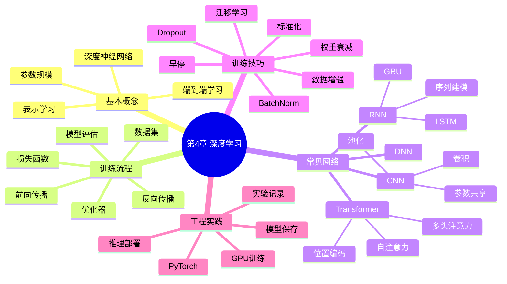

# 第4章 深度学习

## 学习目标
- 能够解释深度学习相对传统机器学习的核心增益与代价。
- 能够比较 DNN、CNN、RNN、Transformer 的建模对象和结构特点。
- 能够搭建并解释标准训练循环（前向、反向、优化、评估）。
- 能够识别过拟合、梯度问题和训练不稳定现象并提出改进方案。

## 关键词
- 深度学习（Deep Learning）
- 表示学习（Representation Learning）
- 卷积神经网络（CNN）
- 循环神经网络（RNN）
- Transformer / Self-Attention
- Batch Normalization（BN）
- Dropout
- 迁移学习（Transfer Learning）

## 核心概念与原理
### 关键定义
- **深度模型**：含多层可训练非线性变换的模型。
- **端到端学习**：直接从原始输入学习到任务输出。
- **预训练-微调**：先学通用表示，再适配具体任务。

### 方法直觉
- 深层网络通过层次表示把复杂模式逐层拆解并重组。
- 大模型性能依赖数据规模、算力与优化技巧协同。

### 与相近方法的区别
- 与浅层模型：深度学习特征自动学习能力强，但调参与计算开销更大。
- 与单一规则系统：深度模型适配复杂非结构化数据，但可解释性相对弱。

## 关键公式与解释
- 一般训练目标：
\[
\min_{\theta}\frac{1}{m}\sum_{i=1}^{m}\ell(f_{\theta}(x_i),y_i)
\]
- 梯度更新（以 SGD 为例）：
\[
\theta\leftarrow\theta-\eta\nabla_{\theta}\ell
\]
- 自注意力核心公式：
\[
Attention(Q,K,V)=softmax\left(\frac{QK^T}{\sqrt{d_k}}\right)V
\]
- 符号解释：\(\theta\) 为模型参数，\(\eta\) 为学习率，\(Q/K/V\) 分别为查询/键/值表示。
- 作用：统一描述深度模型优化和 Transformer 表示融合机制。
- 误用点：学习率过大导致发散；对 `CrossEntropyLoss` 重复手动 `softmax`。

## 算法流程 / 方法步骤
1. **数据与任务定义**：输入原始数据，输出可训练样本与标签；目的为保证数据质量。
2. **模型构建**：输入网络架构与损失函数，输出可训练模型；目的为匹配任务类型。
3. **训练循环**：输入 mini-batch，输出参数更新；目的为逐步最小化损失。
4. **验证监控**：输入验证集指标，输出早停或调参决策；目的为控制过拟合。
5. **部署与复现**：输入最佳检查点，输出可复现实验配置；目的为稳定上线与复盘。

## 实践示例（Python/sklearn）
```python
from sklearn.datasets import load_digits
from sklearn.model_selection import train_test_split
from sklearn.preprocessing import StandardScaler
from sklearn.neural_network import MLPClassifier
from sklearn.pipeline import Pipeline
from sklearn.metrics import f1_score

X, y = load_digits(return_X_y=True)
X_train, X_test, y_train, y_test = train_test_split(
    X, y, test_size=0.2, random_state=42, stratify=y
)

model = Pipeline([
    ("scaler", StandardScaler()),
    ("mlp", MLPClassifier(hidden_layer_sizes=(128, 64), alpha=1e-4, max_iter=400, random_state=42))
])
model.fit(X_train, y_train)
pred = model.predict(X_test)
print("macro_f1:", f1_score(y_test, pred, average="macro"))
```
- 关键参数：`alpha` 为 L2 正则，控制过拟合；`hidden_layer_sizes` 控制模型容量。
- 结果观察：建议同时看 `macro_f1` 与混淆矩阵，关注小类表现。

## 常见易错点
- 错因：把“更深”直接等同“更好”。纠正建议：用验证集和消融实验比较。
- 错因：忽略训练/验证模式切换。纠正建议：深度框架中明确 `train()` 与 `eval()`。
- 错因：只看最终准确率。纠正建议：记录损失曲线、学习率、收敛速度。
- 错因：小数据上盲目从零训练大模型。纠正建议：优先迁移学习和数据增强。

## 练习
1. **概念题**：为何深度学习在图像和文本任务中常优于手工特征方法？  
   参考要点：可自动学习多层表示，减少人工特征瓶颈。
2. **理解题**：BatchNorm 如何帮助训练稳定？  
   参考要点：缓解内部协变量偏移，使梯度传播更稳定并允许更大学习率。
3. **应用题**：若训练集与验证集都低分，应优先检查哪些因素？  
   参考要点：模型容量不足、特征表达弱、学习率不合适、数据预处理错误。
4. **综合题（参数分析）**：把 Dropout 从 0.1 提到 0.6，可能对训练误差和泛化误差产生什么影响？  
   参考要点：正则更强，训练误差上升；泛化可能先改善后恶化（欠拟合）。

## 小结
- 深度学习本质是大规模参数化表示学习。
- 结构选择应与数据类型匹配：图像-CNN，序列-RNN/Transformer。
- 优化稳定性依赖标准化、正则化和学习率策略。
- 工程上“可复现训练流程”与“模型精度”同样重要。

> 建议文件路径：`knowledge_base/machine_learning/04_deep_learning.md`  
> 适用课程：机器学习导论 / 机器学习 / 深度学习入门  
> 章节定位：在第3章神经网络基础上，进一步理解“深度”神经网络的基本思想、训练技巧、常见架构和工程实践。  
> 知识库用途：用于 ML-EduAgent 的课程检索、个性化讲解、题库生成、代码案例生成、OpenMAIC 互动课堂生成。  
> 说明：本章无课堂 PPT，依据公开课程与官方文档构建，内容重点服务本科机器学习课程中的“深度学习入门”教学。

---

## 0. 章节元信息

```yaml
chapter_id: "04_deep_learning"
chapter_title: "第4章 深度学习"
course: "机器学习"
difficulty: "中等到进阶"
prerequisites:
  - 神经网络
  - BP反向传播
  - 梯度下降
  - 线性代数
  - 概率统计
  - Python基础
keywords:
  - 深度学习
  - 表示学习
  - 深度神经网络
  - CNN
  - RNN
  - Transformer
  - 优化器
  - Adam
  - 正则化
  - Dropout
  - Batch Normalization
  - 迁移学习
  - PyTorch
  - 过拟合
  - 训练流程
resource_types:
  - 个性化讲解文档
  - 思维导图
  - 代码案例
  - 练习题
  - OpenMAIC课堂生成Prompt
  - PBL实践任务
```

---

## 1. 本章学习目标

学完本章后，学生应能够：

1. 说明深度学习和传统神经网络的关系。
2. 理解“深度”的含义：多层非线性变换和分层表示学习。
3. 理解为什么深度学习在图像、语音、文本等复杂数据上表现突出。
4. 掌握深度学习训练的基本流程：数据准备、模型构建、损失函数、优化器、训练循环、评估与保存。
5. 理解常见深度网络结构：DNN、CNN、RNN、Transformer。
6. 理解深度学习训练中的关键问题：过拟合、梯度消失、梯度爆炸、学习率选择、数据规模和算力需求。
7. 掌握常用训练技巧：标准化、正则化、Dropout、Batch Normalization、数据增强、迁移学习。
8. 能够使用 PyTorch 完成一个基础深度学习分类任务。

---

## 2. 本章知识结构



---

## 3. 深度学习是什么？

深度学习是机器学习的一个重要分支，它使用具有多层结构的神经网络，从数据中自动学习特征表示，并完成分类、回归、生成、检索、检测等任务。

与传统机器学习相比，深度学习的关键特点是：

1. **表示学习**：不完全依赖人工设计特征，而是让模型自动从数据中学习特征。
2. **多层非线性变换**：通过多层网络逐级提取由低级到高级的特征。
3. **端到端训练**：从输入到输出整体优化，而不是把特征提取和分类器完全拆开。
4. **依赖数据和算力**：通常需要更多数据、计算资源和训练技巧。
5. **适合复杂数据**：尤其适合图像、语音、文本、视频等高维非结构化数据。

---

## 4. 深度学习与神经网络的关系

神经网络是深度学习的基础。一般来说：

- 神经网络强调模型结构；
- 深度学习强调使用较深神经网络进行表示学习和复杂任务建模。

可以简单理解为：

```text
浅层神经网络：输入层 → 1个隐藏层 → 输出层
深度神经网络：输入层 → 多个隐藏层 → 输出层
```

深度学习的“深度”不是单纯指层数多，而是指模型可以通过多层抽象学习复杂表示。

例如图像分类：

```text
原始像素
→ 边缘、角点
→ 局部纹理
→ 物体部件
→ 整体语义类别
```

文本理解：

```text
字词
→ 短语
→ 句法结构
→ 语义关系
→ 任务输出
```

---

## 5. 深度学习为什么有效？

### 5.1 表示学习

传统机器学习常需要人工设计特征，例如图像中的边缘、纹理、颜色直方图等。深度学习可以通过训练自动学习特征。

低层网络通常学习简单模式，高层网络学习复杂抽象。

### 5.2 层次化特征

多层网络可以把复杂函数拆分成多个较简单的函数组合：

\[
f(x)=f_L(f_{L-1}(...f_2(f_1(x))))
\]

每一层都对上一层表示进行转换。

### 5.3 端到端优化

深度学习可以把特征提取、表示变换和预测输出放到同一个模型中，通过一个损失函数统一优化。

### 5.4 大数据和硬件支持

深度学习的发展与以下条件密切相关：

- 大规模数据集；
- GPU/TPU 等并行计算硬件；
- 更成熟的优化算法；
- 更好的深度学习框架；
- 开源社区和预训练模型生态。

---

## 6. 深度学习训练基本流程

### 6.1 数据准备

深度学习通常将数据划分为：

- 训练集：用于更新模型参数；
- 验证集：用于调参和选择模型；
- 测试集：用于最终评估模型泛化能力。

常见数据处理：

- 缺失值处理；
- 数据清洗；
- 特征标准化；
- 图像 resize / normalize；
- 文本 tokenization；
- 数据增强。

### 6.2 模型定义

模型由多个层组成，例如：

```text
Linear → ReLU → Linear → ReLU → Linear
```

或：

```text
Conv2d → ReLU → MaxPool → Conv2d → ReLU → Linear
```

### 6.3 损失函数

损失函数衡量预测值和真实标签之间的差距。

常见损失函数：

| 任务 | 常用损失函数 |
|---|---|
| 回归 | MSELoss / MAELoss |
| 二分类 | Binary Cross Entropy |
| 多分类 | Cross Entropy |
| 分割 | Cross Entropy / Dice Loss |
| 生成任务 | 重构损失 / 对抗损失 / 扩散模型噪声预测损失 |

### 6.4 优化器

优化器使用梯度更新参数。

常见优化器：

- SGD；
- SGD + Momentum；
- RMSProp；
- Adam；
- AdamW。

Adam 在深度学习中非常常用，它结合了动量和自适应学习率思想，通常具有较好的默认表现。

### 6.5 训练循环

基本训练流程：

```text
for epoch in range(num_epochs):
    for batch_x, batch_y in dataloader:
        pred = model(batch_x)
        loss = criterion(pred, batch_y)
        optimizer.zero_grad()
        loss.backward()
        optimizer.step()
```

对应关系：

- `pred = model(batch_x)`：前向传播；
- `loss = criterion(pred, batch_y)`：计算损失；
- `loss.backward()`：反向传播计算梯度；
- `optimizer.step()`：更新参数；
- `optimizer.zero_grad()`：清空旧梯度。

### 6.6 评估与保存

训练后需要在验证集或测试集上评估：

- Accuracy；
- Precision；
- Recall；
- F1-score；
- Confusion Matrix；
- Loss 曲线；
- ROC-AUC。

训练完成后可以保存模型参数：

```python
torch.save(model.state_dict(), "model.pt")
```

---

## 7. 深度前馈网络 DNN

深度前馈网络是最基本的深度神经网络，信息从输入层单向传递到输出层，没有循环连接。

常见结构：

\[
x \rightarrow Linear \rightarrow ReLU \rightarrow Linear \rightarrow ReLU \rightarrow Output
\]

适用场景：

- 表格数据分类；
- 简单图像向量分类；
- 基线模型；
- 作为复杂模型中的子模块。

局限：

- 对图像空间结构利用不足；
- 对序列时间依赖建模较弱；
- 参数数量可能较多。

---

## 8. 卷积神经网络 CNN

### 8.1 CNN 适合什么任务？

CNN 主要用于处理网格结构数据，如：

- 图像；
- 视频帧；
- 医学影像；
- 遥感图像；
- 部分时序信号。

### 8.2 卷积操作

卷积层通过卷积核在输入上滑动，提取局部特征。

核心思想：

- 局部连接；
- 参数共享；
- 平移等变性；
- 层次化特征提取。

### 8.3 卷积层参数

常见参数：

- kernel_size：卷积核大小；
- stride：步幅；
- padding：填充；
- channels：通道数。

### 8.4 池化层

池化用于降低特征图尺寸，减少计算量并增强一定程度的平移鲁棒性。

常见池化：

- Max Pooling；
- Average Pooling。

### 8.5 CNN 基本结构

```text
输入图像
→ 卷积层
→ ReLU
→ 池化层
→ 卷积层
→ ReLU
→ 池化层
→ 展平
→ 全连接层
→ 输出类别
```

### 8.6 经典 CNN

| 模型 | 特点 |
|---|---|
| LeNet | 早期手写数字识别 CNN |
| AlexNet | 2012 年 ImageNet 突破，推动深度学习浪潮 |
| VGG | 使用多个小卷积核堆叠 |
| ResNet | 引入残差连接，缓解深层网络退化问题 |
| EfficientNet | 复合缩放网络深度、宽度和分辨率 |

---

## 9. 循环神经网络 RNN

### 9.1 RNN 适合什么任务？

RNN 用于处理序列数据：

- 文本序列；
- 语音信号；
- 时间序列；
- 传感器数据。

### 9.2 RNN 基本思想

RNN 在每个时间步接收当前输入和上一时刻隐藏状态：

\[
h_t = f(W_xx_t + W_hh_{t-1}+b)
\]

输出可以表示为：

\[
y_t = g(W_yh_t)
\]

隐藏状态 \(h_t\) 相当于模型对历史信息的记忆。

### 9.3 RNN 的问题

普通 RNN 在长序列中容易出现：

- 梯度消失；
- 梯度爆炸；
- 长期依赖捕捉困难。

### 9.4 LSTM 和 GRU

LSTM 和 GRU 通过门控机制缓解长期依赖问题。

LSTM 常见门结构：

- 输入门；
- 遗忘门；
- 输出门；
- 记忆单元。

GRU 结构相对简洁，常见门结构：

- 更新门；
- 重置门。

---

## 10. Transformer

### 10.1 Transformer 为什么重要？

Transformer 是现代深度学习中非常重要的架构，尤其在自然语言处理、大模型、多模态模型中应用广泛。

它的关键思想是：

> 使用自注意力机制建模序列中不同位置之间的关系，避免传统 RNN 逐步处理序列的限制，提高并行计算效率。

### 10.2 自注意力 Self-Attention

自注意力机制使序列中的每个位置都可以关注其他位置。

对于输入表示 \(X\)，线性变换得到：

\[
Q = XW_Q
\]

\[
K = XW_K
\]

\[
V = XW_V
\]

注意力计算：

\[
Attention(Q,K,V)=softmax(\frac{QK^T}{\sqrt{d_k}})V
\]

其中：

- \(Q\)：Query，查询；
- \(K\)：Key，键；
- \(V\)：Value，值；
- \(d_k\)：Key 向量维度，用于缩放稳定训练。

### 10.3 多头注意力

多头注意力将注意力机制并行执行多次，每个头学习不同关系，再将结果拼接。

作用：

- 从不同子空间捕捉信息；
- 学习多种语义关系；
- 提升模型表达能力。

### 10.4 位置编码

由于 Transformer 本身没有循环结构或卷积结构，需要加入位置编码来表示序列顺序。

### 10.5 Transformer 的影响

Transformer 是许多现代模型的重要基础，例如：

- BERT；
- GPT 系列；
- Vision Transformer；
- 多模态模型；
- 大语言模型。

---

## 11. 深度学习训练问题

### 11.1 过拟合

过拟合指模型在训练集表现很好，但在验证集或测试集表现较差。

原因：

- 模型过于复杂；
- 数据太少；
- 训练时间太长；
- 噪声被模型记住。

解决方法：

- 增加数据；
- 数据增强；
- 正则化；
- Dropout；
- 早停；
- 简化模型；
- 使用预训练模型。

### 11.2 欠拟合

欠拟合指模型在训练集和测试集上表现都不好。

原因：

- 模型过于简单；
- 特征不足；
- 训练不足；
- 学习率不合适。

解决方法：

- 增加模型复杂度；
- 训练更久；
- 改进特征；
- 调整学习率；
- 使用更合适的网络结构。

### 11.3 梯度消失

梯度在反向传播过程中逐层变小，导致前面层参数难以更新。

常见原因：

- Sigmoid / tanh 饱和；
- 网络太深；
- 初始化不合适。

缓解方法：

- ReLU；
- Batch Normalization；
- 残差连接；
- 合理初始化；
- LSTM / GRU。

### 11.4 梯度爆炸

梯度在反向传播过程中变得过大，导致训练不稳定。

缓解方法：

- 梯度裁剪；
- 更小学习率；
- 正则化；
- 合理初始化；
- Batch Normalization。

---

## 12. 常用训练技巧

### 12.1 特征标准化

输入标准化可以提升训练稳定性：

\[
x'=\frac{x-\mu}{\sigma}
\]

### 12.2 权重初始化

合适的初始化可以避免梯度过大或过小。

常见方法：

- Xavier / Glorot 初始化；
- He 初始化；
- 小随机数初始化。

### 12.3 Dropout

Dropout 在训练时随机丢弃部分神经元，减少神经元之间的复杂共适应关系。

作用：

- 缓解过拟合；
- 增强模型鲁棒性。

### 12.4 Batch Normalization

BatchNorm 对中间层激活进行标准化，帮助训练更深网络。

作用：

- 稳定训练；
- 加速收敛；
- 对学习率不那么敏感；
- 有一定正则化效果。

### 12.5 数据增强

数据增强通过对训练样本进行变换增加数据多样性。

图像任务常见增强：

- 随机裁剪；
- 翻转；
- 旋转；
- 颜色抖动；
- 随机擦除。

文本任务常见增强：

- 同义词替换；
- 回译；
- 随机删除；
- 数据合成。

### 12.6 早停 Early Stopping

当验证集性能长期不提升时停止训练，避免过拟合。

### 12.7 学习率调度

学习率会显著影响训练效果。

常见策略：

- StepLR；
- CosineAnnealing；
- Warmup；
- ReduceLROnPlateau。

---

## 13. 迁移学习

迁移学习是指使用在大规模数据集上预训练好的模型，再针对具体任务进行微调。

常见流程：

```text
加载预训练模型
→ 替换最后分类层
→ 冻结部分特征提取层
→ 训练新分类层
→ 必要时微调整个网络
```

优点：

- 减少训练数据需求；
- 加快收敛；
- 提升小数据集任务效果；
- 降低从零训练成本。

典型场景：

- 使用 ImageNet 预训练 CNN 做图像分类；
- 使用 BERT / GPT 类预训练模型做文本任务；
- 使用 CLIP 类模型做图文检索。

---

## 14. PyTorch 基础训练示例

### 14.1 定义 MLP 模型

```python
import torch
from torch import nn

class MLP(nn.Module):
    def __init__(self, input_dim=784, hidden_dim=128, num_classes=10):
        super().__init__()
        self.net = nn.Sequential(
            nn.Linear(input_dim, hidden_dim),
            nn.ReLU(),
            nn.Linear(hidden_dim, hidden_dim),
            nn.ReLU(),
            nn.Linear(hidden_dim, num_classes)
        )

    def forward(self, x):
        return self.net(x)
```

### 14.2 训练循环模板

```python
import torch
from torch import nn
from torch.utils.data import DataLoader, TensorDataset

X = torch.randn(500, 20)
y = torch.randint(0, 3, (500,))

dataset = TensorDataset(X, y)
loader = DataLoader(dataset, batch_size=32, shuffle=True)

model = MLP(input_dim=20, hidden_dim=64, num_classes=3)

criterion = nn.CrossEntropyLoss()
optimizer = torch.optim.Adam(model.parameters(), lr=1e-3)

for epoch in range(10):
    model.train()
    total_loss = 0.0

    for batch_x, batch_y in loader:
        logits = model(batch_x)
        loss = criterion(logits, batch_y)

        optimizer.zero_grad()
        loss.backward()
        optimizer.step()

        total_loss += loss.item()

    print(f"epoch={epoch}, loss={total_loss / len(loader):.4f}")
```

---

## 15. PyTorch CNN 示例

```python
import torch
from torch import nn

class SimpleCNN(nn.Module):
    def __init__(self, num_classes=10):
        super().__init__()
        self.features = nn.Sequential(
            nn.Conv2d(1, 16, kernel_size=3, padding=1),
            nn.ReLU(),
            nn.MaxPool2d(2),

            nn.Conv2d(16, 32, kernel_size=3, padding=1),
            nn.ReLU(),
            nn.MaxPool2d(2)
        )

        self.classifier = nn.Sequential(
            nn.Flatten(),
            nn.Linear(32 * 7 * 7, 128),
            nn.ReLU(),
            nn.Dropout(0.3),
            nn.Linear(128, num_classes)
        )

    def forward(self, x):
        x = self.features(x)
        return self.classifier(x)
```

---

## 16. 深度学习与传统机器学习对比

| 对比项 | 传统机器学习 | 深度学习 |
|---|---|---|
| 特征工程 | 依赖人工设计 | 自动学习特征 |
| 数据需求 | 中小规模也可 | 通常需要较多数据 |
| 算力需求 | 较低 | 较高 |
| 可解释性 | 通常较强 | 通常较弱 |
| 适合数据 | 表格数据、小规模任务 | 图像、语音、文本、视频 |
| 训练难度 | 相对较低 | 参数多，调参复杂 |
| 代表模型 | 线性模型、SVM、决策树、随机森林 | CNN、RNN、Transformer、深度MLP |

---

## 17. 深度学习常见易错点

1. 认为深度学习一定比传统机器学习好。小数据和表格任务中，传统模型可能更稳。
2. 只关注训练集准确率，不关注验证集和测试集。
3. 忽略数据质量。深度学习无法自动修复严重错误标签和偏差数据。
4. 学习率设置不合理，导致训练不收敛或发散。
5. 不做标准化，导致训练困难。
6. 不区分 `model.train()` 和 `model.eval()`。
7. 忘记清空梯度 `optimizer.zero_grad()`。
8. 把 Softmax 和 CrossEntropyLoss 重复使用，导致训练异常。在 PyTorch 中，`nn.CrossEntropyLoss` 通常接收未归一化的 logits。
9. 数据泄漏：测试集信息进入训练过程。
10. 没有固定随机种子，实验结果难以复现。
11. 盲目堆叠层数，忽略过拟合和计算成本。
12. 不保存模型和实验配置，难以复现实验。

---

## 18. 面向不同学生画像的学习建议

### 18.1 数学基础较弱

推荐路径：

```text
神经网络回顾
→ 什么是深度
→ 训练循环
→ 过拟合与欠拟合
→ CNN直观理解
→ Transformer直观理解
```

资源形式：

- 图解；
- 流程图；
- 类比；
- 少量公式。

### 18.2 有 Python 基础但深度学习经验少

推荐路径：

```text
PyTorch Tensor
→ nn.Module
→ DataLoader
→ Loss
→ Optimizer
→ 训练循环
→ CNN案例
```

资源形式：

- 代码模板；
- 逐行解释；
- 实验任务；
- Debug 清单。

### 18.3 准备考试

推荐路径：

```text
深度学习概念
→ CNN/RNN/Transformer对比
→ 过拟合与正则化
→ 梯度问题
→ 训练流程
→ 简答题训练
```

资源形式：

- 对比表格；
- 公式卡片；
- 选择题；
- 简答题。

### 18.4 想做项目实践

推荐路径：

```text
图像分类项目
→ CNN训练
→ 迁移学习
→ 模型评估
→ 错误样本分析
→ 项目报告
```

资源形式：

- PBL项目；
- PyTorch 代码；
- 模型训练曲线；
- 实验报告模板。

---

## 19. 练习题库

### 19.1 选择题

**1. 深度学习中的“深度”主要指什么？**

A. 数据量很大  
B. 网络包含多层非线性变换  
C. 模型只能用于图像  
D. 只能在 GPU 上运行  

答案：B

**2. CNN 最核心的结构特点不包括？**

A. 局部连接  
B. 参数共享  
C. 卷积操作  
D. 只适合文本生成  

答案：D

**3. RNN 主要用于处理什么类型的数据？**

A. 无序表格数据  
B. 序列数据  
C. 静态图像像素点  
D. 随机噪声  

答案：B

**4. Transformer 的核心机制是？**

A. 决策树划分  
B. 自注意力机制  
C. KNN投票  
D. 线性回归  

答案：B

**5. Dropout 的主要作用是？**

A. 加速推理并保证准确率为100%  
B. 随机丢弃部分神经元以缓解过拟合  
C. 替代损失函数  
D. 删除训练数据  

答案：B

**6. PyTorch 中 `loss.backward()` 的作用是？**

A. 保存模型  
B. 计算梯度  
C. 加载数据  
D. 执行推理部署  

答案：B

### 19.2 判断题

1. 深度学习本质上是使用多层神经网络进行表示学习。  
答案：正确。

2. CNN 通过卷积核共享参数，可以减少参数数量并利用图像局部结构。  
答案：正确。

3. 训练集准确率越高，模型泛化能力一定越好。  
答案：错误。

4. Transformer 完全依赖循环结构逐步处理序列。  
答案：错误。

5. 在 PyTorch 中，忘记 `optimizer.zero_grad()` 可能导致梯度累积。  
答案：正确。

### 19.3 简答题

**1. 深度学习和传统机器学习的主要区别是什么？**

参考答案：传统机器学习通常依赖人工设计特征，再训练分类器或回归器；深度学习通过多层神经网络自动学习特征表示，并可以端到端优化模型。深度学习更适合图像、语音、文本等复杂高维数据，但通常需要更多数据和算力。

**2. CNN 为什么适合图像任务？**

参考答案：图像具有局部空间结构，邻近像素之间关系密切。CNN 通过局部连接和卷积核参数共享提取局部特征，并通过多层卷积逐渐形成高级语义表示，因此非常适合图像分类、检测和分割等任务。

**3. Transformer 相比 RNN 有什么优势？**

参考答案：RNN 按时间步顺序处理序列，长距离依赖建模困难且并行效率较低。Transformer 使用自注意力机制，使序列中任意位置可以直接建立关系，并支持更强的并行计算，因此在长序列和大规模训练中表现突出。

**4. 为什么需要正则化？**

参考答案：深度模型参数多，容易记住训练集噪声而过拟合。正则化通过限制模型复杂度或增加训练扰动，提高模型在未见数据上的泛化能力。常见方法包括权重衰减、Dropout、数据增强和早停。

### 19.4 编程题

**题目：使用 PyTorch 训练一个简单 MLP 分类器。**

要求：

1. 构建一个两层隐藏层 MLP；
2. 使用 CrossEntropyLoss；
3. 使用 Adam 优化器；
4. 完成训练循环；
5. 打印每轮训练损失；
6. 修改学习率和隐藏层神经元数量，观察训练变化。

---

## 20. OpenMAIC 课堂生成 Prompt

```text
请基于以下内容生成一节面向本科机器学习学生的互动课堂。

【课程】
机器学习

【章节】
第4章 深度学习

【学习主题】
深度学习基本思想、CNN、RNN、Transformer 与 PyTorch 训练流程

【学生画像】
学生已经学过神经网络和 BP 反向传播，有 Python 基础，但对深度学习中的网络结构、训练流程和工程实现还不熟悉。希望通过图文讲解、结构图、代码案例和练习题掌握深度学习入门内容。

【知识库范围】
1. 深度学习与神经网络的关系
2. 表示学习和端到端训练
3. 深度学习训练流程
4. DNN、CNN、RNN、Transformer
5. 过拟合、欠拟合、梯度消失、梯度爆炸
6. Dropout、BatchNorm、数据增强、迁移学习
7. PyTorch模型定义和训练循环
8. CNN图像分类代码案例

【生成要求】
1. 生成 8-10 页 slides；
2. 用图示说明深度学习和传统机器学习区别；
3. 用流程图说明 PyTorch 训练循环；
4. 用结构图对比 CNN、RNN、Transformer；
5. 生成 6 道选择题、2 道简答题、1 道编程题；
6. 生成一个 PyTorch MLP 训练代码案例；
7. 生成一个 CNN 图像分类代码骨架；
8. 生成一个 PBL 项目任务；
9. 难度控制在本科机器学习入门水平。
```

---

## 21. PBL 实践任务

### 任务名称

基于 PyTorch 的图像分类入门实验

### 任务背景

学生需要使用 PyTorch 完成一个小型图像分类任务，理解深度学习完整训练流程。

### 任务要求

1. 选择 MNIST、Fashion-MNIST 或 CIFAR-10 数据集；
2. 使用 DataLoader 加载数据；
3. 构建一个简单 CNN；
4. 使用 CrossEntropyLoss；
5. 使用 Adam 或 SGD 优化器；
6. 完成训练循环；
7. 输出训练损失和测试准确率；
8. 绘制 loss 曲线；
9. 分析错误样本；
10. 尝试加入 Dropout 或数据增强，对比模型效果。

### 输出成果

- 项目代码；
- 模型结构说明；
- 训练曲线；
- 测试集准确率；
- 错误样本分析；
- 实验报告。

---

## 22. 知识库检索关键词

```text
深度学习
Deep Learning
表示学习
Representation Learning
深度神经网络
DNN
CNN
卷积神经网络
卷积
池化
参数共享
局部连接
RNN
循环神经网络
LSTM
GRU
Transformer
Self-Attention
自注意力
Multi-Head Attention
位置编码
PyTorch
nn.Module
DataLoader
loss.backward
optimizer.step
Adam
SGD
Dropout
BatchNorm
数据增强
迁移学习
过拟合
欠拟合
梯度消失
梯度爆炸
模型保存
```

---

## 23. 参考来源说明

本知识库依据以下公开资料整理：

1. Deep Learning Book：Chapter 6 Deep Feedforward Networks
2. Deep Learning Book：Chapter 9 Convolutional Networks
3. Deep Learning Book：Chapter 10 Sequence Modeling: Recurrent and Recursive Nets
4. Vaswani et al., 2017：Attention Is All You Need
5. PyTorch 官方教程：Build the Neural Network、Neural Networks、Transfer Learning for Computer Vision
6. scikit-learn 官方文档：Neural network models supervised / MLPClassifier
7. Stanford CS231n：Neural Networks、Backpropagation、CNN 相关课程资料
