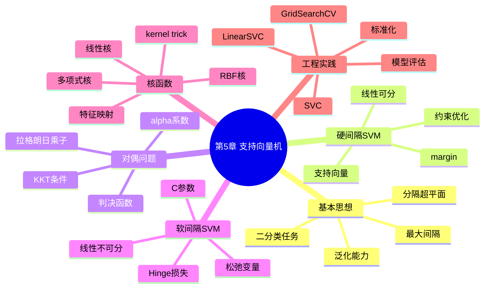

# 第5章 支持向量机

## 学习目标
- 能够从“最大间隔”角度解释 SVM 的泛化优势来源。
- 能够写出硬间隔与软间隔 SVM 的优化目标并解释参数意义。
- 能够说明核函数如何把非线性问题转化为线性可分问题。
- 能够使用 `LinearSVC` / `SVC` 完成建模并分析 `C`、`gamma` 的影响。

## 关键词
- 支持向量机（SVM）
- 最大间隔（Maximum Margin）
- 硬间隔 / 软间隔（Hard/Soft Margin）
- Hinge 损失（Hinge Loss）
- 拉格朗日对偶（Lagrangian Dual）
- KKT 条件
- 核函数（Kernel Function）
- RBF 核（Gaussian/RBF Kernel）

## 核心概念与原理
### 关键定义
- **支持向量**：对决策边界有决定作用的样本点。
- **间隔**：两类支持超平面之间的几何距离。
- **软间隔**：允许部分样本违反间隔约束以提升鲁棒性。

### 方法直觉
- 在可分前提下，不仅要分对，更要“分得开”，减少边界附近不确定样本影响。
- 核技巧避免显式升维，直接在内积层面完成非线性映射。

### 与相近方法的区别
- 与 Logistic 回归：SVM 强调间隔最大化；Logistic 强调概率建模。
- 与神经网络：SVM 在中小样本上常稳健，但大规模非结构化任务扩展性弱。

## 关键公式与解释
- 线性判别函数：
\[
f(x)=w^Tx+b
\]
- 软间隔目标：
\[
\min_{w,b,\xi}\frac{1}{2}\|w\|^2+C\sum_{i=1}^{m}\xi_i,\quad
y_i(w^Tx_i+b)\ge 1-\xi_i,\ \xi_i\ge0
\]
- Hinge 损失：
\[
\max(0,1-yf(x))
\]
- RBF 核：
\[
K(x_i,x_j)=\exp(-\gamma\|x_i-x_j\|^2)
\]
- 误用点：`C` 与 `gamma` 同时取很大易过拟合；未标准化会扭曲距离。

## 算法流程 / 方法步骤
1. **数据标准化**：输入原始特征，输出同尺度特征；目的为稳定间隔与核距离。
2. **模型选择**：输入任务与数据形态，输出线性核或非线性核方案；目的为匹配边界复杂度。
3. **参数搜索**：输入 `C`/`gamma` 网格，输出最佳参数；目的为平衡偏差与方差。
4. **训练求解**：输入训练数据，输出支持向量与决策函数；目的为得到最终边界。
5. **评估解释**：输入测试结果，输出指标与支持向量分析；目的为验证泛化。

## 实践示例（Python/sklearn）
```python
from sklearn.datasets import load_breast_cancer
from sklearn.model_selection import train_test_split
from sklearn.pipeline import Pipeline
from sklearn.preprocessing import StandardScaler
from sklearn.svm import SVC
from sklearn.metrics import f1_score

X, y = load_breast_cancer(return_X_y=True)
X_train, X_test, y_train, y_test = train_test_split(
    X, y, test_size=0.2, random_state=42, stratify=y
)

model = Pipeline([
    ("scaler", StandardScaler()),
    ("svc", SVC(kernel="rbf", C=1.0, gamma="scale"))
])
model.fit(X_train, y_train)
pred = model.predict(X_test)
print("f1:", f1_score(y_test, pred))
```
- 关键参数：`C` 控制错分惩罚；`gamma` 控制局部敏感度。
- 观察结果：建议记录支持向量数量与误差类型变化。

## 常见易错点
- 错因：把 SVM 视为“只能线性分类”。纠正建议：根据数据尝试核函数。
- 错因：忽略标准化。纠正建议：使用 `Pipeline(StandardScaler + SVC)`。
- 错因：只调 `C` 不调 `gamma`。纠正建议：对 RBF 核同时网格搜索两者。
- 错因：概率输出直接使用未校准分数。纠正建议：需要概率时启用 `probability=True` 并做校准。

## 练习
1. **概念题**：什么是支持向量，为什么它们重要？  
   参考要点：它们决定边界位置，非支持向量影响通常较小。
2. **理解题**：软间隔为何比硬间隔更适合真实数据？  
   参考要点：允许噪声和重叠，泛化更稳健。
3. **应用题**：`C` 很大而 `gamma` 很小时，边界可能呈现什么特点？  
   参考要点：强调训练正确但边界较平滑，可能欠拟合/或对噪声敏感取决于数据。
4. **综合题（参数分析）**：在同一数据集上把 `gamma` 从 `scale` 调到 `1`，若测试分数下降，你如何解释？  
   参考要点：边界过度弯曲、局部过拟合，需回调 `gamma` 或增大正则。

## 小结
- SVM 通过“最大间隔 + 支持向量”实现稳健分类。
- 软间隔与 Hinge 损失使模型具备抗噪能力。
- 核函数扩展了线性模型的非线性表达能力。
- 工程中标准化和参数联调是 SVM 成败关键。

> 建议文件路径：`knowledge_base/machine_learning/05_support_vector_machine.md`  
> 适用课程：机器学习导论 / 机器学习  
> 章节定位：在前面学习线性模型、神经网络之后，理解另一类经典监督学习方法——支持向量机。重点掌握最大间隔思想、硬间隔 SVM、软间隔 SVM、Hinge 损失、对偶问题、支持向量、核函数和 sklearn 实践。  
> 知识库用途：用于 ML-EduAgent 的课程检索、个性化讲解、题库生成、代码案例生成、OpenMAIC 互动课堂生成。

---

## 0. 章节元信息

```yaml
chapter_id: "05_support_vector_machine"
chapter_title: "第5章 支持向量机"
course: "机器学习"
difficulty: "中等到偏难"
prerequisites:
  - 线性分类器
  - 向量内积
  - 点到超平面的距离
  - 凸优化基本概念
  - 拉格朗日乘子法
  - 正则化
  - Logistic回归
  - 线性判别分析
keywords:
  - 支持向量机
  - SVM
  - Support Vector Machine
  - 最大间隔
  - margin
  - 分隔超平面
  - support vector
  - 硬间隔
  - 软间隔
  - slack variable
  - Hinge损失
  - 拉格朗日对偶
  - KKT条件
  - 核函数
  - kernel trick
  - 线性核
  - 多项式核
  - RBF核
  - 高斯核
  - C参数
  - gamma参数
  - SVC
  - LinearSVC
resource_types:
  - 个性化讲解文档
  - 公式推导
  - 思维导图
  - 代码案例
  - 练习题
  - OpenMAIC课堂生成Prompt
  - PBL实践任务
```

---

## 1. 本章学习目标

学完本章后，学生应能够：

1. 解释支持向量机的核心思想：在能够分类的前提下，使分类间隔尽可能大。
2. 写出线性 SVM 的分隔超平面和预测模型。
3. 理解几何间隔、函数间隔和最大间隔之间的关系。
4. 推导硬间隔 SVM 的原始优化问题。
5. 理解拉格朗日对偶问题、KKT 条件与支持向量的关系。
6. 理解软间隔 SVM 为什么需要松弛变量和 Hinge 损失。
7. 说明参数 \(C\) 如何平衡间隔大小和训练误差。
8. 理解核函数如何把非线性分类问题转化为高维空间中的线性分类问题。
9. 掌握常见核函数：线性核、多项式核、RBF / 高斯核。
10. 能够使用 sklearn 中的 `LinearSVC`、`SVC` 完成分类实验，并解释 `C`、`kernel`、`gamma` 等参数的作用。

---

## 2. 本章知识结构



---

## 3. 支持向量机的基本思想

支持向量机（Support Vector Machine, SVM）是一类经典的监督学习方法，最常用于分类任务，也可以扩展到回归和异常检测任务。

SVM 的核心思想可以用一句话概括：

> 在能够正确分类训练样本的前提下，寻找一个距离两类样本都尽可能远的分隔超平面。

对于二分类任务，假设训练集为：

\[
D=\{(x_1,y_1),(x_2,y_2),\cdots,(x_m,y_m)\}
\]

其中：

\[
x_i \in \mathbb{R}^n,\quad y_i\in\{-1,+1\}
\]

SVM 希望找到一个超平面：

\[
w^Tx+b=0
\]

将正类和负类样本分开。

分类预测函数为：

\[
f(x)=sgn(w^Tx+b)
\]

即：

\[
f(x)=
\begin{cases}
+1, & w^Tx+b \geq 0 \\
-1, & w^Tx+b < 0
\end{cases}
\]

---

## 4. 分隔超平面

### 4.1 什么是超平面？

超平面是 \(n\) 维空间中的 \(n-1\) 维子空间。

不同维度下的直观形式：

| 特征维度 | 超平面形式 | 直观理解 |
|---|---|---|
| 1 维 | 点 | 把数轴分成左右两部分 |
| 2 维 | 直线 | 把平面分成两部分 |
| 3 维 | 平面 | 把三维空间分成两部分 |
| n 维 | n-1 维超平面 | 把高维空间分成两部分 |

SVM 中的分隔超平面为：

\[
w^Tx+b=0
\]

其中：

- \(w\)：超平面的法向量，决定超平面的方向；
- \(b\)：偏置项，决定超平面的位置；
- \(w^Tx+b\)：样本到超平面哪一侧的判别值。

### 4.2 分类约束

对于正确分类的样本，希望满足：

\[
y_i(w^Tx_i+b)>0
\]

SVM 为了最大化间隔，使用更严格的约束：

\[
y_i(w^Tx_i+b)\geq 1
\]

其中：

- 若 \(y_i=+1\)，则要求 \(w^Tx_i+b\geq 1\)；
- 若 \(y_i=-1\)，则要求 \(w^Tx_i+b\leq -1\)。

---

## 5. 间隔 margin

### 5.1 间隔的直观含义

SVM 不只是要找到一个能把训练样本分开的超平面，还希望这个超平面尽可能位于两类样本中间。

在几何上，SVM 使用两条边界：

\[
w^Tx+b=+1
\]

\[
w^Tx+b=-1
\]

这两条边界之间的距离就是间隔：

\[
margin=\frac{2}{\|w\|}
\]

间隔越大，说明分类边界距离两类样本越远，对未见测试样本通常更稳健。

### 5.2 为什么边界可以设为 ±1？

如果超平面参数 \(w,b\) 满足某个比例形式，例如：

\[
w^Tx+b=\pm a
\]

由于 \(w,b\) 同时缩放不会改变分类边界，因此可以把 \(w,b\) 同时除以 \(a\)，将边界归一化为：

\[
w^Tx+b=\pm 1
\]

这使得数学推导更方便。

---

## 6. 硬间隔支持向量机

### 6.1 适用场景

硬间隔 SVM 适用于线性可分数据，即存在一个超平面能够完全正确地区分训练样本。

### 6.2 优化目标

最大化间隔：

\[
\max_{w,b}\frac{2}{\|w\|}
\]

等价于最小化：

\[
\min_{w,b}\frac{1}{2}\|w\|^2
\]

约束条件：

\[
y_i(w^Tx_i+b)\geq 1,\quad i=1,2,\cdots,m
\]

所以硬间隔 SVM 的原始优化问题为：

\[
\min_{w,b}\frac{1}{2}\|w\|^2
\]

\[
s.t.\quad y_i(w^Tx_i+b)\geq 1,\quad i=1,2,\cdots,m
\]

### 6.3 直观理解

该优化目标包含两层含义：

1. 约束条件保证训练样本被正确分类，并且至少位于间隔边界之外；
2. 目标函数最小化 \(\|w\|^2\)，等价于最大化间隔。

---

## 7. 拉格朗日对偶与支持向量

### 7.1 为什么需要对偶问题？

硬间隔 SVM 是带约束的凸二次规划问题。为了求解它，通常使用拉格朗日乘子法，将约束条件合并到目标函数中。

构造拉格朗日函数：

\[
L(w,b,\alpha)
=
\frac{1}{2}\|w\|^2
+
\sum_{i=1}^{m}\alpha_i[1-y_i(w^Tx_i+b)]
\]

其中：

\[
\alpha_i\geq 0
\]

### 7.2 对 \(w\) 和 \(b\) 求偏导

令偏导为 0：

\[
\frac{\partial L}{\partial w}=0
\Rightarrow
w=\sum_{i=1}^{m}\alpha_i y_i x_i
\]

\[
\frac{\partial L}{\partial b}=0
\Rightarrow
\sum_{i=1}^{m}\alpha_i y_i=0
\]

代回可得对偶问题：

\[
\max_{\alpha}
\sum_{i=1}^{m}\alpha_i
-
\frac{1}{2}
\sum_{i=1}^{m}\sum_{j=1}^{m}
\alpha_i\alpha_jy_iy_jx_i^Tx_j
\]

约束：

\[
\sum_{i=1}^{m}\alpha_i y_i=0,\quad \alpha_i\geq 0
\]

### 7.3 支持向量

在最终解中，绝大多数样本对应的 \(\alpha_i=0\)，只有少数样本对应 \(\alpha_i>0\)。

这些 \(\alpha_i>0\) 的样本位于间隔边界上：

\[
w^Tx_i+b=\pm 1
\]

它们决定最终分类边界，被称为支持向量。

支持向量是 SVM 名称的来源。

### 7.4 支持向量的意义

支持向量的特点：

1. 数量通常远小于训练样本数；
2. 决定最终分隔超平面；
3. 移动非支持向量通常不改变分类边界；
4. 移动支持向量可能显著改变模型；
5. 模型预测时主要依赖支持向量。

---

## 8. KKT 条件

KKT 条件是求解带等式和不等式约束优化问题的重要工具。

对于 SVM，KKT 条件可以帮助解释：

1. 为什么支持向量对应 \(\alpha_i>0\)；
2. 为什么非支持向量对应 \(\alpha_i=0\)；
3. 如何利用支持向量计算 \(b^*\)。

互补松弛条件为：

\[
\alpha_i[1-y_i(w^Tx_i+b)] = 0
\]

这意味着：

- 若 \(\alpha_i=0\)，该样本不影响最终超平面；
- 若 \(\alpha_i>0\)，则必须有：

\[
y_i(w^Tx_i+b)=1
\]

即该样本刚好位于间隔边界上，是支持向量。

---

## 9. 软间隔支持向量机

### 9.1 为什么需要软间隔？

现实数据通常不是完全线性可分的，可能存在：

- 噪声；
- 离群点；
- 类别重叠；
- 标注错误；
- 本身非线性结构。

如果强制所有训练样本都被正确分类，模型可能为了少数异常点牺牲整体泛化能力。

因此软间隔 SVM 允许少量样本违反间隔约束。

### 9.2 松弛变量

引入松弛变量：

\[
\xi_i\geq 0
\]

将约束放宽为：

\[
y_i(w^Tx_i+b)\geq 1-\xi_i
\]

其中：

- \(\xi_i=0\)：样本在正确侧且位于间隔外；
- \(0<\xi_i<1\)：样本在间隔内但分类正确；
- \(\xi_i>1\)：样本被错分。

### 9.3 软间隔优化目标

\[
\min_{w,b,\xi}
\frac{1}{2}\|w\|^2
+
C\sum_{i=1}^{m}\xi_i
\]

约束：

\[
y_i(w^Tx_i+b)\geq 1-\xi_i
\]

\[
\xi_i\geq 0
\]

### 9.4 参数 C 的含义

参数 \(C\) 控制“间隔大小”和“训练误差”之间的权衡。

| C 值 | 模型倾向 | 可能结果 |
|---|---|---|
| 较大 | 更重视训练样本分类正确 | 间隔更窄，可能过拟合 |
| 较小 | 更允许训练错误 | 间隔更宽，可能欠拟合 |

通俗理解：

- \(C\) 大：对错分惩罚重，不愿意放过错误样本；
- \(C\) 小：对错分更宽容，更关注间隔和泛化能力。

---

## 10. Hinge 损失

软间隔 SVM 可以使用 Hinge 损失表示训练误差：

\[
L_{hinge}(y,f(x))=\max(0,1-yf(x))
\]

其中：

\[
f(x)=w^Tx+b
\]

如果：

\[
yf(x)\geq 1
\]

说明样本分类正确并且在间隔外，损失为 0。

如果：

\[
yf(x)<1
\]

说明样本落入间隔内或被错分，损失大于 0。

软间隔 SVM 的目标函数可写为：

\[
L(w,b)=
\frac{1}{2}\|w\|^2
+
C\sum_{i=1}^{m}
\max(0,1-y_i(w^Tx_i+b))
\]

### 10.1 Hinge 损失与 Logistic 回归损失对比

| 对比项 | Hinge 损失 | Logistic 交叉熵损失 |
|---|---|---|
| 常见模型 | SVM | Logistic 回归 |
| 标签形式 | \(-1,+1\) | \(0,1\) |
| 输出解释 | 分类得分 | 概率 |
| 是否有间隔要求 | 有，要求 \(yf(x)\geq1\) | 无显式间隔 |
| 概率解释 | 通常不直接给概率 | 可解释为概率 |

两者都属于分类损失，但 SVM 更强调间隔最大化，Logistic 回归更强调概率建模。

---

## 11. 核函数

### 11.1 为什么需要核函数？

软间隔 SVM 仍然是线性模型，面对复杂非线性数据时可能表现不足。

核函数的核心思想：

> 将原始空间中的非线性问题，通过特征映射转换为高维空间中的线性问题。

设特征映射为：

\[
\phi(x)
\]

在高维空间中的线性分类器为：

\[
w^T\phi(x)+b=0
\]

### 11.2 核技巧 kernel trick

在 SVM 的对偶问题中，样本只以内积形式出现：

\[
x_i^Tx_j
\]

如果将样本映射到高维空间，需要计算：

\[
\phi(x_i)^T\phi(x_j)
\]

核函数定义为：

\[
K(x_i,x_j)=\phi(x_i)^T\phi(x_j)
\]

这样就可以在不显式计算 \(\phi(x)\) 的情况下，直接得到高维空间中的内积。这被称为核技巧。

### 11.3 常见核函数

#### 11.3.1 线性核

\[
K(x_i,x_j)=x_i^Tx_j
\]

适合：

- 线性可分或近似线性可分数据；
- 特征维度很高的数据；
- 大规模文本分类。

#### 11.3.2 多项式核

\[
K(x_i,x_j)=(\gamma x_i^Tx_j+c)^d
\]

适合：

- 存在多项式关系的数据；
- 想显式控制特征交互阶数的场景。

重要参数：

- \(d\)：多项式次数；
- \(\gamma\)：缩放参数；
- \(c\)：常数项。

#### 11.3.3 RBF / 高斯核

\[
K(x_i,x_j)=\exp(-\gamma\|x_i-x_j\|^2)
\]

也常写作：

\[
K(x_i,x_j)=\exp(-\frac{\|x_i-x_j\|^2}{2\sigma^2})
\]

其中：

\[
\gamma=\frac{1}{2\sigma^2}
\]

RBF 核适合处理复杂非线性分类边界，是实践中常用的核函数之一。

### 11.4 gamma 参数的含义

在 RBF 核中，\(\gamma\) 控制单个样本影响范围。

| gamma 值 | 模型行为 | 可能结果 |
|---|---|---|
| 较大 | 单个样本影响范围小，边界更弯曲 | 可能过拟合 |
| 较小 | 单个样本影响范围大，边界更平滑 | 可能欠拟合 |

### 11.5 核函数选择建议

| 数据情况 | 推荐核函数 |
|---|---|
| 样本多、特征维度高、近似线性 | 线性核 / LinearSVC |
| 样本中等、边界明显非线性 | RBF 核 |
| 有明确多项式交互关系 | 多项式核 |
| 不确定 | 先用线性模型做基线，再尝试 RBF 核 |

---

## 12. SVM 的多分类扩展

SVM 原始形式主要面向二分类任务，但可通过策略扩展到多分类。

常见策略：

### 12.1 One-vs-Rest

为每个类别训练一个分类器：

```text
当前类别 vs 其他所有类别
```

预测时选择得分最高的类别。

### 12.2 One-vs-One

为每两个类别训练一个分类器：

```text
类别 i vs 类别 j
```

若有 \(K\) 个类别，需要训练：

\[
\frac{K(K-1)}{2}
\]

个分类器。

sklearn 中的 `SVC` 多分类通常采用 one-vs-one 方案。

---

## 13. SVM 与其他模型对比

### 13.1 SVM 与 Logistic 回归

| 对比项 | SVM | Logistic 回归 |
|---|---|---|
| 目标 | 最大化间隔 | 最大化似然 / 最小交叉熵 |
| 损失 | Hinge 损失 | 交叉熵损失 |
| 输出 | 分类得分 | 概率 |
| 关键参数 | C、kernel、gamma | C / 正则化强度 |
| 非线性能力 | 可通过核函数实现 | 需要特征工程或多项式特征 |
| 可解释性 | 支持向量决定边界 | 参数和概率较易解释 |

### 13.2 SVM 与 LDA

| 对比项 | SVM | LDA |
|---|---|---|
| 思路 | 最大间隔分类 | 类内小、类间大投影 |
| 假设 | 不强依赖高斯分布假设 | 常与类高斯分布、协方差结构相关 |
| 非线性扩展 | 核函数 | 核 LDA 等扩展 |
| 输出 | 分类器 | 分类 / 降维方向 |
| 关键点 | 支持向量 | 投影方向 |

### 13.3 SVM 与神经网络

| 对比项 | SVM | 神经网络 |
|---|---|---|
| 训练目标 | 凸优化，常有全局最优 | 非凸优化，依赖初始化和训练技巧 |
| 表达能力 | 核函数增强非线性 | 多层结构自动学习表示 |
| 数据需求 | 中小数据表现较好 | 通常需要更多数据 |
| 可扩展性 | 样本很大时核 SVM 计算成本高 | 可借助 GPU 训练大模型 |
| 调参重点 | C、kernel、gamma | 网络结构、学习率、优化器、正则化 |

---

## 14. sklearn 实践

### 14.1 使用 LinearSVC

适合近似线性分类、大样本或高维稀疏特征。

```python
from sklearn.datasets import load_breast_cancer
from sklearn.model_selection import train_test_split
from sklearn.preprocessing import StandardScaler
from sklearn.svm import LinearSVC
from sklearn.metrics import accuracy_score, classification_report, confusion_matrix

X, y = load_breast_cancer(return_X_y=True)

X_train, X_test, y_train, y_test = train_test_split(
    X, y, test_size=0.2, random_state=42, stratify=y
)

scaler = StandardScaler()
X_train = scaler.fit_transform(X_train)
X_test = scaler.transform(X_test)

model = LinearSVC(C=1.0, max_iter=10000, random_state=42)
model.fit(X_train, y_train)

pred = model.predict(X_test)

print("accuracy:", accuracy_score(y_test, pred))
print("confusion matrix:")
print(confusion_matrix(y_test, pred))
print("classification report:")
print(classification_report(y_test, pred))
```

### 14.2 使用 RBF 核 SVC

适合非线性分类任务。

```python
from sklearn.datasets import load_breast_cancer
from sklearn.model_selection import train_test_split
from sklearn.preprocessing import StandardScaler
from sklearn.svm import SVC
from sklearn.metrics import accuracy_score, classification_report

X, y = load_breast_cancer(return_X_y=True)

X_train, X_test, y_train, y_test = train_test_split(
    X, y, test_size=0.2, random_state=42, stratify=y
)

scaler = StandardScaler()
X_train = scaler.fit_transform(X_train)
X_test = scaler.transform(X_test)

model = SVC(
    C=1.0,
    kernel="rbf",
    gamma="scale",
    probability=True,
    random_state=42
)

model.fit(X_train, y_train)

pred = model.predict(X_test)
prob = model.predict_proba(X_test)

print("accuracy:", accuracy_score(y_test, pred))
print(classification_report(y_test, pred))
print("first sample probability:", prob[0])
```

### 14.3 使用 GridSearchCV 调参

```python
from sklearn.datasets import load_breast_cancer
from sklearn.model_selection import train_test_split, GridSearchCV
from sklearn.preprocessing import StandardScaler
from sklearn.pipeline import Pipeline
from sklearn.svm import SVC
from sklearn.metrics import classification_report

X, y = load_breast_cancer(return_X_y=True)

X_train, X_test, y_train, y_test = train_test_split(
    X, y, test_size=0.2, random_state=42, stratify=y
)

pipe = Pipeline([
    ("scaler", StandardScaler()),
    ("svc", SVC())
])

param_grid = {
    "svc__kernel": ["linear", "rbf"],
    "svc__C": [0.1, 1, 10, 100],
    "svc__gamma": ["scale", 0.01, 0.1, 1]
}

grid = GridSearchCV(
    pipe,
    param_grid=param_grid,
    cv=5,
    scoring="accuracy",
    n_jobs=-1
)

grid.fit(X_train, y_train)

print("best params:", grid.best_params_)
print("best cv score:", grid.best_score_)

pred = grid.predict(X_test)
print(classification_report(y_test, pred))
```

### 14.4 可视化 SVM 决策边界

```python
import numpy as np
import matplotlib.pyplot as plt
from sklearn.datasets import make_moons
from sklearn.preprocessing import StandardScaler
from sklearn.pipeline import Pipeline
from sklearn.svm import SVC

X, y = make_moons(n_samples=300, noise=0.25, random_state=42)

model = Pipeline([
    ("scaler", StandardScaler()),
    ("svc", SVC(kernel="rbf", C=10, gamma=1))
])

model.fit(X, y)

x_min, x_max = X[:, 0].min() - 0.5, X[:, 0].max() + 0.5
y_min, y_max = X[:, 1].min() - 0.5, X[:, 1].max() + 0.5

xx, yy = np.meshgrid(
    np.linspace(x_min, x_max, 300),
    np.linspace(y_min, y_max, 300)
)

Z = model.predict(np.c_[xx.ravel(), yy.ravel()])
Z = Z.reshape(xx.shape)

plt.contourf(xx, yy, Z, alpha=0.3)
plt.scatter(X[:, 0], X[:, 1], c=y, edgecolor="k")
plt.title("RBF Kernel SVM Decision Boundary")
plt.show()
```

---

## 15. SVM 工程实践建议

### 15.1 必须做特征标准化

SVM 尤其是 RBF 核对特征尺度敏感。如果不同特征量纲差异很大，距离计算会被大尺度特征主导。

建议使用：

```python
StandardScaler()
```

并通过 `Pipeline` 避免数据泄漏。

### 15.2 先建立基线

推荐顺序：

```text
Logistic回归
→ LinearSVC
→ SVC(kernel="rbf")
→ GridSearchCV调参
```

这样可以判断是否真的需要复杂核函数。

### 15.3 参数调优重点

核心参数：

- `C`：控制训练误差和间隔大小的权衡；
- `kernel`：核函数类型；
- `gamma`：RBF / poly / sigmoid 核的影响范围；
- `degree`：多项式核次数；
- `class_weight`：类别不平衡时使用。

### 15.4 计算复杂度注意

核 SVM 需要计算样本之间的核矩阵，样本数量很大时训练会变慢。大规模线性问题可优先考虑：

- `LinearSVC`
- `SGDClassifier`
- 线性模型
- 核近似方法，如 Nystroem

---

## 16. 面向不同学生画像的学习建议

### 16.1 数学基础较弱

推荐路径：

```text
先理解“分隔超平面”
→ 再理解“间隔越大越稳”
→ 再看硬间隔和软间隔区别
→ 最后用图理解核函数
```

资源形式：

- 图文讲解；
- 几何直观；
- 少量公式；
- 决策边界可视化。

### 16.2 有 Python 基础但公式弱

推荐路径：

```text
先跑 LinearSVC
→ 再跑 RBF SVC
→ 调整 C 和 gamma 观察边界变化
→ 再回头理解 margin 和 kernel
```

资源形式：

- 代码案例；
- 可视化边界；
- 参数实验；
- GridSearchCV 调参。

### 16.3 准备考试

推荐路径：

```text
SVM基本思想
→ 硬间隔优化目标
→ 软间隔与Hinge损失
→ 核函数
→ 支持向量
→ 参数C和gamma
```

资源形式：

- 公式卡片；
- 对比表；
- 简答题模板；
- 选择题训练。

### 16.4 想做项目实践

推荐路径：

```text
乳腺癌二分类
→ 数据标准化
→ LinearSVC基线
→ RBF SVC
→ GridSearchCV调参
→ 分类报告和混淆矩阵
```

资源形式：

- PBL 项目；
- sklearn 实战；
- 实验报告；
- 参数对比表。

---

## 17. 常见易错点

1. 认为 SVM 只适用于线性分类。实际上通过核函数，SVM 可以处理非线性分类。
2. 混淆硬间隔和软间隔。硬间隔不允许错分，软间隔允许一定程度违反约束。
3. 认为所有训练样本都决定分类边界。实际上主要由支持向量决定。
4. 忽略标准化。SVM 对特征尺度敏感，尤其是 RBF 核。
5. 把参数 \(C\) 理解反了。\(C\) 越大，对错分惩罚越强；\(C\) 越小，对错分越宽容。
6. 把 gamma 理解反了。RBF 核中 gamma 越大，样本影响范围越小，边界越复杂。
7. 认为核函数必须显式构造高维特征。核技巧的价值就在于避免显式计算高维映射。
8. 在大样本数据上盲目使用 RBF 核 SVC，导致训练过慢。
9. 混淆 Hinge 损失和交叉熵损失。
10. 以为 SVC 默认输出概率。sklearn 中 `SVC` 要设置 `probability=True` 才能调用 `predict_proba`。

---

## 18. 练习题库

### 18.1 选择题

**1. SVM 的核心思想是？**

A. 最小化训练样本数量  
B. 最大化分类间隔  
C. 随机选择分类边界  
D. 只使用所有样本的平均值  

答案：B

**2. 硬间隔 SVM 适用于哪类数据？**

A. 完全线性可分数据  
B. 完全无标签数据  
C. 图像生成任务  
D. 强化学习任务  

答案：A

**3. 软间隔 SVM 引入松弛变量的主要目的是什么？**

A. 增加特征数量  
B. 允许部分样本违反间隔约束  
C. 删除支持向量  
D. 替代核函数  

答案：B

**4. SVM 中支持向量通常指什么？**

A. 所有训练样本  
B. 离分类边界最远的样本  
C. 位于间隔边界上或影响边界的样本  
D. 测试集样本  

答案：C

**5. Hinge 损失的形式是？**

A. \(-y\log(p)\)  
B. \(\max(0,1-yf(x))\)  
C. \((y-\hat{y})^2\)  
D. \(\sum x_i\)  

答案：B

**6. RBF 核中的 gamma 较大时，通常会怎样？**

A. 决策边界更平滑，模型更简单  
B. 单个样本影响范围更小，边界更复杂  
C. 模型自动变成线性模型  
D. 支持向量数量一定为 0  

答案：B

### 18.2 判断题

1. SVM 的最大间隔思想与泛化能力有关。  
答案：正确。

2. 硬间隔 SVM 允许训练样本被错分。  
答案：错误。

3. 核函数可以在不显式构造高维映射的情况下计算高维空间内积。  
答案：正确。

4. SVM 只能做二分类，不能扩展到多分类。  
答案：错误。

5. 使用 RBF 核时通常不需要考虑特征缩放。  
答案：错误。

### 18.3 简答题

**1. 什么是支持向量？为什么它们重要？**

参考答案：支持向量是位于间隔边界上或违反间隔约束、对最终分类边界有影响的训练样本。在 SVM 的对偶解中，它们对应的拉格朗日乘子 \(\alpha_i>0\)。最终分类超平面主要由支持向量决定，因此它们对模型非常重要。

**2. 硬间隔 SVM 和软间隔 SVM 有什么区别？**

参考答案：硬间隔 SVM 要求所有训练样本都被正确分类，并且满足间隔约束，适用于线性可分数据；软间隔 SVM 引入松弛变量，允许部分样本落入间隔内甚至被错分，以提高对噪声和离群点的鲁棒性。

**3. 为什么 SVM 要最大化间隔？**

参考答案：间隔越大，说明分类边界距离两类样本越远，对训练数据中的扰动和未见样本更稳健，通常有助于提高泛化能力。

**4. 核函数的作用是什么？**

参考答案：核函数用于计算样本在高维特征空间中的内积，而无需显式构造高维映射。通过核函数，SVM 可以在原始空间中形成非线性分类边界。

**5. 参数 C 和 gamma 分别控制什么？**

参考答案：C 控制分类错误惩罚强度，C 越大越重视训练样本正确分类，C 越小越允许误差；gamma 是 RBF 核的重要参数，控制单个样本影响范围，gamma 越大影响范围越小，边界越复杂。

### 18.4 计算题

**1. 若 \(\|w\|=4\)，则 SVM 的间隔是多少？**

\[
margin=\frac{2}{\|w\|}=\frac{2}{4}=0.5
\]

**2. 给定 \(y=+1\)，\(f(x)=0.3\)，计算 Hinge 损失。**

\[
L=\max(0,1-yf(x))=\max(0,1-0.3)=0.7
\]

**3. 给定 \(y=-1\)，\(f(x)=0.8\)，计算 Hinge 损失。**

\[
L=\max(0,1-yf(x))=\max(0,1-(-1)(0.8))=1.8
\]

解释：真实类别为负类，但模型给出正方向较高得分，因此惩罚较大。

### 18.5 编程题

**题目：使用 sklearn 完成乳腺癌数据集的 SVM 二分类实验。**

要求：

1. 加载 `load_breast_cancer` 数据集；
2. 划分训练集和测试集；
3. 使用 `StandardScaler` 标准化；
4. 分别训练 `LinearSVC` 和 `SVC(kernel="rbf")`；
5. 输出准确率、混淆矩阵和分类报告；
6. 使用 `GridSearchCV` 调整 `C` 和 `gamma`；
7. 比较不同参数对结果的影响。

---

## 19. OpenMAIC 课堂生成 Prompt

```text
请基于以下内容生成一节面向本科机器学习学生的互动课堂。

【课程】
机器学习

【章节】
第5章 支持向量机

【学习主题】
最大间隔、软间隔与核函数

【学生画像】
学生已经学习过线性模型、Logistic回归、LDA和神经网络，有 Python 基础，但对凸优化、拉格朗日乘子和核函数理解较弱。希望通过图文讲解、几何示意、公式卡片、代码案例和练习题掌握支持向量机。

【知识库范围】
1. 支持向量机基本思想
2. 分隔超平面
3. 最大间隔与 margin
4. 硬间隔 SVM 原始优化问题
5. 拉格朗日对偶与 KKT 条件
6. 支持向量
7. 软间隔 SVM
8. Hinge 损失
9. 核函数与 kernel trick
10. 线性核、多项式核、RBF核
11. sklearn 中的 LinearSVC、SVC、GridSearchCV

【生成要求】
1. 生成 8-10 页 slides；
2. 用图示解释分隔超平面和最大间隔；
3. 用几何方式解释支持向量；
4. 用流程图解释硬间隔到软间隔的变化；
5. 用动画思路解释核函数如何把非线性问题变成线性问题；
6. 生成 6 道选择题、2 道简答题、2 道计算题、1 道编程题；
7. 生成一个 sklearn SVC 代码案例；
8. 生成一个调参实验任务；
9. 难度控制在本科机器学习入门到中等水平。
```

---

## 20. PBL 实践任务

### 任务名称

基于 SVM 的乳腺癌二分类与核函数调参实验

### 任务背景

学生需要使用乳腺癌数据集完成二分类任务，对比 Logistic 回归、LinearSVC 和 RBF 核 SVC 的效果，理解最大间隔、核函数和参数调优对分类性能的影响。

### 任务要求

1. 加载 `load_breast_cancer` 数据集；
2. 划分训练集和测试集；
3. 对特征进行标准化；
4. 训练 Logistic 回归作为基线；
5. 训练 LinearSVC；
6. 训练 SVC(kernel="rbf")；
7. 使用 GridSearchCV 调整 C 和 gamma；
8. 输出准确率、召回率、F1 值、混淆矩阵；
9. 分析支持向量数量；
10. 解释不同参数对模型的影响。

### 输出成果

- 实验代码；
- 参数对比表；
- 分类报告；
- 混淆矩阵；
- 支持向量数量分析；
- 实验总结报告。

---

## 21. 知识库检索关键词

```text
支持向量机
SVM
Support Vector Machine
线性可分
分隔超平面
hyperplane
最大间隔
margin
hard margin
硬间隔
soft margin
软间隔
slack variable
松弛变量
Hinge loss
折页损失
support vector
支持向量
Lagrange dual
拉格朗日对偶
KKT条件
kernel
核函数
kernel trick
线性核
多项式核
RBF核
高斯核
C参数
gamma参数
SVC
LinearSVC
GridSearchCV
SMO算法
LIBSVM
LIBLINEAR
```

---

## 22. 参考来源说明

本知识库依据以下资料整理：

1. 课程材料：`Chpt5. 支持向量机.pdf`
2. scikit-learn 官方文档：Support Vector Machines User Guide
3. scikit-learn 官方文档：SVC
4. scikit-learn 官方文档：LinearSVC
5. LIBSVM: A Library for Support Vector Machines
6. Stanford CS229：Support Vector Machines 课程笔记
