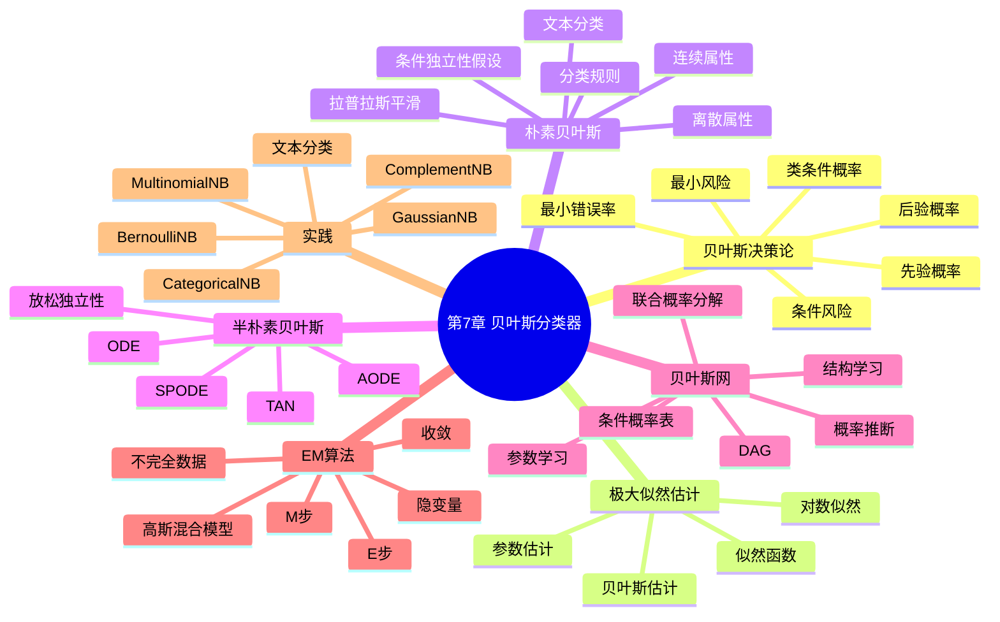

# 第7章 贝叶斯分类器

## 学习目标
- 能够基于贝叶斯决策论解释“最小风险分类”而非仅“最大概率分类”。
- 能够推导朴素贝叶斯分类规则并说明条件独立假设的作用与局限。
- 能够解释拉普拉斯平滑、对数概率计算和零频问题的关系。
- 能够使用 sklearn 选择合适的朴素贝叶斯变体并完成文本或表格分类。

## 关键词
- 贝叶斯决策论（Bayesian Decision Theory）
- 后验概率（Posterior Probability）
- 先验概率（Prior Probability）
- 朴素贝叶斯（Naive Bayes, NB）
- 拉普拉斯平滑（Laplace Smoothing）
- 半朴素贝叶斯（Semi-Naive Bayes）
- 贝叶斯网络（Bayesian Network）
- EM 算法（Expectation-Maximization, EM）

## 核心概念与原理
### 关键定义
- **贝叶斯分类**：基于后验概率或条件风险进行类别决策。
- **朴素假设**：给定类别时各特征条件独立。
- **生成式模型视角**：先建模 \(P(x|y)\) 与 \(P(y)\)，再推断 \(P(y|x)\)。

### 方法直觉
- 用概率分解把高维分类问题拆为更易估计的局部概率。
- 用平滑避免“某个条件概率为 0 导致整类概率归零”。

### 与相近方法的区别
- 与 Logistic 回归：NB 先建模数据分布，Logistic 直接学习判别边界。
- 与决策树：NB 参数更少、训练更快，但独立性假设较强。

## 关键公式与解释
- 贝叶斯公式：
\[
P(c_k|x)=\frac{P(c_k)P(x|c_k)}{P(x)}
\]
- 朴素贝叶斯判别规则：
\[
\hat{y}=\arg\max_{c_k} P(c_k)\prod_{j=1}^{d}P(x_j|c_k)
\]
- 对数形式：
\[
\hat{y}=\arg\max_{c_k}\left[\log P(c_k)+\sum_{j=1}^{d}\log P(x_j|c_k)\right]
\]
- 拉普拉斯平滑（离散）：
\[
P(x_j=a|c_k)=\frac{N_{a,k}+\alpha}{N_k+\alpha S_j}
\]
- 误用点：连续特征错误使用 MultinomialNB；忽略平滑导致零频失效。

## 算法流程 / 方法步骤
1. **任务与特征类型识别**：输入数据字段，输出 NB 变体选择；目的为匹配分布假设。
2. **参数估计**：输入训练数据，输出先验与条件概率参数；目的为构建生成式模型。
3. **后验计算**：输入新样本，输出各类别后验分数；目的为做类别决策。
4. **风险与阈值调整**：输入业务代价矩阵，输出分类规则；目的为最小化业务风险。
5. **误差分析**：输入错分样本，输出特征依赖性改进建议；目的为判断是否升级到半朴素或其他模型。

## 实践示例（Python/sklearn）
```python
from sklearn.datasets import fetch_20newsgroups
from sklearn.feature_extraction.text import TfidfVectorizer
from sklearn.naive_bayes import MultinomialNB
from sklearn.pipeline import Pipeline
from sklearn.model_selection import train_test_split
from sklearn.metrics import f1_score

cats = ["sci.space", "rec.sport.baseball"]
data = fetch_20newsgroups(subset="all", categories=cats, remove=("headers", "footers", "quotes"))
X_train, X_test, y_train, y_test = train_test_split(
    data.data, data.target, test_size=0.2, random_state=42, stratify=data.target
)

model = Pipeline([
    ("tfidf", TfidfVectorizer(stop_words="english")),
    ("nb", MultinomialNB(alpha=1.0))
])
model.fit(X_train, y_train)
pred = model.predict(X_test)
print("macro_f1:", f1_score(y_test, pred, average="macro"))
```
- 关键参数：`alpha` 控制平滑强度，过小可能过拟合稀有词。
- 结果观察：查看宏平均 F1 判断类别平衡表现。

## 常见易错点
- 错因：把先验与后验混淆。纠正建议：先写清“观测前/观测后”的概率语义。
- 错因：将 NB 概率视为天然校准。纠正建议：高风险场景做概率校准与阈值验证。
- 错因：忽略特征依赖。纠正建议：当强相关明显时尝试 TAN、AODE 或判别式模型。
- 错因：文本预处理与向量化不一致。纠正建议：固定 Pipeline，保证训练与推理一致。

## 练习
1. **概念题**：为什么朴素贝叶斯被称为“朴素”？  
   参考要点：假设给定类别后特征条件独立，简化参数估计。
2. **理解题**：拉普拉斯平滑如何避免零概率问题？  
   参考要点：为每个离散取值增加伪计数，防止概率为 0。
3. **应用题**：同一文本分类任务中，何时更适合 BernoulliNB 而非 MultinomialNB？  
   参考要点：特征是“是否出现”而非“出现次数”时更合适。
4. **综合题（参数分析）**：把 `alpha` 从 1.0 调到 1e-6 后测试分数下降，可能原因是什么？  
   参考要点：平滑不足，模型对稀有词过度自信导致泛化变差。

## 小结
- 贝叶斯分类核心是“后验概率 + 风险最小化”。
- 朴素贝叶斯以强假设换取高效率和强基线能力。
- 平滑与对数计算是实际工程稳定性的关键细节。
- 当特征依赖显著时，可升级到半朴素贝叶斯或更复杂模型。

> 建议文件路径：`knowledge_base/machine_learning/07_bayesian_classifiers.md`  
> 适用课程：机器学习导论 / 机器学习  
> 章节定位：以周志华《机器学习》第7章“贝叶斯分类器”的知识框架为主线，围绕贝叶斯决策论、极大似然估计、朴素贝叶斯、半朴素贝叶斯、贝叶斯网和 EM 算法建立完整知识库。  
> 知识库用途：用于 ML-EduAgent 的课程检索、个性化讲解、题库生成、代码案例生成、OpenMAIC 互动课堂生成。

---

## 0. 章节元信息

```yaml
chapter_id: "07_bayesian_classifiers"
chapter_title: "第7章 贝叶斯分类器"
course: "机器学习"
difficulty: "中等"
chapter_standard:
  - 周志华《机器学习》第7章：贝叶斯分类器
core_sections:
  - 贝叶斯决策论
  - 极大似然估计
  - 朴素贝叶斯分类器
  - 半朴素贝叶斯分类器
  - 贝叶斯网
  - EM算法
prerequisites:
  - 概率论基础
  - 条件概率
  - 全概率公式
  - 贝叶斯公式
  - 最大似然估计
  - 分类任务基本概念
  - 决策树与线性分类器基础
keywords:
  - 贝叶斯分类器
  - Bayesian classifier
  - 贝叶斯决策论
  - Bayesian decision theory
  - 先验概率
  - 后验概率
  - 条件风险
  - 极大似然估计
  - 朴素贝叶斯
  - Naive Bayes
  - 属性条件独立性假设
  - 拉普拉斯平滑
  - GaussianNB
  - MultinomialNB
  - BernoulliNB
  - CategoricalNB
  - ComplementNB
  - 半朴素贝叶斯
  - ODE
  - SPODE
  - TAN
  - AODE
  - 贝叶斯网
  - Bayesian network
  - 有向无环图
  - 条件概率表
  - EM算法
resource_types:
  - 个性化讲解文档
  - 思维导图
  - 公式推导
  - 代码案例
  - 练习题
  - OpenMAIC课堂生成Prompt
  - PBL实践任务
```

---

## 1. 本章学习目标

学完本章后，学生应能够：

1. 理解贝叶斯分类器的核心思想：基于概率估计后验概率，并选择风险最小或后验概率最大的类别。
2. 掌握贝叶斯公式、先验概率、类条件概率、证据因子、后验概率之间的关系。
3. 理解贝叶斯决策论中“条件风险”和“最小风险决策”的含义。
4. 掌握极大似然估计在概率模型参数估计中的基本思想。
5. 掌握朴素贝叶斯分类器的属性条件独立性假设、分类规则和参数估计方法。
6. 理解拉普拉斯平滑为什么能解决零概率问题。
7. 区分 GaussianNB、MultinomialNB、BernoulliNB、CategoricalNB、ComplementNB 的适用场景。
8. 理解半朴素贝叶斯分类器为何放松独立性假设，掌握 ODE、SPODE、TAN、AODE 的基本思想。
9. 理解贝叶斯网的结构表示、联合概率分解、学习和推断。
10. 理解 EM 算法如何处理隐变量和缺失数据。
11. 能够使用 sklearn 实现朴素贝叶斯分类器，并在文本分类和表格分类任务中完成实验。

---

## 2. 本章知识结构



---

## 3. 贝叶斯分类器的整体思想

贝叶斯分类器是一类基于概率建模的分类方法。它不直接寻找一个几何分类边界，而是先估计样本属于各个类别的概率，再根据概率进行决策。

给定样本 \(x\)，分类器希望判断它属于哪个类别：

\[
c \in \mathcal{Y}=\{c_1,c_2,\cdots,c_K\}
\]

贝叶斯分类的基本问题是计算后验概率：

\[
P(c_k|x)
\]

然后选择最可能的类别：

\[
\hat{y} = \arg\max_{c_k} P(c_k|x)
\]

使用贝叶斯公式：

\[
P(c_k|x)=\frac{P(c_k)P(x|c_k)}{P(x)}
\]

其中：

- \(P(c_k)\)：先验概率，表示类别 \(c_k\) 在总体中的出现概率；
- \(P(x|c_k)\)：类条件概率，表示类别为 \(c_k\) 时观察到样本 \(x\) 的概率；
- \(P(x)\)：证据因子，对所有类别相同；
- \(P(c_k|x)\)：后验概率，表示观察到 \(x\) 后样本属于类别 \(c_k\) 的概率。

由于对所有类别来说 \(P(x)\) 相同，分类时可以省略：

\[
\hat{y} = \arg\max_{c_k} P(c_k)P(x|c_k)
\]

这就是贝叶斯分类器最基本的决策规则。

---

## 4. 贝叶斯决策论

### 4.1 为什么需要贝叶斯决策论？

在分类任务中，预测错误的代价可能不一样。

例如：

- 将垃圾邮件误判为正常邮件，代价较小；
- 将重要邮件误判为垃圾邮件，代价较大；
- 将健康患者误判为患病，代价较小；
- 将患病患者误判为健康，代价很大。

因此，最优决策不一定只是选择后验概率最大的类别，而应考虑不同错误带来的损失。

### 4.2 损失函数

设真实类别为 \(c_j\)，分类器将样本预测为 \(c_i\)，对应损失为：

\[
\lambda_{ij}
\]

其中：

- \(i\)：预测类别；
- \(j\)：真实类别；
- \(\lambda_{ij}\)：把真实类别 \(c_j\) 预测为 \(c_i\) 的损失。

如果 \(i=j\)，通常损失为 0；如果 \(i\neq j\)，损失为正数。

### 4.3 条件风险

给定样本 \(x\)，如果采取决策 \(c_i\)，其条件风险为：

\[
R(c_i|x)=\sum_{j=1}^{K}\lambda_{ij}P(c_j|x)
\]

含义：

> 在观察到样本 \(x\) 的情况下，把它预测为 \(c_i\) 所带来的期望损失。

### 4.4 最小风险决策

贝叶斯决策论选择条件风险最小的类别：

\[
h^*(x)=\arg\min_{c_i}R(c_i|x)
\]

这就是贝叶斯最优分类器。

### 4.5 最小错误率分类

如果所有分类错误的损失相同，即：

\[
\lambda_{ij}=
\begin{cases}
0, & i=j \\
1, & i\neq j
\end{cases}
\]

则条件风险最小等价于后验概率最大：

\[
h^*(x)=\arg\max_{c_i}P(c_i|x)
\]

这就是常见的最大后验概率分类规则。

---

## 5. 极大似然估计

### 5.1 为什么需要参数估计？

贝叶斯分类器需要知道：

\[
P(c_k),\quad P(x|c_k)
\]

但现实中这些概率通常未知，需要从训练数据中估计。

极大似然估计（Maximum Likelihood Estimation, MLE）的思想是：

> 选择一组参数，使得当前观察到的训练数据出现的概率最大。

### 5.2 似然函数

假设数据集为：

\[
D=\{x_1,x_2,\cdots,x_m\}
\]

参数为 \(\theta\)，则似然函数为：

\[
L(\theta)=P(D|\theta)=\prod_{i=1}^{m}P(x_i|\theta)
\]

为了方便计算，通常使用对数似然：

\[
\ell(\theta)=\log L(\theta)=\sum_{i=1}^{m}\log P(x_i|\theta)
\]

极大似然估计为：

\[
\hat{\theta}=\arg\max_{\theta}\ell(\theta)
\]

### 5.3 类别先验概率估计

对于分类任务，类别先验概率可以估计为：

\[
P(c_k)=\frac{|D_{c_k}|}{|D|}
\]

其中：

- \(|D|\)：训练集样本总数；
- \(|D_{c_k}|\)：类别 \(c_k\) 的样本数量。

### 5.4 离散属性条件概率估计

若属性 \(x_j\) 是离散值，取值集合为：

\[
\{a_{j1},a_{j2},\cdots,a_{jS_j}\}
\]

则：

\[
P(x_j=a_{jl}|c_k)
=
\frac{|D_{c_k,x_j=a_{jl}}|}{|D_{c_k}|}
\]

其中 \(|D_{c_k,x_j=a_{jl}}|\) 表示类别为 \(c_k\) 且第 \(j\) 个属性取值为 \(a_{jl}\) 的样本数。

### 5.5 连续属性条件概率估计

对于连续属性，常假设在每个类别下服从高斯分布：

\[
P(x_j|c_k)=
\frac{1}{\sqrt{2\pi}\sigma_{kj}}
\exp\left(
-\frac{(x_j-\mu_{kj})^2}{2\sigma_{kj}^2}
\right)
\]

其中：

- \(\mu_{kj}\)：类别 \(c_k\) 下第 \(j\) 个属性的均值；
- \(\sigma_{kj}^2\)：类别 \(c_k\) 下第 \(j\) 个属性的方差。

---

## 6. 朴素贝叶斯分类器

### 6.1 核心假设

朴素贝叶斯分类器的“朴素”之处在于它做了一个强假设：

> 给定类别后，各个属性之间相互条件独立。

即：

\[
P(x|c_k)=P(x_1,x_2,\cdots,x_d|c_k)
=
\prod_{j=1}^{d}P(x_j|c_k)
\]

这样后验概率可以写成：

\[
P(c_k|x)
\propto
P(c_k)\prod_{j=1}^{d}P(x_j|c_k)
\]

分类规则为：

\[
\hat{y}
=
\arg\max_{c_k}
P(c_k)\prod_{j=1}^{d}P(x_j|c_k)
\]

### 6.2 为什么这个假设有用？

如果不做条件独立性假设，需要估计完整联合概率：

\[
P(x_1,x_2,\cdots,x_d|c_k)
\]

这在属性数量较多、取值较多时会导致参数数量爆炸。

朴素贝叶斯通过条件独立性假设大幅降低参数估计复杂度，使模型：

- 训练速度快；
- 对小数据集较稳健；
- 对高维稀疏文本特征效果较好；
- 实现简单，易解释。

### 6.3 为什么朴素假设不完全成立时仍可能有效？

现实中属性之间往往并不独立，但朴素贝叶斯仍常有不错表现，原因包括：

1. 分类只需要比较各类别后验概率的大小，不一定需要精确概率值。
2. 属性依赖对不同类别的影响可能相互抵消。
3. 朴素假设降低了方差，减少了过拟合风险。
4. 在文本分类等高维稀疏任务中，条件独立近似常能提供强基线。

---

## 7. 拉普拉斯平滑

### 7.1 零概率问题

如果某个属性值在某个类别中没有出现，则：

\[
P(x_j=a|c_k)=0
\]

由于朴素贝叶斯会连乘多个条件概率，只要其中一个概率为 0，则整个类别概率变为 0：

\[
P(c_k)\prod_jP(x_j|c_k)=0
\]

这会导致模型过于极端。

### 7.2 拉普拉斯平滑

为解决零概率问题，引入拉普拉斯平滑：

\[
P(c_k)=\frac{|D_{c_k}|+1}{|D|+K}
\]

\[
P(x_j=a_{jl}|c_k)
=
\frac{|D_{c_k,x_j=a_{jl}}|+1}{|D_{c_k}|+S_j}
\]

其中：

- \(K\)：类别数量；
- \(S_j\)：第 \(j\) 个属性可能取值数量。

更一般地，可以使用平滑参数 \(\alpha\)：

\[
P(x_j=a_{jl}|c_k)
=
\frac{|D_{c_k,x_j=a_{jl}}|+\alpha}{|D_{c_k}|+\alpha S_j}
\]

当 \(\alpha=1\) 时就是常见的拉普拉斯平滑。

### 7.3 平滑的直观理解

平滑相当于给每个类别、每个属性取值都预先加上一点“虚拟计数”，避免某些事件因为训练集中没有出现而被认为概率为 0。

---

## 8. 朴素贝叶斯的常见形式

### 8.1 Gaussian Naive Bayes

适用于连续特征，假设每个特征在给定类别下服从高斯分布。

适合：

- 连续数值特征；
- 中小规模表格数据；
- 初步基线模型。

公式：

\[
P(x_j|c_k)=
\frac{1}{\sqrt{2\pi}\sigma_{kj}}
\exp
\left(
-\frac{(x_j-\mu_{kj})^2}{2\sigma_{kj}^2}
\right)
\]

### 8.2 Multinomial Naive Bayes

适用于离散计数特征，常用于文本分类中的词频特征。

适合：

- 词频；
- 文档分类；
- 垃圾邮件识别；
- 主题分类。

### 8.3 Bernoulli Naive Bayes

适用于二值特征，例如某个词是否出现。

适合：

- 二值文本特征；
- 是否包含某个关键词；
- 多个 0/1 属性组成的分类任务。

### 8.4 Categorical Naive Bayes

适用于类别型离散特征。

适合：

- 特征值是有限类别；
- 例如“颜色=红/绿/蓝”“天气=晴/阴/雨”。

### 8.5 Complement Naive Bayes

ComplementNB 常用于文本分类，尤其在类别不平衡时可能比普通 MultinomialNB 更稳健。

适合：

- 文本分类；
- 类别不平衡数据；
- 高维稀疏计数特征。

---

## 9. 对数概率计算

朴素贝叶斯需要连乘很多小概率，可能导致数值下溢。实践中常使用对数概率：

\[
\log P(c_k|x)
\propto
\log P(c_k)
+
\sum_{j=1}^{d}\log P(x_j|c_k)
\]

分类规则变为：

\[
\hat{y}
=
\arg\max_{c_k}
\left[
\log P(c_k)+\sum_{j=1}^{d}\log P(x_j|c_k)
\right]
\]

优点：

1. 把连乘变成求和；
2. 避免小概率连乘导致数值下溢；
3. 计算更稳定；
4. 便于调试和解释。

---

## 10. 半朴素贝叶斯分类器

### 10.1 为什么需要半朴素贝叶斯？

朴素贝叶斯假设属性之间条件独立，但现实任务中属性之间常有依赖关系。

例如：

- “年龄”和“收入”可能相关；
- “词语 A 出现”和“词语 B 出现”可能相关；
- “血压”和“心率”可能相关。

完全建模所有属性依赖会导致复杂度过高。半朴素贝叶斯试图在两者之间折中：

> 适当考虑部分属性依赖关系，同时保持模型复杂度可控。

### 10.2 独依赖估计 ODE

ODE（One-Dependence Estimator）假设每个属性在类别之外最多依赖于一个其他属性。

形式上：

\[
P(x|c)
=
\prod_{j=1}^{d}
P(x_j|c,pa_j)
\]

其中 \(pa_j\) 表示属性 \(x_j\) 的一个父属性。

### 10.3 SPODE

SPODE（Super-Parent One-Dependence Estimator）假设所有属性都依赖于同一个“超父属性”。

如果选定超父属性 \(x_s\)，则：

\[
P(c|x)
\propto
P(c)P(x_s|c)
\prod_{j\neq s}
P(x_j|c,x_s)
\]

优点：

- 比朴素贝叶斯考虑更多依赖；
- 结构仍较简单。

缺点：

- 超父属性选择很关键；
- 选错超父属性可能影响效果。

### 10.4 TAN：Tree-Augmented Naive Bayes

TAN 使用树结构建模属性依赖。其思想是：

1. 计算属性之间在给定类别下的条件互信息；
2. 构造最大带权生成树；
3. 为每个属性选择一个父属性；
4. 保留类别节点指向所有属性的边。

TAN 相比朴素贝叶斯多考虑属性之间的树形依赖关系，通常比朴素贝叶斯更灵活。

### 10.5 AODE

AODE（Averaged One-Dependence Estimator）不是只选择一个超父属性，而是对多个 SPODE 模型进行平均。

直观理解：

> 既然不知道哪个属性最适合作为超父属性，那就让多个候选超父属性都参与建模，再对结果求平均。

AODE 的优点：

- 降低单一超父属性选择错误的风险；
- 在复杂属性依赖下通常更稳健。

---

## 11. 贝叶斯网

### 11.1 什么是贝叶斯网？

贝叶斯网（Bayesian Network）用有向无环图（DAG）表示变量之间的概率依赖关系。

它包含两部分：

1. 图结构：表示变量之间的依赖关系；
2. 条件概率表：表示每个变量在父节点给定时的概率分布。

若变量集合为：

\[
X=\{X_1,X_2,\cdots,X_d\}
\]

贝叶斯网将联合概率分解为：

\[
P(X_1,X_2,\cdots,X_d)
=
\prod_{i=1}^{d}P(X_i|Pa(X_i))
\]

其中 \(Pa(X_i)\) 表示变量 \(X_i\) 的父节点集合。

### 11.2 朴素贝叶斯与贝叶斯网的关系

朴素贝叶斯可以看作一种特殊的贝叶斯网：

```text
类别节点 C
  ↓ ↓ ↓ ↓
 X1 X2 X3 ... Xd
```

特点：

- 类别变量作为根节点；
- 所有属性变量都依赖于类别；
- 属性变量之间没有边。

因此，朴素贝叶斯是贝叶斯网分类器中结构最简单的一类。

### 11.3 贝叶斯网的优势

贝叶斯网可以表示比朴素贝叶斯更复杂的依赖关系：

- 属性之间可以存在依赖；
- 可用于概率推断；
- 可用于缺失值处理；
- 可以结合专家知识；
- 模型结构具有一定可解释性。

### 11.4 贝叶斯网学习

贝叶斯网学习包括两类任务：

#### 11.4.1 结构学习

确定变量之间有哪些边。

常见方法：

- 基于评分搜索；
- 基于条件独立性检验；
- 结合专家知识约束；
- 贪心搜索；
- 爬山搜索；
- 最大带权生成树（用于 TAN）。

#### 11.4.2 参数学习

在图结构确定后，估计条件概率表。

如果数据完整，常用极大似然估计或贝叶斯估计。

如果数据不完整，常使用 EM 算法。

### 11.5 贝叶斯网推断

贝叶斯网推断是指在已知部分变量取值的情况下，计算其他变量的概率分布。

例如：

\[
P(C|X_1=x_1,X_2=x_2)
\]

常见推断方法：

| 类型 | 方法 |
|---|---|
| 精确推断 | 变量消去、团树传播 |
| 近似推断 | 采样、MCMC、重要性采样 |

---

## 12. EM 算法

### 12.1 为什么需要 EM？

在很多概率模型中，训练数据并不完整，可能存在：

- 缺失属性；
- 未观测类别；
- 隐变量；
- 混合模型中的潜在成分标签。

此时无法直接使用普通极大似然估计。

EM（Expectation-Maximization）算法用于含有隐变量的参数估计问题。

### 12.2 EM 的基本思想

EM 交替进行两步：

#### E 步：Expectation

在当前参数下，估计隐变量的后验分布，计算完整数据对数似然的期望。

#### M 步：Maximization

最大化 E 步得到的期望，更新模型参数。

流程：

```text
初始化参数 θ
repeat:
    E步：根据当前 θ 估计隐变量分布
    M步：最大化期望似然，更新 θ
until 收敛
```

### 12.3 EM 的直观理解

如果知道隐变量，参数估计会比较容易；如果知道参数，推断隐变量也比较容易。

EM 的策略是：

> 参数未知时先猜一个参数；用这个参数估计隐变量；再利用估计出的隐变量更新参数；不断重复，直到收敛。

### 12.4 EM 与 K-means 的关系

K-means 可以看作一种硬分配形式的 EM：

- E 步：把每个样本分到最近的簇中心；
- M 步：更新每个簇中心为簇内样本均值。

高斯混合模型则是软分配形式的 EM：

- 每个样本属于每个高斯成分都有一个概率；
- 参数更新时按照概率加权。

### 12.5 EM 常见问题

1. 可能收敛到局部最优；
2. 对初始参数敏感；
3. E 步和 M 步推导可能复杂；
4. 隐变量过多时计算成本较高；
5. 需要判断收敛条件。

---

## 13. 贝叶斯分类器与其他模型对比

| 模型 | 核心思想 | 优点 | 局限 |
|---|---|---|---|
| Logistic 回归 | 直接学习 \(P(y|x)\) 或判决边界 | 概率输出、解释性较好 | 需要特征工程处理非线性 |
| 决策树 | 递归划分特征空间 | 可解释性强 | 容易过拟合 |
| SVM | 最大化分类间隔 | 中小数据效果好，泛化强 | 概率解释不直接，核SVM大数据慢 |
| 朴素贝叶斯 | 基于贝叶斯公式和条件独立假设 | 快速、适合高维稀疏文本 | 独立性假设较强 |
| 贝叶斯网 | 显式建模变量依赖 | 可解释、可推断 | 结构学习和推断复杂 |
| 神经网络 | 多层非线性表示学习 | 表达能力强 | 需要数据和算力，解释性较弱 |

---

## 14. sklearn 实践：GaussianNB

适用于连续数值特征。

```python
from sklearn.datasets import load_iris
from sklearn.model_selection import train_test_split
from sklearn.naive_bayes import GaussianNB
from sklearn.metrics import accuracy_score, classification_report, confusion_matrix

X, y = load_iris(return_X_y=True)

X_train, X_test, y_train, y_test = train_test_split(
    X, y, test_size=0.2, random_state=42, stratify=y
)

model = GaussianNB()
model.fit(X_train, y_train)

pred = model.predict(X_test)

print("accuracy:", accuracy_score(y_test, pred))
print("confusion matrix:")
print(confusion_matrix(y_test, pred))
print("classification report:")
print(classification_report(y_test, pred))
```

---

## 15. sklearn 实践：MultinomialNB 文本分类

适用于词频、计数特征。

```python
from sklearn.datasets import fetch_20newsgroups
from sklearn.feature_extraction.text import CountVectorizer
from sklearn.naive_bayes import MultinomialNB
from sklearn.pipeline import Pipeline
from sklearn.metrics import classification_report

categories = ["sci.space", "rec.sport.baseball"]

train = fetch_20newsgroups(
    subset="train",
    categories=categories,
    remove=("headers", "footers", "quotes")
)

test = fetch_20newsgroups(
    subset="test",
    categories=categories,
    remove=("headers", "footers", "quotes")
)

model = Pipeline([
    ("vectorizer", CountVectorizer(stop_words="english")),
    ("clf", MultinomialNB(alpha=1.0))
])

model.fit(train.data, train.target)
pred = model.predict(test.data)

print(classification_report(test.target, pred, target_names=test.target_names))
```

---

## 16. sklearn 实践：BernoulliNB

适用于词是否出现、二值特征。

```python
from sklearn.datasets import fetch_20newsgroups
from sklearn.feature_extraction.text import CountVectorizer
from sklearn.naive_bayes import BernoulliNB
from sklearn.pipeline import Pipeline
from sklearn.metrics import classification_report

categories = ["sci.space", "rec.sport.baseball"]

train = fetch_20newsgroups(
    subset="train",
    categories=categories,
    remove=("headers", "footers", "quotes")
)

test = fetch_20newsgroups(
    subset="test",
    categories=categories,
    remove=("headers", "footers", "quotes")
)

model = Pipeline([
    ("vectorizer", CountVectorizer(binary=True, stop_words="english")),
    ("clf", BernoulliNB(alpha=1.0))
])

model.fit(train.data, train.target)
pred = model.predict(test.data)

print(classification_report(test.target, pred, target_names=test.target_names))
```

---

## 17. sklearn 实践：CategoricalNB

适用于离散类别型特征。

```python
import numpy as np
from sklearn.naive_bayes import CategoricalNB
from sklearn.preprocessing import OrdinalEncoder
from sklearn.pipeline import Pipeline

# 天气、温度、湿度、风力 -> 是否适合打球
X = np.array([
    ["sunny", "hot", "high", "weak"],
    ["sunny", "hot", "high", "strong"],
    ["overcast", "hot", "high", "weak"],
    ["rain", "mild", "high", "weak"],
    ["rain", "cool", "normal", "weak"],
    ["rain", "cool", "normal", "strong"],
    ["overcast", "cool", "normal", "strong"],
    ["sunny", "mild", "high", "weak"],
    ["sunny", "cool", "normal", "weak"],
    ["rain", "mild", "normal", "weak"],
])
y = np.array(["no", "no", "yes", "yes", "yes", "no", "yes", "no", "yes", "yes"])

model = Pipeline([
    ("encoder", OrdinalEncoder()),
    ("clf", CategoricalNB(alpha=1.0))
])

model.fit(X, y)

sample = np.array([["sunny", "cool", "high", "strong"]])
print(model.predict(sample))
print(model.predict_proba(sample))
```

---

## 18. 从零实现一个简单朴素贝叶斯

适用于离散属性演示。

```python
from collections import defaultdict, Counter
import math

class SimpleCategoricalNB:
    def __init__(self, alpha=1.0):
        self.alpha = alpha
        self.class_counts = Counter()
        self.feature_counts = defaultdict(Counter)
        self.feature_values = defaultdict(set)
        self.classes = []

    def fit(self, X, y):
        self.classes = sorted(set(y))
        n_samples = len(y)
        n_features = len(X[0])

        for xi, yi in zip(X, y):
            self.class_counts[yi] += 1
            for j in range(n_features):
                self.feature_counts[(j, xi[j])][yi] += 1
                self.feature_values[j].add(xi[j])

        self.n_samples = n_samples
        self.n_features = n_features
        return self

    def predict_one(self, x):
        scores = {}

        for c in self.classes:
            # prior with smoothing
            log_prob = math.log(
                (self.class_counts[c] + self.alpha) /
                (self.n_samples + self.alpha * len(self.classes))
            )

            for j, value in enumerate(x):
                count = self.feature_counts[(j, value)][c]
                num_values = len(self.feature_values[j])
                cond_prob = (
                    (count + self.alpha) /
                    (self.class_counts[c] + self.alpha * num_values)
                )
                log_prob += math.log(cond_prob)

            scores[c] = log_prob

        return max(scores, key=scores.get)

    def predict(self, X):
        return [self.predict_one(x) for x in X]
```

---

## 19. 工程实践建议

### 19.1 选择哪种朴素贝叶斯？

| 数据类型 | 推荐模型 |
|---|---|
| 连续数值特征 | GaussianNB |
| 词频 / 计数特征 | MultinomialNB |
| 二值特征 | BernoulliNB |
| 类别型离散特征 | CategoricalNB |
| 类别不平衡文本分类 | ComplementNB |

### 19.2 什么时候适合贝叶斯分类器？

适合：

- 文本分类；
- 垃圾邮件过滤；
- 高维稀疏特征；
- 小样本快速基线；
- 需要概率解释的场景；
- 需要快速训练和预测的场景。

不适合：

- 属性之间依赖非常强且不能忽略；
- 需要复杂非线性表示学习；
- 概率校准要求特别高；
- 特征分布假设明显不符合。

### 19.3 实践注意事项

1. 文本分类中要先进行向量化。
2. 多项式朴素贝叶斯适合计数特征，而不是任意连续特征。
3. 连续特征可使用 GaussianNB，也可先离散化。
4. 使用平滑避免零概率。
5. 使用对数概率避免数值下溢。
6. 类别不平衡时要关注 precision、recall、F1，而不是只看 accuracy。
7. 可以把朴素贝叶斯作为基线模型，与 Logistic 回归、SVM、决策树进行对比。

---

## 20. 常见易错点

1. 把先验概率和后验概率混淆。
2. 忘记贝叶斯公式中的证据因子 \(P(x)\)。
3. 以为朴素贝叶斯要求属性真实独立。实际上它是假设给定类别后条件独立。
4. 忘记拉普拉斯平滑，导致零概率问题。
5. 连续特征直接使用 MultinomialNB，导致模型假设不匹配。
6. 文本分类中混淆 MultinomialNB 和 BernoulliNB：前者看词频，后者看是否出现。
7. 忽略类别不平衡，只看准确率。
8. 以为贝叶斯网一定表示因果关系。贝叶斯网的边可表示概率依赖，不一定等同因果。
9. 把 EM 算法理解成分类器。EM 是含隐变量模型的参数估计算法。
10. 认为朴素贝叶斯输出的概率一定校准良好。由于独立性假设强，概率值可能偏极端。

---

## 21. 面向不同学生画像的学习建议

### 21.1 数学基础较弱

推荐路径：

```text
先验概率 / 后验概率
→ 贝叶斯公式
→ 最大后验分类
→ 朴素贝叶斯直观例子
→ 拉普拉斯平滑
→ sklearn代码实践
```

资源形式：

- 概率树图；
- 频数表；
- 手算例题；
- 少量公式。

### 21.2 有 Python 基础但概率弱

推荐路径：

```text
先跑 GaussianNB
→ 再跑文本分类 MultinomialNB
→ 打印 class_log_prior_
→ 打印 feature_log_prob_
→ 回看公式含义
```

资源形式：

- 代码案例；
- 参数解释；
- 调试输出；
- 对数概率解释。

### 21.3 准备考试

推荐路径：

```text
贝叶斯决策论
→ 极大似然估计
→ 朴素贝叶斯公式
→ 拉普拉斯平滑
→ 半朴素贝叶斯
→ 贝叶斯网
→ EM算法
```

资源形式：

- 公式卡片；
- 简答题；
- 判断题；
- 手算题。

### 21.4 想做项目实践

推荐路径：

```text
文本分类数据集
→ CountVectorizer
→ MultinomialNB
→ ComplementNB
→ Logistic回归对比
→ 错误样本分析
```

资源形式：

- PBL项目；
- sklearn Pipeline；
- 分类报告；
- 混淆矩阵；
- 模型对比实验。

---

## 22. 练习题库

### 22.1 选择题

**1. 贝叶斯分类器主要依据什么进行分类？**

A. 距离最近的训练样本  
B. 后验概率或条件风险  
C. 决策树节点纯度  
D. 神经网络隐藏层数量  

答案：B

**2. 朴素贝叶斯的“朴素”主要指什么？**

A. 模型不能处理多分类  
B. 假设属性在给定类别后条件独立  
C. 只能处理连续变量  
D. 不需要训练数据  

答案：B

**3. 拉普拉斯平滑主要解决什么问题？**

A. 梯度爆炸  
B. 零概率问题  
C. 决策树过拟合  
D. SVM 间隔太小  

答案：B

**4. GaussianNB 适合哪类特征？**

A. 连续数值特征  
B. 文本词频特征  
C. 图片像素必须为整数  
D. 图结构数据  

答案：A

**5. MultinomialNB 常用于什么任务？**

A. 图像分割  
B. 文本分类  
C. 强化学习  
D. 聚类可视化  

答案：B

**6. EM 算法常用于什么情况？**

A. 完全无参数模型  
B. 含隐变量或缺失数据的参数估计  
C. 只用于 KNN  
D. 替代所有分类器  

答案：B

### 22.2 判断题

1. 朴素贝叶斯分类器一定要求属性之间在现实中完全独立。  
答案：错误。它是模型假设，现实中不完全成立时也可能有效。

2. 分类时 \(P(x)\) 对所有类别相同，因此最大后验分类中可以省略。  
答案：正确。

3. 贝叶斯网可以表示变量之间的概率依赖关系。  
答案：正确。

4. EM 算法一定能找到全局最优。  
答案：错误。EM 通常只能保证似然不下降，可能收敛到局部最优。

5. BernoulliNB 更适合二值特征。  
答案：正确。

### 22.3 简答题

**1. 什么是贝叶斯最优分类器？**

参考答案：在给定样本 \(x\) 的情况下，贝叶斯最优分类器选择条件风险最小的类别。如果不同错误代价相同，则等价于选择后验概率最大的类别。

**2. 朴素贝叶斯为什么训练速度快？**

参考答案：因为它假设给定类别后属性之间条件独立，使联合概率分解为多个单属性条件概率的乘积，大幅减少需要估计的参数数量。

**3. 为什么需要拉普拉斯平滑？**

参考答案：如果某个属性值在某个类别中没有出现，其条件概率会被估计为 0，导致连乘后的类别概率为 0。拉普拉斯平滑通过给每个取值加入虚拟计数，避免零概率问题。

**4. 半朴素贝叶斯和朴素贝叶斯有什么区别？**

参考答案：朴素贝叶斯完全忽略属性之间的条件依赖；半朴素贝叶斯适当考虑属性之间的一部分依赖关系，如 ODE、TAN、AODE，从而在模型复杂度和表达能力之间折中。

**5. 贝叶斯网和朴素贝叶斯有什么关系？**

参考答案：朴素贝叶斯可以看作一种特殊的贝叶斯网，其中类别节点指向所有属性节点，而属性节点之间没有边。一般贝叶斯网则可以表示更复杂的变量依赖结构。

### 22.4 计算题

**1. 已知 \(P(c_1)=0.6\)，\(P(x|c_1)=0.2\)，\(P(c_2)=0.4\)，\(P(x|c_2)=0.5\)，判断 \(x\) 应属于哪一类。**

计算：

\[
P(c_1)P(x|c_1)=0.6\times0.2=0.12
\]

\[
P(c_2)P(x|c_2)=0.4\times0.5=0.20
\]

因此预测为 \(c_2\)。

**2. 某类别 \(c\) 中共有 10 个样本，属性 \(A\) 有 3 个可能取值。其中 \(A=a_1\) 出现 0 次。使用拉普拉斯平滑后 \(P(A=a_1|c)\) 为多少？**

\[
P(A=a_1|c)=\frac{0+1}{10+3}=\frac{1}{13}
\]

**3. 二分类任务中，若 \(P(c_1|x)=0.7\)，\(P(c_2|x)=0.3\)，且误判损失相同，应选择哪个类别？**

选择后验概率最大的 \(c_1\)。

### 22.5 编程题

**题目：使用朴素贝叶斯完成文本分类。**

要求：

1. 使用 `fetch_20newsgroups` 加载两个或多个类别；
2. 使用 `CountVectorizer` 或 `TfidfVectorizer` 进行文本向量化；
3. 使用 `MultinomialNB` 建模；
4. 使用 `ComplementNB` 作为对比；
5. 输出 accuracy、precision、recall、F1；
6. 分析类别不平衡时两个模型的表现差异。

---

## 23. OpenMAIC 课堂生成 Prompt

```text
请基于以下内容生成一节面向本科机器学习学生的互动课堂。

【课程】
机器学习

【章节】
第7章 贝叶斯分类器

【学习主题】
贝叶斯决策论、朴素贝叶斯、半朴素贝叶斯、贝叶斯网与 EM 算法

【学生画像】
学生已经学习过线性模型、决策树、神经网络和支持向量机，有 Python 基础，但概率论基础一般，容易混淆先验概率、后验概率、类条件概率和证据因子。希望通过图文讲解、频数表、手算例题、代码案例和练习题掌握贝叶斯分类器。

【知识库范围】
1. 贝叶斯公式、先验概率、类条件概率、后验概率
2. 贝叶斯决策论、条件风险、最小风险决策
3. 极大似然估计
4. 朴素贝叶斯分类器与属性条件独立性假设
5. 拉普拉斯平滑
6. GaussianNB、MultinomialNB、BernoulliNB、CategoricalNB、ComplementNB
7. 半朴素贝叶斯：ODE、SPODE、TAN、AODE
8. 贝叶斯网：DAG、条件概率表、联合概率分解、学习和推断
9. EM算法：E步、M步、隐变量和缺失数据
10. sklearn 文本分类实践

【生成要求】
1. 生成 8-10 页 slides；
2. 用图示解释贝叶斯公式；
3. 用频数表演示朴素贝叶斯手算过程；
4. 用流程图解释拉普拉斯平滑；
5. 用结构图对比朴素贝叶斯、半朴素贝叶斯和贝叶斯网；
6. 用动画式步骤解释 EM 算法；
7. 生成 6 道选择题、2 道简答题、2 道计算题、1 道编程题；
8. 生成一个 sklearn 文本分类代码案例；
9. 难度控制在本科机器学习入门到中等水平。
```

---

## 24. PBL 实践任务

### 任务名称

基于朴素贝叶斯的新闻文本分类与模型对比实验

### 任务背景

学生需要使用 20 Newsgroups 新闻文本数据集完成文本分类任务，比较 MultinomialNB、BernoulliNB、ComplementNB 和 Logistic 回归的表现，理解朴素贝叶斯在高维稀疏文本数据上的优势和局限。

### 任务要求

1. 加载 `fetch_20newsgroups` 数据集；
2. 选择 2-4 个新闻类别；
3. 使用 `CountVectorizer` 构造词频特征；
4. 使用 `TfidfVectorizer` 构造 TF-IDF 特征；
5. 分别训练 MultinomialNB、BernoulliNB、ComplementNB；
6. 加入 LogisticRegression 作为对比模型；
7. 输出准确率、精确率、召回率、F1 值和混淆矩阵；
8. 分析不同向量化方式和不同朴素贝叶斯模型的效果；
9. 观察分类错误样本，总结错误原因。

### 输出成果

- 实验代码；
- 模型对比表；
- 分类报告；
- 混淆矩阵；
- 错误样本分析；
- 实验总结报告。

---

## 25. 知识库检索关键词

```text
贝叶斯分类器
Bayesian classifier
贝叶斯决策论
Bayesian decision theory
先验概率
后验概率
条件概率
类条件概率
条件风险
最小风险
最大后验概率
MAP
极大似然估计
MLE
朴素贝叶斯
Naive Bayes
属性条件独立
conditional independence
拉普拉斯平滑
Laplace smoothing
GaussianNB
MultinomialNB
BernoulliNB
CategoricalNB
ComplementNB
半朴素贝叶斯
semi-naive Bayes
ODE
SPODE
TAN
AODE
贝叶斯网
Bayesian network
有向无环图
DAG
条件概率表
CPT
变量消去
EM算法
Expectation Maximization
隐变量
missing data
文本分类
垃圾邮件分类
```

---

## 26. 参考来源说明

本知识库依据以下资料整理：

1. 周志华《机器学习》第7章：贝叶斯分类器
2. scikit-learn 官方文档：Naive Bayes User Guide
3. scikit-learn 官方文档：GaussianNB、MultinomialNB、BernoulliNB、CategoricalNB、ComplementNB
4. Stanford CS229：Generative Learning Algorithms / Naive Bayes 课程笔记
5. Friedman, Geiger, Goldszmidt: Bayesian Network Classifiers
6. Cheng & Greiner: Comparing Bayesian Network Classifiers
7. 公开课程与笔记中关于半朴素贝叶斯、TAN、AODE、贝叶斯网和 EM 算法的通用教学材料
