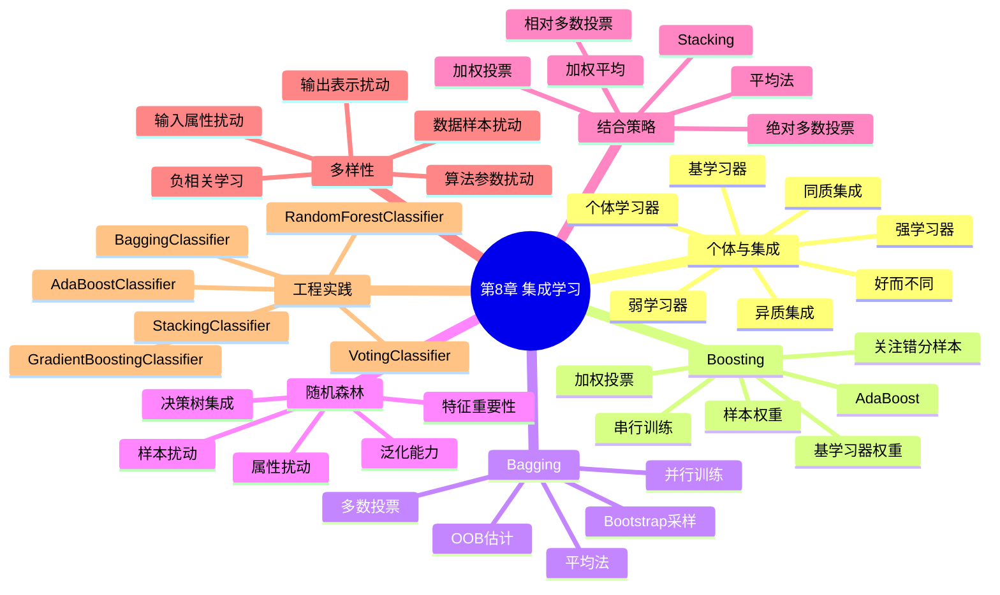

# 第8章 集成学习

## 学习目标
- 能够解释“好而不同”为什么是集成学习有效的核心条件。
- 能够区分 Bagging、Boosting、Stacking 的训练机制与适用场景。
- 能够说明随机森林如何通过样本与特征双重随机性降低方差。
- 能够基于 sklearn 完成多模型集成并做指标与参数对比分析。

## 关键词
- 集成学习（Ensemble Learning）
- 基学习器（Base Learner）
- Bagging（Bootstrap Aggregating）
- Boosting（AdaBoost / Gradient Boosting）
- 随机森林（Random Forest）
- Stacking
- OOB（Out-of-Bag）
- 多样性（Diversity）

## 核心概念与原理
### 关键定义
- **同质集成**：基学习器同类型，如多棵决策树。
- **异质集成**：基学习器不同类型，如 LR + SVM + 树。
- **结合策略**：投票、平均、加权、元学习器融合。

### 方法直觉
- 单模型会犯系统性错误，多模型若错误分布不同可相互纠偏。
- 集成本质是在“偏差、方差、相关误差”之间做工程折中。

### 与相近方法的区别
- 与单树相比：集成更稳健，但可解释性和推理速度常下降。
- 与神经网络集成相比：树集成在结构化数据上常更强、调参更直接。

## 关键公式与解释
- 简单平均（回归）：
\[
H(x)=\frac{1}{T}\sum_{t=1}^{T}h_t(x)
\]
- 加权投票（分类）：
\[
H(x)=\arg\max_{c}\sum_{t=1}^{T}w_t I(h_t(x)=c)
\]
- AdaBoost 基学习器权重：
\[
\alpha_t=\frac{1}{2}\ln\frac{1-\epsilon_t}{\epsilon_t}
\]
- 作用：融合多个模型输出，降低单模型误差波动。
- 常见误用点：只增加基学习器数量而忽略多样性；Stacking 发生数据泄漏。

## 算法流程 / 方法步骤
1. **构建基线模型**：输入原始数据，输出单模型结果；目的为对照集成收益。
2. **生成多学习器**：输入采样策略或序列策略，输出基学习器集合；目的为引入差异性。
3. **融合预测**：输入多个模型输出，输出最终预测；目的为降低总体误差。
4. **参数联调**：输入 `n_estimators`、`max_depth`、`learning_rate` 等，输出最优组合；目的为平衡偏差方差。
5. **结果解释**：输入指标与特征重要性，输出模型选择建议；目的为可部署决策。

## 实践示例（Python/sklearn）
```python
from sklearn.datasets import load_breast_cancer
from sklearn.model_selection import train_test_split
from sklearn.ensemble import RandomForestClassifier
from sklearn.metrics import f1_score

X, y = load_breast_cancer(return_X_y=True)
X_train, X_test, y_train, y_test = train_test_split(
    X, y, test_size=0.2, random_state=42, stratify=y
)

rf = RandomForestClassifier(
    n_estimators=300, max_features="sqrt", oob_score=True, random_state=42, n_jobs=-1
)
rf.fit(X_train, y_train)
pred = rf.predict(X_test)

print("f1:", f1_score(y_test, pred))
print("oob_score:", rf.oob_score_)
```
- 关键参数：`n_estimators` 提升稳定性；`max_features` 影响多样性；`oob_score` 提供近似泛化估计。
- 结果观察：同时看 OOB 与测试集指标，检查是否过拟合。

## 常见易错点
- 错因：把 Bagging 和 Boosting 视为同一种训练逻辑。纠正建议：记住前者并行、后者串行纠错。
- 错因：Stacking 直接用训练集预测训练元模型。纠正建议：使用 out-of-fold 预测。
- 错因：只看准确率。纠正建议：类别不平衡场景重点看 F1、召回、PR-AUC。
- 错因：随机森林特征重要性直接解释因果。纠正建议：仅作相关性线索，需额外因果验证。

## 练习
1. **概念题**：何谓“好而不同”，为何集成学习离不开它？  
   参考要点：个体需有一定准确且错误不完全重合，才能互补。
2. **理解题**：随机森林为何通常比单棵树稳定？  
   参考要点：样本与特征随机化 + 投票平均降低方差。
3. **应用题**：何时优先尝试 Boosting 而不是 Bagging？  
   参考要点：希望降低偏差、追求更高精度、数据质量较好时。
4. **综合题（参数分析）**：将 `n_estimators` 从 100 增到 1000 后测试分数提升很小但耗时大增，如何决策？  
   参考要点：出现收益递减，应在性能-延迟-成本间选折中点。

## 小结
- 集成学习通过组合多个模型提升泛化与稳定性。
- Bagging 偏降方差，Boosting 偏降偏差，Stacking 学习组合策略。
- 随机森林是结构化数据高性价比强基线。
- 工程实践中防泄漏、看多指标、做成本评估同样关键。

> 建议文件路径：`knowledge_base/machine_learning/08_ensemble_learning.md`  
> 适用课程：机器学习导论 / 机器学习  
> 章节定位：以周志华《机器学习》第8章“集成学习”的知识框架为主线，围绕个体学习器、集成策略、Boosting、Bagging、随机森林、结合策略和多样性展开，并补充工程实践中常用的 Voting、Stacking、Gradient Boosting、HistGradientBoosting 与 sklearn 实现。  
> 知识库用途：用于 ML-EduAgent 的课程检索、个性化讲解、题库生成、代码案例生成、OpenMAIC 互动课堂生成。

---

## 0. 章节元信息

```yaml
chapter_id: "08_ensemble_learning"
chapter_title: "第8章 集成学习"
course: "机器学习"
difficulty: "中等"
chapter_standard:
  - 周志华《机器学习》第8章：集成学习
core_sections:
  - 个体与集成
  - Boosting
  - Bagging与随机森林
  - 结合策略
  - 多样性
extended_sections:
  - Voting
  - Stacking
  - Gradient Boosting
  - Histogram Gradient Boosting
  - Extra Trees
  - sklearn工程实践
prerequisites:
  - 决策树
  - 线性模型
  - 贝叶斯分类器
  - 支持向量机
  - 模型评估
  - 偏差-方差基本思想
keywords:
  - 集成学习
  - ensemble learning
  - 个体学习器
  - 基学习器
  - 弱学习器
  - 强学习器
  - Boosting
  - AdaBoost
  - Bagging
  - Bootstrap Aggregating
  - 随机森林
  - Random Forest
  - Extra Trees
  - Voting
  - Averaging
  - Stacking
  - Gradient Boosting
  - HistGradientBoosting
  - 结合策略
  - 多样性
  - diversity
  - out-of-bag
  - OOB
  - 偏差
  - 方差
  - 泛化能力
resource_types:
  - 个性化讲解文档
  - 思维导图
  - 算法流程
  - 公式推导
  - 代码案例
  - 练习题
  - OpenMAIC课堂生成Prompt
  - PBL实践任务
```

---

## 1. 本章学习目标

学完本章后，学生应能够：

1. 解释集成学习的基本思想：通过组合多个学习器来提升泛化性能。
2. 区分个体学习器、基学习器、同质集成、异质集成、弱学习器和强学习器。
3. 理解“好而不同”的集成学习核心要求：个体学习器既要有一定准确性，又要具有差异性。
4. 掌握 Boosting 的基本思想：串行训练多个学习器，后续学习器重点关注前面学习器分错的样本。
5. 掌握 AdaBoost 的样本权重更新、基学习器权重计算和加权投票规则。
6. 掌握 Bagging 的基本思想：通过 bootstrap 采样生成多个训练子集，并行训练多个学习器后投票或平均。
7. 理解随机森林如何在 Bagging 的基础上引入随机属性选择，进一步增强多样性。
8. 掌握常见结合策略：平均法、投票法、学习法。
9. 理解多样性在集成学习中的作用，以及多样性增强的常见方法。
10. 能够使用 sklearn 实现 Bagging、RandomForest、AdaBoost、GradientBoosting、Voting、Stacking 等模型，并进行实验对比。

---

## 2. 本章知识结构



---

## 3. 集成学习的基本思想

集成学习（Ensemble Learning）通过构建并结合多个学习器来完成学习任务。相比单一模型，集成模型往往能获得更好的泛化性能、更高的稳定性和更强的鲁棒性。

假设有多个个体学习器：

\[
h_1(x), h_2(x), \cdots, h_T(x)
\]

集成学习通过某种结合策略得到最终模型：

\[
H(x)=F(h_1(x), h_2(x), \cdots, h_T(x))
\]

其中：

- \(h_t(x)\)：第 \(t\) 个个体学习器；
- \(T\)：个体学习器数量；
- \(F(\cdot)\)：结合策略，例如投票、平均、加权平均、学习器组合等。

直观理解：

> 单个模型可能会犯错，但多个模型如果错误不完全相同，组合后有机会互相弥补，从而得到更稳定、更准确的预测结果。

---

## 4. 个体学习器与集成

### 4.1 个体学习器

集成中的每一个模型称为个体学习器，也常称为基学习器。

常见基学习器包括：

- 决策树；
- 线性模型；
- 朴素贝叶斯；
- 支持向量机；
- 神经网络；
- KNN；
- 逻辑回归。

### 4.2 同质集成与异质集成

根据个体学习器类型是否相同，可以分为：

| 类型 | 含义 | 示例 |
|---|---|---|
| 同质集成 | 个体学习器属于同一类型 | 多棵决策树组成随机森林 |
| 异质集成 | 个体学习器属于不同类型 | 决策树 + SVM + Logistic 回归组成 Voting / Stacking |

同质集成中的个体学习器通常也称为基学习器；异质集成中的个体学习器有时称为组件学习器。

### 4.3 弱学习器与强学习器

弱学习器通常指性能略好于随机猜测的学习器。强学习器则具有较高预测性能。

Boosting 的重要思想之一是：

> 将多个弱学习器组合起来，可以得到一个强学习器。

例如 AdaBoost 常使用浅层决策树，也就是决策树桩（decision stump）作为弱学习器。

### 4.4 “好而不同”

集成学习要有效，个体学习器需要满足两个条件：

1. **准确性**：每个学习器不能太差，至少要比随机猜测好；
2. **多样性**：学习器之间要有差异，错误不能完全相同。

如果多个学习器完全一样，那么集成没有意义。  
如果多个学习器都很差，即使组合起来也难以获得好结果。

因此集成学习的核心可以概括为：

> 个体学习器要“好而不同”。

---

## 5. 为什么集成学习有效？

### 5.1 从投票角度理解

假设有 \(T\) 个二分类器，每个分类器独立出错概率为 \(\epsilon\)，且：

\[
\epsilon < 0.5
\]

如果使用多数投票，集成错误发生在超过一半分类器都出错的情况下：

\[
P(H(x)\neq y)=
\sum_{k=\lceil T/2\rceil}^{T}
\binom{T}{k}\epsilon^k(1-\epsilon)^{T-k}
\]

当个体学习器误差小于 0.5 且相互独立时，随着学习器数量增加，集成错误率会下降。

### 5.2 现实中的限制

上述结论依赖“独立性”假设。但现实中个体学习器通常不独立，尤其当它们使用相同数据和相同算法训练时，错误可能高度相关。

因此集成学习不仅要求个体准确，还要求个体之间具有多样性。

### 5.3 从偏差-方差角度理解

集成学习常见作用：

- Bagging 主要降低方差；
- Boosting 常能降低偏差，也可能降低方差；
- Random Forest 通过样本扰动和属性扰动降低树模型方差；
- Stacking 通过学习组合方式提升整体表现。

---

## 6. Boosting

### 6.1 Boosting 的基本思想

Boosting 是一类串行集成方法。它按照顺序训练多个学习器，每一轮训练都会根据上一轮结果调整训练样本权重，使后续学习器更加关注前面被错误分类的样本。

基本流程：

```text
初始化样本权重
for t = 1 ... T:
    使用当前样本权重训练基学习器 h_t
    计算 h_t 的错误率
    根据错误率计算 h_t 的权重
    增大被错分样本的权重
    减小被正确分类样本的权重
最终将所有 h_t 按权重组合
```

Boosting 的关键特点：

- 个体学习器串行训练；
- 后一个学习器依赖前一个学习器的表现；
- 错分样本在后续训练中更重要；
- 最终通常使用加权投票或加权求和。

---

## 7. AdaBoost

AdaBoost 是 Boosting 中最经典的算法之一。

### 7.1 训练数据

给定训练集：

\[
D=\{(x_1,y_1),(x_2,y_2),\cdots,(x_m,y_m)\}
\]

其中：

\[
y_i\in\{-1,+1\}
\]

### 7.2 初始化样本权重

初始时，每个样本权重相同：

\[
D_1(i)=\frac{1}{m}
\]

其中 \(D_t(i)\) 表示第 \(t\) 轮中第 \(i\) 个样本的权重。

### 7.3 训练基学习器

第 \(t\) 轮使用当前样本权重 \(D_t\) 训练基学习器：

\[
h_t(x)
\]

### 7.4 计算加权错误率

\[
\epsilon_t
=
\sum_{i=1}^{m}D_t(i)I(h_t(x_i)\neq y_i)
\]

其中 \(I(\cdot)\) 是指示函数。

### 7.5 计算基学习器权重

\[
\alpha_t
=
\frac{1}{2}\ln\frac{1-\epsilon_t}{\epsilon_t}
\]

如果错误率越低，\(\alpha_t\) 越大，该学习器在最终投票中的话语权越大。

当 \(\epsilon_t=0.5\) 时：

\[
\alpha_t=0
\]

说明该学习器只相当于随机猜测，不应贡献最终结果。

### 7.6 更新样本权重

\[
D_{t+1}(i)
=
\frac{D_t(i)}{Z_t}
\exp(-\alpha_t y_i h_t(x_i))
\]

其中 \(Z_t\) 是归一化因子，使得权重和为 1。

对于正确分类样本：

\[
y_i h_t(x_i)=1
\]

权重变为：

\[
D_t(i)\exp(-\alpha_t)
\]

会减小。

对于错误分类样本：

\[
y_i h_t(x_i)=-1
\]

权重变为：

\[
D_t(i)\exp(\alpha_t)
\]

会增大。

### 7.7 最终分类器

\[
H(x)
=
sign\left(
\sum_{t=1}^{T}\alpha_t h_t(x)
\right)
\]

即每个基学习器按其权重进行加权投票。

### 7.8 AdaBoost 的直观理解

AdaBoost 像一个不断纠错的学习系统：

1. 第一轮先训练一个简单模型；
2. 看它错在哪里；
3. 下一轮让错分样本权重变大；
4. 新模型重点学习这些难样本；
5. 多轮后，将多个模型按表现加权组合。

### 7.9 AdaBoost 常见特点

优点：

- 理论基础强；
- 可以将弱学习器提升为强学习器；
- 实现相对简单；
- 常与决策树桩配合使用；
- 能自动关注难分类样本。

局限：

- 对噪声和异常值敏感；
- 错误标注样本可能被不断提高权重；
- 基学习器太强时可能过拟合；
- 对类别极度不平衡数据需要谨慎处理。

---

## 8. Bagging

### 8.1 Bagging 的基本思想

Bagging 是 Bootstrap Aggregating 的缩写，中文通常称为自助聚合。

它的核心思想是：

> 从原始训练集中通过有放回采样生成多个训练子集，在每个子集上训练一个基学习器，再通过投票或平均组合预测结果。

Bagging 的训练过程是并行的，每个基学习器之间相互独立。

### 8.2 Bootstrap 采样

给定包含 \(m\) 个样本的训练集，每次从中有放回地采样 \(m\) 次，得到一个大小为 \(m\) 的训练子集。

由于是有放回采样：

- 某些样本可能出现多次；
- 某些样本可能一次都没有出现。

一个样本在一次 bootstrap 采样中没有被选中的概率为：

\[
(1-\frac{1}{m})^m
\]

当 \(m\) 很大时：

\[
(1-\frac{1}{m})^m \approx e^{-1}\approx 0.368
\]

因此，一个样本至少出现一次的概率约为：

\[
1-0.368=0.632
\]

这就是常说的 bootstrap 样本大约包含原始数据中 63.2% 的不同样本。

### 8.3 Bagging 算法流程

```text
输入：训练集 D，基学习算法 L，集成规模 T

for t = 1 ... T:
    从 D 中有放回采样得到 D_t
    使用 D_t 训练基学习器 h_t

分类任务：
    对 h_1, h_2, ..., h_T 的预测结果进行多数投票

回归任务：
    对 h_1, h_2, ..., h_T 的预测值进行平均
```

### 8.4 Bagging 的作用

Bagging 主要用于降低模型方差，尤其适合不稳定学习器。

不稳定学习器指训练数据稍微变化，模型就会明显变化的算法，例如：

- 决策树；
- 高方差模型；
- 小样本下容易波动的模型。

决策树与 Bagging 非常适配，因为单棵决策树方差较大，而 Bagging 多棵树可以显著提高稳定性。

### 8.5 OOB 估计

在每次 bootstrap 采样中，约 36.8% 的样本没有被选中。对于某个样本，可以使用没有包含该样本的基学习器来预测它，并估计泛化误差。

这称为包外估计（Out-of-Bag Estimate, OOB）。

OOB 的优点：

- 不需要额外验证集；
- 可以评估模型泛化性能；
- 在随机森林中非常常用。

---

## 9. 随机森林

### 9.1 随机森林与 Bagging 的关系

随机森林（Random Forest）是在 Bagging 基础上的扩展，通常使用决策树作为基学习器。

它引入两类随机性：

1. **样本随机性**：通过 bootstrap 采样生成不同训练子集；
2. **属性随机性**：在每个节点分裂时，只从随机选择的一部分特征中寻找最优划分。

因此，随机森林可以看作：

```text
Bagging + 决策树 + 随机特征选择
```

### 9.2 随机森林算法流程

```text
输入：训练集 D，树的数量 T，每次分裂候选特征数量 k

for t = 1 ... T:
    使用 bootstrap 从 D 中采样得到 D_t
    用 D_t 训练一棵决策树
    在每个节点分裂时：
        随机选择 k 个特征
        从 k 个特征中选择最优划分特征
        继续生长决策树

分类任务：
    多数投票

回归任务：
    平均预测
```

### 9.3 随机森林为什么有效？

随机森林有效的原因：

1. 决策树本身表达能力强，但方差大；
2. Bagging 可以降低方差；
3. 随机特征选择增加了树之间的差异；
4. 多棵树投票可以减少单棵树的偶然错误；
5. 对非线性关系和特征交互有较强建模能力。

### 9.4 随机森林的重要参数

| 参数 | 含义 | 常见影响 |
|---|---|---|
| `n_estimators` | 树的数量 | 越大越稳定，但计算成本更高 |
| `max_depth` | 树最大深度 | 控制单棵树复杂度 |
| `max_features` | 每次分裂考虑的特征数量 | 控制树之间多样性 |
| `min_samples_split` | 内部节点继续分裂所需最小样本数 | 控制过拟合 |
| `min_samples_leaf` | 叶节点最小样本数 | 控制叶节点过细 |
| `bootstrap` | 是否 bootstrap 采样 | 是否启用样本扰动 |
| `oob_score` | 是否使用 OOB 估计 | 可用于泛化误差估计 |
| `class_weight` | 类别权重 | 用于类别不平衡 |

### 9.5 随机森林优点

- 泛化性能强；
- 不容易过拟合；
- 可以处理非线性问题；
- 对特征尺度不敏感；
- 可估计特征重要性；
- 训练可并行；
- 可用于分类和回归。

### 9.6 随机森林局限

- 模型较大，解释性不如单棵树；
- 推理时需要多棵树参与，速度慢于单模型；
- 对高维稀疏文本特征不一定优于线性模型；
- 特征重要性可能偏向取值较多或连续变量；
- 对外推能力较弱。

---

## 10. 结合策略

集成学习的关键不只是训练多个学习器，还包括如何组合它们的输出。

### 10.1 平均法

常用于回归任务。

简单平均：

\[
H(x)=\frac{1}{T}\sum_{t=1}^{T}h_t(x)
\]

加权平均：

\[
H(x)=\sum_{t=1}^{T}w_t h_t(x)
\]

其中：

\[
w_t\geq0,\quad \sum_{t=1}^{T}w_t=1
\]

加权平均适合个体学习器性能差异明显的情况。

### 10.2 投票法

常用于分类任务。

#### 10.2.1 绝对多数投票

某类别获得超过半数票时，预测为该类别；否则拒绝预测。

#### 10.2.2 相对多数投票

选择得票最多的类别，即使没有超过半数。

#### 10.2.3 加权投票

每个学习器的投票带权重：

\[
H(x)=\arg\max_{c_j}\sum_{t=1}^{T}w_t I(h_t(x)=c_j)
\]

AdaBoost 就是一种加权投票形式。

### 10.3 学习法

学习法不预先固定组合规则，而是再训练一个学习器来组合多个模型的输出。

典型方法是 Stacking。

---

## 11. Voting

Voting 是最直观的集成方式，常用于异质学习器组合。

### 11.1 Hard Voting

Hard Voting 直接对类别标签投票：

```text
模型1预测 A
模型2预测 B
模型3预测 A
最终预测 A
```

### 11.2 Soft Voting

Soft Voting 对类别概率求平均或加权平均：

\[
P(c|x)=\frac{1}{T}\sum_{t=1}^{T}P_t(c|x)
\]

选择平均概率最大的类别。

Soft Voting 通常要求各模型能输出较可靠的概率估计。

### 11.3 Voting 适用场景

适合：

- 多个模型性能接近；
- 模型类型差异较大；
- 想快速构建集成基线；
- 希望提升稳定性。

不适合：

- 各模型高度相似；
- 个体模型性能差异极大；
- 概率输出未校准却使用 soft voting。

---

## 12. Stacking

### 12.1 Stacking 基本思想

Stacking 通过训练一个元学习器来学习如何组合多个基学习器。

流程：

```text
训练多个基学习器
↓
使用基学习器产生预测结果
↓
把这些预测结果作为新特征
↓
训练元学习器
↓
由元学习器输出最终预测
```

### 12.2 为什么需要交叉验证？

如果直接用基学习器在训练集上的预测结果训练元学习器，会产生数据泄漏，因为基学习器已经见过这些训练样本。

因此 Stacking 常使用交叉验证产生 out-of-fold 预测：

```text
将训练集分成 K 折
每次用 K-1 折训练基模型
用剩下 1 折生成预测
拼接所有折预测作为元学习器训练数据
```

### 12.3 Stacking 的优缺点

优点：

- 能学习复杂组合方式；
- 适合异质模型；
- 在比赛和工程中常见。

缺点：

- 实现和调试复杂；
- 容易数据泄漏；
- 训练成本较高；
- 解释性较弱。

---

## 13. Gradient Boosting

### 13.1 基本思想

Gradient Boosting 也是 Boosting 家族方法，但它不是简单调整样本权重，而是让后续模型拟合当前模型的残差或负梯度方向。

基本形式：

\[
F_M(x)=\sum_{m=1}^{M}\nu h_m(x)
\]

其中：

- \(h_m(x)\)：第 \(m\) 个基学习器；
- \(\nu\)：学习率；
- \(M\)：学习器数量。

每一轮都在当前模型基础上增加一个新学习器，使整体损失继续下降。

### 13.2 与 AdaBoost 的区别

| 对比项 | AdaBoost | Gradient Boosting |
|---|---|---|
| 核心机制 | 调整样本权重 | 拟合损失函数负梯度 |
| 常用基学习器 | 决策树桩 | 回归树 |
| 损失函数 | 指数损失思想 | 可使用多种可微损失 |
| 任务 | 分类为主，也可回归 | 分类和回归都常用 |
| 工程扩展 | AdaBoostClassifier | GradientBoosting、XGBoost、LightGBM、CatBoost 等 |

### 13.3 HistGradientBoosting

Histogram-based Gradient Boosting 使用直方图分箱加速训练，在大样本上通常比传统 GradientBoosting 更快，也支持一些现代功能。

---

## 14. 多样性

### 14.1 什么是多样性？

多样性指不同个体学习器之间的差异程度。集成学习希望个体学习器犯不同的错误。

如果所有学习器完全一样，则：

\[
h_1(x)=h_2(x)=\cdots=h_T(x)
\]

此时集成等价于单个学习器，没有提升效果。

### 14.2 多样性的来源

常见增强多样性的方法：

| 方法 | 思想 | 示例 |
|---|---|---|
| 数据样本扰动 | 使用不同训练子集 | Bagging、随机森林 |
| 输入属性扰动 | 使用不同特征子集 | 随机森林 |
| 输出表示扰动 | 改变标签表示 | ECOC |
| 算法参数扰动 | 使用不同参数设置 | 不同深度的树 |
| 算法类型扰动 | 使用不同算法 | Voting、Stacking |
| 随机性扰动 | 使用随机初始化 | 神经网络集成 |

### 14.3 准确性与多样性的权衡

集成学习中存在一个重要权衡：

- 个体太弱：即使多样，也难以组合出强模型；
- 个体太强且相似：准确但缺乏多样性，集成提升有限；
- 个体适度准确且差异明显：最适合集成。

---

## 15. 集成学习与偏差-方差

### 15.1 Bagging 降低方差

Bagging 通过对训练数据重采样训练多个模型，再取平均或投票，能够降低不稳定模型的方差。

典型例子：

```text
单棵决策树：低偏差，高方差
Bagging/随机森林：降低方差，提升稳定性
```

### 15.2 Boosting 降低偏差

Boosting 按顺序训练模型，后续模型不断纠正前面模型的错误，因此常能降低偏差。

但如果数据有噪声或异常点，Boosting 可能过度关注难样本，导致过拟合。

### 15.3 Stacking 提升组合表达能力

Stacking 不使用固定投票或平均，而是学习如何组合多个模型预测，通常能在复杂任务中提升效果，但也更容易发生数据泄漏。

---

## 16. sklearn 实践：VotingClassifier

```python
from sklearn.datasets import load_breast_cancer
from sklearn.model_selection import train_test_split
from sklearn.preprocessing import StandardScaler
from sklearn.pipeline import Pipeline
from sklearn.linear_model import LogisticRegression
from sklearn.svm import SVC
from sklearn.tree import DecisionTreeClassifier
from sklearn.ensemble import VotingClassifier
from sklearn.metrics import accuracy_score, classification_report

X, y = load_breast_cancer(return_X_y=True)

X_train, X_test, y_train, y_test = train_test_split(
    X, y, test_size=0.2, random_state=42, stratify=y
)

clf1 = Pipeline([
    ("scaler", StandardScaler()),
    ("lr", LogisticRegression(max_iter=1000))
])

clf2 = Pipeline([
    ("scaler", StandardScaler()),
    ("svc", SVC(probability=True))
])

clf3 = DecisionTreeClassifier(max_depth=4, random_state=42)

voting = VotingClassifier(
    estimators=[
        ("lr", clf1),
        ("svc", clf2),
        ("tree", clf3)
    ],
    voting="soft"
)

voting.fit(X_train, y_train)
pred = voting.predict(X_test)

print("accuracy:", accuracy_score(y_test, pred))
print(classification_report(y_test, pred))
```

---

## 17. sklearn 实践：BaggingClassifier

```python
from sklearn.datasets import load_breast_cancer
from sklearn.model_selection import train_test_split
from sklearn.tree import DecisionTreeClassifier
from sklearn.ensemble import BaggingClassifier
from sklearn.metrics import accuracy_score, classification_report

X, y = load_breast_cancer(return_X_y=True)

X_train, X_test, y_train, y_test = train_test_split(
    X, y, test_size=0.2, random_state=42, stratify=y
)

base_tree = DecisionTreeClassifier(max_depth=None, random_state=42)

bagging = BaggingClassifier(
    estimator=base_tree,
    n_estimators=100,
    max_samples=0.8,
    bootstrap=True,
    random_state=42,
    n_jobs=-1
)

bagging.fit(X_train, y_train)
pred = bagging.predict(X_test)

print("accuracy:", accuracy_score(y_test, pred))
print(classification_report(y_test, pred))
```

---

## 18. sklearn 实践：RandomForestClassifier

```python
from sklearn.datasets import load_breast_cancer
from sklearn.model_selection import train_test_split
from sklearn.ensemble import RandomForestClassifier
from sklearn.metrics import accuracy_score, classification_report

X, y = load_breast_cancer(return_X_y=True)

X_train, X_test, y_train, y_test = train_test_split(
    X, y, test_size=0.2, random_state=42, stratify=y
)

rf = RandomForestClassifier(
    n_estimators=200,
    max_depth=None,
    max_features="sqrt",
    oob_score=True,
    random_state=42,
    n_jobs=-1
)

rf.fit(X_train, y_train)
pred = rf.predict(X_test)

print("test accuracy:", accuracy_score(y_test, pred))
print("oob score:", rf.oob_score_)
print(classification_report(y_test, pred))

# 查看特征重要性
importances = rf.feature_importances_
top_idx = importances.argsort()[-10:][::-1]
print("top feature indices:", top_idx)
print("top importances:", importances[top_idx])
```

---

## 19. sklearn 实践：AdaBoostClassifier

```python
from sklearn.datasets import load_breast_cancer
from sklearn.model_selection import train_test_split
from sklearn.tree import DecisionTreeClassifier
from sklearn.ensemble import AdaBoostClassifier
from sklearn.metrics import accuracy_score, classification_report

X, y = load_breast_cancer(return_X_y=True)

X_train, X_test, y_train, y_test = train_test_split(
    X, y, test_size=0.2, random_state=42, stratify=y
)

base = DecisionTreeClassifier(max_depth=1, random_state=42)

ada = AdaBoostClassifier(
    estimator=base,
    n_estimators=100,
    learning_rate=0.5,
    random_state=42
)

ada.fit(X_train, y_train)
pred = ada.predict(X_test)

print("accuracy:", accuracy_score(y_test, pred))
print(classification_report(y_test, pred))
```

---

## 20. sklearn 实践：GradientBoostingClassifier

```python
from sklearn.datasets import load_breast_cancer
from sklearn.model_selection import train_test_split
from sklearn.ensemble import GradientBoostingClassifier
from sklearn.metrics import accuracy_score, classification_report

X, y = load_breast_cancer(return_X_y=True)

X_train, X_test, y_train, y_test = train_test_split(
    X, y, test_size=0.2, random_state=42, stratify=y
)

gb = GradientBoostingClassifier(
    n_estimators=150,
    learning_rate=0.05,
    max_depth=3,
    random_state=42
)

gb.fit(X_train, y_train)
pred = gb.predict(X_test)

print("accuracy:", accuracy_score(y_test, pred))
print(classification_report(y_test, pred))
```

---

## 21. sklearn 实践：StackingClassifier

```python
from sklearn.datasets import load_breast_cancer
from sklearn.model_selection import train_test_split
from sklearn.preprocessing import StandardScaler
from sklearn.pipeline import Pipeline
from sklearn.linear_model import LogisticRegression
from sklearn.svm import SVC
from sklearn.tree import DecisionTreeClassifier
from sklearn.ensemble import RandomForestClassifier, StackingClassifier
from sklearn.metrics import accuracy_score, classification_report

X, y = load_breast_cancer(return_X_y=True)

X_train, X_test, y_train, y_test = train_test_split(
    X, y, test_size=0.2, random_state=42, stratify=y
)

estimators = [
    ("lr", Pipeline([
        ("scaler", StandardScaler()),
        ("lr", LogisticRegression(max_iter=1000))
    ])),
    ("svc", Pipeline([
        ("scaler", StandardScaler()),
        ("svc", SVC(probability=True))
    ])),
    ("rf", RandomForestClassifier(n_estimators=100, random_state=42))
]

stacking = StackingClassifier(
    estimators=estimators,
    final_estimator=LogisticRegression(max_iter=1000),
    cv=5,
    n_jobs=-1
)

stacking.fit(X_train, y_train)
pred = stacking.predict(X_test)

print("accuracy:", accuracy_score(y_test, pred))
print(classification_report(y_test, pred))
```

---

## 22. 集成学习工程实践建议

### 22.1 什么时候优先使用随机森林？

适合：

- 表格数据；
- 非线性关系；
- 特征交互明显；
- 希望快速得到强基线；
- 希望查看特征重要性；
- 对特征标准化不想过度依赖。

不适合：

- 极高维稀疏文本特征；
- 对模型解释性要求极高；
- 推理延迟要求极低；
- 需要外推预测的回归任务。

### 22.2 什么时候使用 Boosting？

适合：

- 希望进一步提升精度；
- 数据质量较好；
- 可以进行调参；
- 表格数据预测任务；
- 需要强模型表现。

注意：

- 对噪声更敏感；
- 学习率和树数量需要配合；
- 训练通常比随机森林更依赖调参。

### 22.3 什么时候使用 Voting / Stacking？

适合：

- 已经有多个表现不错但错误不同的模型；
- 比赛场景；
- 需要融合不同模型优势；
- 允许较高训练成本。

注意：

- Stacking 要避免数据泄漏；
- Soft Voting 需要概率输出较可靠；
- 不同模型太相似时收益有限。

---

## 23. 常见易错点

1. 认为集成学习一定比单模型好。若基学习器很差或高度相似，集成效果可能有限。
2. 只增加学习器数量，不关注多样性。
3. 混淆 Bagging 和 Boosting：Bagging 通常并行，Boosting 通常串行。
4. 混淆随机森林和普通 Bagging：随机森林在节点划分时还会随机选择特征子集。
5. 认为 AdaBoost 只是在做简单投票。实际上它有样本权重更新和基学习器权重。
6. 忽略 AdaBoost 对噪声和异常值的敏感性。
7. 使用 Stacking 时发生数据泄漏。
8. Soft Voting 中使用未校准的概率，导致组合效果不佳。
9. 只看准确率，不看召回率、F1、混淆矩阵。
10. 把随机森林特征重要性当成绝对因果解释。
11. 忽略 OOB 估计的适用前提：通常需要 bootstrap。
12. 在小数据集上盲目使用复杂集成，可能过拟合。

---

## 24. 面向不同学生画像的学习建议

### 24.1 数学基础较弱

推荐路径：

```text
先理解“多个模型投票”
→ 再理解“好而不同”
→ 再看 Bagging 和 Boosting 区别
→ 最后理解随机森林
```

资源形式：

- 图文解释；
- 类比投票；
- 少量公式；
- 流程图。

### 24.2 有 Python 基础但理论弱

推荐路径：

```text
先跑 RandomForestClassifier
→ 查看特征重要性
→ 再跑 AdaBoostClassifier
→ 比较 Bagging 和 Boosting 的结果
→ 最后尝试 Stacking
```

资源形式：

- sklearn 代码；
- 参数实验；
- 模型对比表；
- 混淆矩阵。

### 24.3 准备考试

推荐路径：

```text
个体与集成
→ AdaBoost公式
→ Bagging采样
→ 随机森林
→ 结合策略
→ 多样性
```

资源形式：

- 公式卡片；
- 简答题；
- 判断题；
- 算法流程题。

### 24.4 想做项目实践

推荐路径：

```text
乳腺癌二分类
→ Logistic回归基线
→ 决策树
→ Bagging
→ RandomForest
→ AdaBoost
→ GradientBoosting
→ Stacking
```

资源形式：

- PBL 项目；
- sklearn Pipeline；
- GridSearchCV；
- 模型对比实验报告。

---

## 25. 练习题库

### 25.1 选择题

**1. 集成学习的基本思想是？**

A. 只使用一个最复杂模型  
B. 组合多个学习器提升泛化性能  
C. 删除训练样本  
D. 只做无监督学习  

答案：B

**2. Bagging 的核心机制是？**

A. 调整错分样本权重  
B. Bootstrap 采样并并行训练多个学习器  
C. 只使用一个线性模型  
D. 删除所有弱学习器  

答案：B

**3. Boosting 的训练方式通常是？**

A. 完全并行  
B. 串行迭代，后续学习器关注前面错误  
C. 不需要标签  
D. 只进行聚类  

答案：B

**4. 随机森林相比普通 Bagging 决策树额外引入了什么随机性？**

A. 标签随机打乱  
B. 节点划分时随机选择特征子集  
C. 随机删除类别  
D. 随机改变损失函数  

答案：B

**5. AdaBoost 中基学习器错误率越低，其权重通常如何变化？**

A. 越大  
B. 越小  
C. 恒为 0  
D. 与错误率无关  

答案：A

**6. Stacking 的核心思想是？**

A. 简单多数投票  
B. 训练元学习器组合基学习器输出  
C. 使用 bootstrap 采样  
D. 只训练一棵树  

答案：B

### 25.2 判断题

1. 集成学习中个体学习器越相同越好。  
答案：错误。集成学习需要多样性。

2. Bagging 通常有助于降低方差。  
答案：正确。

3. Boosting 通常是并行训练所有基学习器。  
答案：错误。Boosting 通常是串行训练。

4. 随机森林可以进行 OOB 估计。  
答案：正确。

5. Soft Voting 不需要模型输出概率。  
答案：错误。Soft Voting 通常依赖概率输出。

### 25.3 简答题

**1. 什么是“好而不同”？为什么它对集成学习重要？**

参考答案：好而不同指个体学习器既要具有一定准确性，又要有差异性。若学习器太差，组合后难以得到强模型；若学习器完全相同，集成等价于单模型。只有准确且差异明显的学习器组合，才有可能互相弥补错误，提升泛化性能。

**2. Bagging 和 Boosting 有什么区别？**

参考答案：Bagging 通过 bootstrap 采样构造多个训练集，并行训练多个基学习器，最终投票或平均，主要降低方差；Boosting 串行训练多个基学习器，后续学习器关注前面学习器分错的样本，最终加权组合，常用于降低偏差并提升性能。

**3. 随机森林为什么比单棵决策树更稳定？**

参考答案：单棵决策树对训练数据扰动敏感，方差较高。随机森林通过 bootstrap 采样训练多棵树，并在节点划分时随机选择特征子集，使树之间具有差异，最终通过投票或平均降低方差，因此更稳定。

**4. AdaBoost 如何更新样本权重？**

参考答案：AdaBoost 在每轮训练后提高被当前基学习器错分样本的权重，降低被正确分类样本的权重，使下一轮基学习器更加关注难分类样本。同时，根据基学习器错误率计算其权重，错误率越低，最终投票权重越大。

**5. Stacking 为什么要使用交叉验证产生元学习器训练数据？**

参考答案：如果直接使用基学习器在训练集上的预测训练元学习器，基学习器已经见过这些样本，会造成数据泄漏。使用交叉验证产生 out-of-fold 预测，可以让元学习器看到更接近未见数据的预测结果，从而提高泛化能力。

### 25.4 计算题

**1. AdaBoost 中某基学习器加权错误率为 \(\epsilon=0.2\)，计算其权重 \(\alpha\)。**

\[
\alpha = \frac{1}{2}\ln\frac{1-\epsilon}{\epsilon}
=
\frac{1}{2}\ln\frac{0.8}{0.2}
=
\frac{1}{2}\ln4
\approx 0.693
\]

**2. 若某样本在当前轮被 AdaBoost 错分，且当前基学习器权重 \(\alpha=0.5\)，其未归一化权重将乘以多少？**

错分时：

\[
y_i h_t(x_i)=-1
\]

\[
D_{t+1}(i)\propto D_t(i)\exp(\alpha)
\]

因此乘以：

\[
e^{0.5}\approx1.648
\]

**3. 一个训练集有 \(m\) 个样本，Bagging 每轮进行 \(m\) 次有放回采样。某样本未被选中的概率近似是多少？**

\[
(1-\frac{1}{m})^m\approx e^{-1}\approx0.368
\]

因此被选中至少一次的概率约为：

\[
1-0.368=0.632
\]

### 25.5 编程题

**题目：使用集成学习完成乳腺癌二分类模型对比。**

要求：

1. 加载 `load_breast_cancer` 数据集；
2. 划分训练集和测试集；
3. 分别训练 LogisticRegression、DecisionTree、RandomForest、AdaBoost、GradientBoosting、Stacking；
4. 输出 accuracy、precision、recall、F1；
5. 绘制模型对比表；
6. 分析 Bagging 和 Boosting 的效果差异；
7. 尝试调整 `n_estimators`、`max_depth`、`learning_rate` 参数。

---

## 26. OpenMAIC 课堂生成 Prompt

```text
请基于以下内容生成一节面向本科机器学习学生的互动课堂。

【课程】
机器学习

【章节】
第8章 集成学习

【学习主题】
从 Bagging、Boosting 到随机森林

【学生画像】
学生已经学习过线性模型、决策树、支持向量机和贝叶斯分类器，有 Python 基础，但容易混淆 Bagging、Boosting、随机森林、Voting 和 Stacking。希望通过图文讲解、流程图、公式卡片、代码案例和模型对比实验掌握集成学习。

【知识库范围】
1. 个体学习器与集成学习
2. 好而不同：准确性与多样性
3. Boosting 与 AdaBoost
4. Bagging 与 bootstrap 采样
5. OOB 估计
6. 随机森林
7. 结合策略：平均法、投票法、学习法
8. 多样性增强方法
9. Voting、Stacking、Gradient Boosting
10. sklearn 工程实践

【生成要求】
1. 生成 8-10 页 slides；
2. 用图示解释多个学习器投票为什么可能更稳定；
3. 用流程图对比 Bagging 和 Boosting；
4. 用动画式步骤解释 AdaBoost 的样本权重更新；
5. 用图示解释随机森林的样本随机和特征随机；
6. 生成 6 道选择题、2 道简答题、2 道计算题、1 道编程题；
7. 生成一个 sklearn RandomForest + AdaBoost + Stacking 模型对比案例；
8. 生成一个 PBL 项目任务；
9. 难度控制在本科机器学习中等水平。
```

---

## 27. PBL 实践任务

### 任务名称

基于集成学习的乳腺癌二分类模型对比实验

### 任务背景

学生需要使用乳腺癌数据集完成二分类任务，对比单模型、Bagging、Boosting、随机森林和 Stacking 的表现，理解集成学习对泛化性能和稳定性的影响。

### 任务要求

1. 加载 `load_breast_cancer` 数据集；
2. 划分训练集和测试集；
3. 建立 Logistic 回归和单棵决策树作为基线；
4. 训练 BaggingClassifier；
5. 训练 RandomForestClassifier；
6. 训练 AdaBoostClassifier；
7. 训练 GradientBoostingClassifier；
8. 训练 StackingClassifier；
9. 输出 accuracy、precision、recall、F1、混淆矩阵；
10. 对比不同模型训练时间和预测效果；
11. 分析随机森林的特征重要性；
12. 总结 Bagging、Boosting 和 Stacking 的适用场景。

### 输出成果

- 实验代码；
- 模型对比表；
- 分类报告；
- 混淆矩阵；
- 特征重要性分析；
- 实验总结报告。

---

## 28. 知识库检索关键词

```text
集成学习
Ensemble Learning
个体学习器
基学习器
弱学习器
强学习器
好而不同
diversity
Boosting
AdaBoost
样本权重
加权错误率
基学习器权重
Bagging
Bootstrap Aggregating
bootstrap采样
OOB估计
out-of-bag
随机森林
Random Forest
Extra Trees
Voting
Hard Voting
Soft Voting
Stacking
StackingClassifier
Gradient Boosting
HistGradientBoosting
结合策略
平均法
投票法
学习法
多样性
偏差方差
RandomForestClassifier
AdaBoostClassifier
BaggingClassifier
VotingClassifier
GradientBoostingClassifier
```

---

## 29. 参考来源说明

本知识库依据以下资料整理：

1. 周志华《机器学习》第8章：集成学习
2. Zhou, Z.-H. Ensemble Learning. Encyclopedia of Biometrics, 2009.
3. Zhou, Z.-H. Ensemble Methods: Foundations and Algorithms.
4. scikit-learn 官方文档：Ensemble methods User Guide
5. scikit-learn 官方文档：sklearn.ensemble API
6. Breiman, L. Random Forests, Machine Learning, 2001.
7. Friedman, J. Greedy Function Approximation: A Gradient Boosting Machine, 2001.
8. Wolpert, D. Stacked Generalization, 1992.
