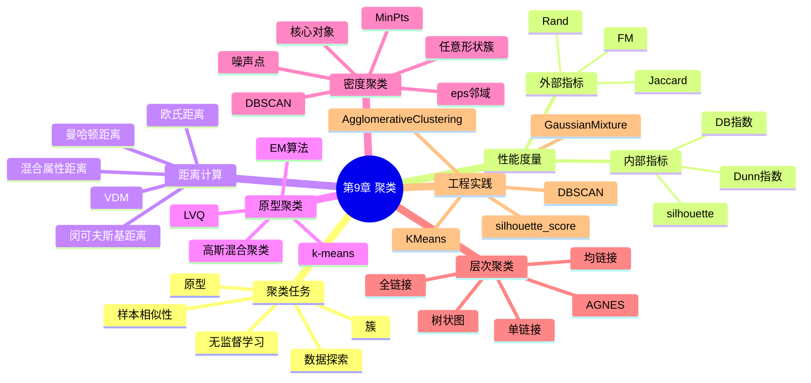

# 第9章 聚类

## 学习目标
- 能够解释聚类与分类在学习范式、输入信息与输出解释上的差异。
- 能够根据数据形态选择 k-means、GMM、DBSCAN 或层次聚类方法。
- 能够结合轮廓系数等指标与可视化结果评价聚类质量。
- 能够分析 `k`、`eps`、`min_samples` 等关键参数变化对结果的影响。

## 关键词
- 聚类（Clustering）
- 簇内紧凑 / 簇间分离
- k-means
- 高斯混合模型（GMM）
- DBSCAN
- 层次聚类（Hierarchical Clustering）
- 轮廓系数（Silhouette Score）
- 密度可达（Density Reachability）

## 核心概念与原理
### 关键定义
- **聚类**：在无标签数据中按相似性自动分组。
- **硬聚类/软聚类**：样本是否只能属于单个簇。
- **噪声点**：不属于任何高密度簇的样本。

### 方法直觉
- 聚类不是“找正确答案”，而是“发现可解释结构”。
- 不同算法隐含不同簇形状假设，需与数据分布匹配。

### 与相近方法的区别
- 与分类：聚类无标签，评估更依赖内部指标与业务解释。
- 与降维：降维强调表示压缩，聚类强调样本分组。

## 关键公式与解释
- k-means 目标：
\[
\min \sum_{i=1}^{k}\sum_{x\in C_i}\|x-\mu_i\|_2^2
\]
- 轮廓系数：
\[
s(i)=\frac{b(i)-a(i)}{\max(a(i),b(i))}
\]
- DBSCAN 核心判据：
\[
|N_{\varepsilon}(x)|\ge MinPts
\]
- 符号解释：\(a(i)\) 为簇内平均距离，\(b(i)\) 为最近其他簇平均距离。
- 误用点：在簇数为 1 或噪声过多时强行计算轮廓系数并解释。

## 算法流程 / 方法步骤
1. **数据预处理**：输入原始样本，输出标准化数据；目的为避免尺度主导距离。
2. **算法选择**：输入簇形态假设，输出候选算法；目的为匹配数据结构。
3. **参数搜索**：输入参数范围，输出候选聚类结果；目的为寻找稳定簇结构。
4. **质量评估**：输入聚类标签，输出内部指标与可视化；目的为验证结构合理性。
5. **业务解释**：输入簇统计画像，输出可执行洞察；目的为把聚类结果转化为决策。

## 实践示例（Python/sklearn）
```python
from sklearn.datasets import make_moons
from sklearn.preprocessing import StandardScaler
from sklearn.cluster import DBSCAN
from sklearn.metrics import silhouette_score

X, _ = make_moons(n_samples=400, noise=0.08, random_state=42)
X = StandardScaler().fit_transform(X)

model = DBSCAN(eps=0.25, min_samples=5)
labels = model.fit_predict(X)

valid = labels != -1
if len(set(labels[valid])) >= 2:
    print("silhouette:", silhouette_score(X[valid], labels[valid]))
print("noise_ratio:", (labels == -1).mean())
```
- 关键参数：`eps` 控制邻域半径，`min_samples` 控制核心点密度门槛。
- 结果观察：关注噪声占比和簇数量是否符合数据直觉。

## 常见易错点
- 错因：把簇编号当真实类别编号。纠正建议：通过簇画像再做语义命名。
- 错因：未标准化直接聚类。纠正建议：优先标准化后再比较算法。
- 错因：只使用单个内部指标。纠正建议：结合多个指标和可视化联合判断。
- 错因：在非球形数据上只用 k-means。纠正建议：加入 DBSCAN 或 GMM 对照实验。

## 练习
1. **概念题**：为什么说聚类结果“可解释”比“唯一正确”更重要？  
   参考要点：无监督无真标签，价值来自结构洞察与业务可用性。
2. **理解题**：DBSCAN 为什么能识别任意形状簇？  
   参考要点：基于密度连通扩展，而非中心点球形假设。
3. **应用题**：若 DBSCAN 输出几乎全是噪声，通常先调哪个参数？  
   参考要点：适当增大 `eps` 或降低 `min_samples`，并检查标准化。
4. **综合题（参数分析）**：k-means 中把 `k` 从 3 提到 10 时，`inertia` 与可解释性通常如何变化？  
   参考要点：`inertia` 通常下降，但簇碎片化加剧、解释难度增大。

## 小结
- 聚类是结构发现工具，不是监督分类替代品。
- 算法选择应紧扣簇形状假设与噪声特征。
- 指标、可视化、业务知识三者缺一不可。
- 参数敏感性分析是聚类报告中必须呈现的内容。

> 建议文件路径：`knowledge_base/machine_learning/09_clustering.md`  
> 适用课程：机器学习导论 / 机器学习  
> 章节定位：以周志华《机器学习》第9章“聚类”的知识框架为主线，围绕聚类任务、性能度量、距离计算、原型聚类、密度聚类和层次聚类建立知识库，并结合 sklearn 官方文档补充 KMeans、GaussianMixture、DBSCAN、AgglomerativeClustering、轮廓系数等工程实践。  
> 知识库用途：用于 ML-EduAgent 的课程检索、个性化讲解、题库生成、代码案例生成、OpenMAIC 互动课堂生成。

---

## 0. 章节元信息

```yaml
chapter_id: "09_clustering"
chapter_title: "第9章 聚类"
course: "机器学习"
difficulty: "中等"
chapter_standard:
  - 周志华《机器学习》第9章：聚类
core_sections:
  - 聚类任务
  - 性能度量
  - 距离计算
  - 原型聚类
  - 密度聚类
  - 层次聚类
extended_sections:
  - KMeans工程实践
  - 高斯混合聚类 GaussianMixture
  - DBSCAN参数选择
  - 层次聚类可视化
  - 轮廓系数 silhouette score
  - 聚类结果解释与可视化
prerequisites:
  - 无监督学习基本概念
  - 向量与距离度量
  - 概率分布基础
  - EM算法
  - 模型评估
keywords:
  - 聚类
  - clustering
  - 无监督学习
  - 簇
  - cluster
  - 性能度量
  - 外部指标
  - 内部指标
  - Jaccard系数
  - FM指数
  - Rand指数
  - DB指数
  - Dunn指数
  - 轮廓系数
  - 距离度量
  - 闵可夫斯基距离
  - 欧氏距离
  - 曼哈顿距离
  - VDM
  - k-means
  - k均值
  - LVQ
  - 学习向量量化
  - 高斯混合聚类
  - Gaussian Mixture
  - GMM
  - EM
  - 密度聚类
  - DBSCAN
  - epsilon
  - MinPts
  - 核心对象
  - 密度可达
  - 密度相连
  - 层次聚类
  - AGNES
  - 凝聚层次聚类
  - AgglomerativeClustering
resource_types:
  - 个性化讲解文档
  - 思维导图
  - 算法流程
  - 公式推导
  - 代码案例
  - 练习题
  - OpenMAIC课堂生成Prompt
  - PBL实践任务
```

---

## 1. 本章学习目标

学完本章后，学生应能够：

1. 解释聚类任务的基本思想：在没有类别标签的情况下，根据样本相似性自动划分簇。
2. 区分聚类与分类的不同：分类属于监督学习，聚类属于无监督学习。
3. 理解聚类结果的外部指标与内部指标。
4. 掌握常见距离度量，包括欧氏距离、曼哈顿距离、闵可夫斯基距离以及类别属性距离。
5. 掌握 k-means 的目标函数、迭代流程、优缺点和参数选择。
6. 理解学习向量量化 LVQ 的基本思想。
7. 掌握高斯混合聚类的概率建模思想，以及 EM 算法在其中的作用。
8. 掌握 DBSCAN 的核心概念：邻域、核心对象、密度直达、密度可达、密度相连。
9. 理解层次聚类，尤其是 AGNES 凝聚层次聚类的流程和簇间距离。
10. 能够使用 sklearn 实现 KMeans、GaussianMixture、DBSCAN、AgglomerativeClustering，并使用 silhouette score 等指标辅助评估聚类效果。

---

## 2. 本章知识结构



---

## 3. 聚类任务

### 3.1 什么是聚类？

聚类（Clustering）是一类典型的无监督学习任务。给定没有类别标签的数据集：

\[
D=\{x_1,x_2,\cdots,x_m\}
\]

聚类算法希望将样本划分为若干个不相交的子集：

\[
C=\{C_1,C_2,\cdots,C_k\}
\]

其中每个子集称为一个簇（cluster）。

聚类的基本目标是：

> 同一簇内的样本尽可能相似，不同簇之间的样本尽可能不同。

### 3.2 聚类与分类的区别

| 对比项 | 分类 | 聚类 |
|---|---|---|
| 学习类型 | 监督学习 | 无监督学习 |
| 是否有标签 | 有类别标签 | 无类别标签 |
| 目标 | 学习输入到标签的映射 | 自动发现样本结构 |
| 输出 | 预定义类别 | 数据驱动形成的簇 |
| 典型算法 | Logistic回归、SVM、决策树 | k-means、GMM、DBSCAN、层次聚类 |

### 3.3 聚类的应用场景

聚类常用于：

- 用户分群；
- 图像分割；
- 文档主题发现；
- 异常检测辅助；
- 生物信息学中的基因表达分析；
- 市场细分；
- 推荐系统用户画像；
- 数据预处理与探索性分析；
- 半监督学习中的伪标签生成。

### 3.4 聚类结果的解释风险

聚类是无监督学习，算法只根据数据相似性划分样本。聚类得到的簇不一定天然对应真实语义类别。

例如：

- k-means 可能按样本大小划分，而不是按业务类别划分；
- DBSCAN 可能把稀疏区域样本识别为噪声；
- 层次聚类在不同切分高度会得到不同簇数。

因此聚类结果需要结合业务知识解释。

---

## 4. 聚类性能度量

聚类性能度量用于评估聚类结果是否合理。由于聚类通常没有标签，评估方法可分为两类：

1. 外部指标：将聚类结果与某个参考划分进行比较；
2. 内部指标：只根据数据本身和聚类结果进行评估。

---

## 5. 外部指标

假设聚类结果为：

\[
C=\{C_1,C_2,\cdots,C_k\}
\]

参考划分为：

\[
C^*=\{C_1^*,C_2^*,\cdots,C_s^*\}
\]

对任意两个样本 \(x_i,x_j\)，可统计：

- \(a\)：在聚类结果中同簇，且在参考划分中也同簇的样本对数量；
- \(b\)：在聚类结果中同簇，但在参考划分中不同簇的样本对数量；
- \(c\)：在聚类结果中不同簇，但在参考划分中同簇的样本对数量；
- \(d\)：在聚类结果中不同簇，且在参考划分中也不同簇的样本对数量。

### 5.1 Jaccard 系数

\[
JC = \frac{a}{a+b+c}
\]

Jaccard 系数越大，说明聚类结果与参考划分越一致。

### 5.2 FM 指数

\[
FMI = \sqrt{
\frac{a}{a+b}
\cdot
\frac{a}{a+c}
}
\]

FM 指数综合考虑了聚类结果中的同簇样本对和参考划分中的同簇样本对。

### 5.3 Rand 指数

\[
RI = \frac{2(a+d)}{m(m-1)}
\]

Rand 指数衡量样本对关系的一致性，取值越大越好。

### 5.4 外部指标的局限

外部指标需要参考划分，但无监督聚类中常常没有真实标签。因此实际工程中更多使用内部指标、可视化和业务解释共同判断聚类质量。

---

## 6. 内部指标

内部指标不依赖参考标签，只根据样本距离和聚类结果评估。

核心思想通常包括：

- 簇内紧凑度：同一簇样本越接近越好；
- 簇间分离度：不同簇之间越远越好。

### 6.1 簇内距离

簇 \(C_i\) 的平均簇内距离可表示为：

\[
avg(C_i)=
\frac{2}{|C_i|(|C_i|-1)}
\sum_{1\leq p<q\leq |C_i|}
dist(x_p,x_q)
\]

簇的直径：

\[
diam(C_i)=
\max_{x_p,x_q\in C_i}dist(x_p,x_q)
\]

### 6.2 簇间距离

两个簇之间的最小距离：

\[
d_{min}(C_i,C_j)=
\min_{x_p\in C_i,x_q\in C_j}dist(x_p,x_q)
\]

两个簇之间的中心距离：

\[
d_{cen}(C_i,C_j)=dist(\mu_i,\mu_j)
\]

其中 \(\mu_i\) 是簇 \(C_i\) 的中心。

### 6.3 DB 指数

DB 指数（Davies-Bouldin Index）衡量簇内散度与簇间距离的比值：

\[
DBI=
\frac{1}{k}
\sum_{i=1}^{k}
\max_{j\neq i}
\left(
\frac{avg(C_i)+avg(C_j)}{d_{cen}(C_i,C_j)}
\right)
\]

DBI 越小越好。

直观理解：

- 簇内越紧凑，分子越小；
- 簇间越远，分母越大；
- 因此 DBI 越小表示聚类越好。

### 6.4 Dunn 指数

Dunn 指数定义为簇间最小距离与簇内最大直径的比值：

\[
DI=
\min_{i\neq j}
\frac{d_{min}(C_i,C_j)}
{\max_l diam(C_l)}
\]

Dunn 指数越大越好。

### 6.5 轮廓系数 Silhouette Coefficient

对每个样本 \(x_i\)：

- \(a(i)\)：样本到同簇其他样本的平均距离；
- \(b(i)\)：样本到最近其他簇样本的平均距离。

轮廓系数：

\[
s(i)=\frac{b(i)-a(i)}{\max\{a(i),b(i)\}}
\]

取值范围为 \([-1,1]\)。

解释：

| 轮廓系数 | 含义 |
|---|---|
| 接近 1 | 样本与本簇更接近，聚类较合理 |
| 接近 0 | 样本位于两个簇边界附近 |
| 小于 0 | 样本可能被分错簇 |

整体轮廓系数是所有样本 \(s(i)\) 的平均值。

---

## 7. 距离计算

聚类依赖样本之间的相似性或距离，因此距离度量非常重要。

### 7.1 闵可夫斯基距离

\[
dist_{mk}(x_i,x_j)=
\left(
\sum_{u=1}^{n}|x_{iu}-x_{ju}|^p
\right)^{1/p}
\]

其中 \(p\) 是参数。

### 7.2 曼哈顿距离

当 \(p=1\) 时：

\[
dist_{man}(x_i,x_j)=
\sum_{u=1}^{n}|x_{iu}-x_{ju}|
\]

适合网格路径、绝对差异累积等场景。

### 7.3 欧氏距离

当 \(p=2\) 时：

\[
dist_{ed}(x_i,x_j)=
\sqrt{
\sum_{u=1}^{n}(x_{iu}-x_{ju})^2
}
\]

欧氏距离是 k-means 中最常见的距离度量。

### 7.4 切比雪夫距离

当 \(p\rightarrow\infty\) 时：

\[
dist_{che}(x_i,x_j)=
\max_u |x_{iu}-x_{ju}|
\]

关注所有维度中最大的差异。

### 7.5 类别属性距离 VDM

对于离散类别属性，不能直接使用数值差异。VDM（Value Difference Metric）可用于度量两个离散属性值之间的差异。

设属性 \(u\) 的两个取值为 \(a,b\)，则：

\[
VDM_p(a,b)=
\sum_{i=1}^{k}
\left|
\frac{m_{u,a,i}}{m_{u,a}}
-
\frac{m_{u,b,i}}{m_{u,b}}
\right|^p
\]

其中：

- \(m_{u,a}\)：属性 \(u\) 上取值为 \(a\) 的样本数；
- \(m_{u,a,i}\)：属性 \(u\) 上取值为 \(a\) 且属于第 \(i\) 类的样本数。

### 7.6 距离度量选择注意事项

1. 特征尺度会显著影响距离，因此通常需要标准化。
2. 高维数据中距离可能失去区分度。
3. 不同类型特征需要不同处理。
4. 对文本数据常使用余弦相似度。
5. 对类别型变量可考虑 one-hot、VDM 或专门距离。
6. 对混合类型数据可使用组合距离或 Gower 距离。

---

## 8. 原型聚类

原型聚类通过一组原型代表簇结构。常见方法包括：

- k-means；
- LVQ；
- 高斯混合聚类。

其中 k-means 使用簇中心作为原型；LVQ 使用带标签的原型向量；高斯混合聚类使用概率分布作为原型。

---

## 9. k-means 聚类

### 9.1 基本思想

k-means 试图将样本划分为 \(k\) 个簇，使得每个样本到所属簇中心的距离平方和最小。

目标函数：

\[
E=
\sum_{i=1}^{k}
\sum_{x\in C_i}
\|x-\mu_i\|_2^2
\]

其中：

- \(C_i\)：第 \(i\) 个簇；
- \(\mu_i\)：第 \(i\) 个簇的均值向量；
- \(E\)：簇内平方误差。

### 9.2 算法流程

```text
输入：样本集 D，簇数 k

1. 随机选择 k 个样本作为初始均值向量
2. repeat:
3.     对每个样本，计算其到 k 个均值向量的距离
4.     将样本分配到最近的均值向量对应的簇
5.     根据当前簇重新计算每个簇的均值向量
6. until 均值向量不再明显变化或达到最大迭代次数

输出：k 个簇
```

### 9.3 k-means 的直观理解

k-means 不断重复两件事：

1. 分配样本：每个样本找离自己最近的中心；
2. 更新中心：每个中心移动到当前簇样本的平均位置。

这个过程会使簇内平方误差不断下降，直到收敛到局部最优。

### 9.4 k-means 的优点

- 简单直观；
- 速度快；
- 适合大规模数据；
- 易于实现；
- 聚类中心可解释；
- 是很多复杂聚类方法的基础。

### 9.5 k-means 的局限

1. 需要预先指定 \(k\)。
2. 对初始中心敏感，可能收敛到局部最优。
3. 对异常值敏感。
4. 假设簇近似球形、大小相近。
5. 不适合发现任意形状簇。
6. 对特征尺度敏感，需要标准化。
7. 对高维稀疏数据可能效果不稳定。

### 9.6 k-means++ 初始化

k-means++ 用更合理的方式选择初始中心，倾向于让初始中心彼此距离较远，从而提高收敛质量。

sklearn 中 `KMeans` 默认使用 `init="k-means++"`。

### 9.7 如何选择 k？

常见方法：

1. 肘部法则（Elbow Method）：观察 inertia 随 k 增加的下降曲线；
2. 轮廓系数（Silhouette Score）：选择轮廓系数较高的 k；
3. 业务解释：选择业务上合理的簇数；
4. 稳定性分析：观察不同随机种子下聚类结果是否稳定。

---

## 10. 学习向量量化 LVQ

### 10.1 基本思想

学习向量量化（Learning Vector Quantization, LVQ）是一种基于原型向量的监督学习方法。与 k-means 不同，LVQ 使用类别标签来调整原型向量。

LVQ 的核心思想：

> 每个类别用若干个原型向量表示，新样本根据最近原型向量的类别进行分类。

### 10.2 LVQ 训练流程

```text
输入：带标签训练集，原型向量数量，学习率

1. 初始化原型向量及其类别标签
2. 从训练集中随机选择样本 x
3. 找到距离 x 最近的原型向量 p
4. 如果 p 的类别与 x 的真实类别相同：
       p 向 x 移动
   否则：
       p 远离 x
5. 重复直到达到迭代次数
```

### 10.3 更新规则

若最近原型向量 \(p\) 与样本 \(x\) 类别相同：

\[
p' = p + \eta(x-p)
\]

若类别不同：

\[
p' = p - \eta(x-p)
\]

其中 \(\eta\) 是学习率。

### 10.4 LVQ 与 k-means 对比

| 对比项 | k-means | LVQ |
|---|---|---|
| 学习类型 | 无监督 | 监督 |
| 是否使用标签 | 不使用 | 使用 |
| 原型含义 | 簇中心 | 带类别标签的代表向量 |
| 目标 | 发现数据结构 | 提升分类效果 |
| 样本分配 | 最近中心 | 最近带标签原型 |

---

## 11. 高斯混合聚类 GMM

### 11.1 基本思想

高斯混合模型（Gaussian Mixture Model, GMM）认为数据由多个高斯分布混合生成。

概率密度：

\[
p(x)=
\sum_{i=1}^{k}
\alpha_i
\mathcal{N}(x|\mu_i,\Sigma_i)
\]

其中：

- \(k\)：高斯成分数量；
- \(\alpha_i\)：第 \(i\) 个高斯成分的混合系数；
- \(\mu_i\)：均值向量；
- \(\Sigma_i\)：协方差矩阵；
- \(\sum_i \alpha_i=1\)。

### 11.2 GMM 与 k-means 的区别

| 对比项 | k-means | GMM |
|---|---|---|
| 聚类方式 | 硬划分 | 软划分 |
| 簇形状 | 近似球形 | 可表示椭圆形 |
| 输出 | 每个样本属于一个簇 | 每个样本属于各簇的概率 |
| 优化目标 | 簇内平方误差 | 数据似然 |
| 参数 | 聚类中心 | 均值、协方差、混合权重 |
| 算法 | 迭代分配-更新 | EM算法 |

### 11.3 GMM 的隐变量

引入隐变量：

\[
z_i \in \{1,2,\cdots,k\}
\]

表示样本 \(x_i\) 来自哪个高斯成分。

但真实 \(z_i\) 未知，因此使用 EM 算法估计。

### 11.4 EM 算法求解 GMM

E 步：计算样本属于每个高斯成分的后验概率，也称责任度：

\[
\gamma_{ji}
=
\frac{\alpha_j \mathcal{N}(x_i|\mu_j,\Sigma_j)}
{\sum_{l=1}^{k}\alpha_l \mathcal{N}(x_i|\mu_l,\Sigma_l)}
\]

M 步：根据责任度更新参数：

\[
\mu_j =
\frac{\sum_i \gamma_{ji}x_i}{\sum_i \gamma_{ji}}
\]

\[
\Sigma_j =
\frac{\sum_i \gamma_{ji}(x_i-\mu_j)(x_i-\mu_j)^T}{\sum_i \gamma_{ji}}
\]

\[
\alpha_j =
\frac{1}{m}\sum_i \gamma_{ji}
\]

### 11.5 GMM 的优点

- 可以进行软聚类；
- 能表示椭圆形簇；
- 有概率解释；
- 可用于密度估计；
- 可根据 BIC/AIC 辅助选择成分数量。

### 11.6 GMM 的局限

- 需要指定成分数量；
- 对初始化敏感；
- 假设簇符合高斯分布；
- 协方差矩阵估计可能不稳定；
- 高维数据中参数多，容易过拟合。

---

## 12. 密度聚类

密度聚类认为簇是数据空间中的高密度区域，簇之间由低密度区域分隔。

与 k-means 不同，密度聚类不要求簇是球形，因此能够发现任意形状的簇。

最经典的密度聚类算法是 DBSCAN。

---

## 13. DBSCAN

### 13.1 基本参数

DBSCAN 有两个关键参数：

- \(\varepsilon\)：邻域半径；
- \(MinPts\)：成为核心对象所需的最小邻域样本数。

### 13.2 ε-邻域

样本 \(x_j\) 的 \(\varepsilon\)-邻域为：

\[
N_\varepsilon(x_j)=\{x_i\in D|dist(x_i,x_j)\leq \varepsilon\}
\]

### 13.3 核心对象

如果样本 \(x_j\) 的 \(\varepsilon\)-邻域中至少包含 \(MinPts\) 个样本，则称 \(x_j\) 为核心对象：

\[
|N_\varepsilon(x_j)|\geq MinPts
\]

### 13.4 密度直达

如果 \(x_i\) 位于核心对象 \(x_j\) 的 \(\varepsilon\)-邻域内，则称 \(x_i\) 由 \(x_j\) 密度直达。

### 13.5 密度可达

如果存在样本序列：

\[
p_1,p_2,\cdots,p_n
\]

其中：

- \(p_1=x_j\)
- \(p_n=x_i\)
- \(p_{t+1}\) 由 \(p_t\) 密度直达

则称 \(x_i\) 由 \(x_j\) 密度可达。

### 13.6 密度相连

如果存在样本 \(x_k\)，使得 \(x_i\) 和 \(x_j\) 都由 \(x_k\) 密度可达，则称 \(x_i\) 和 \(x_j\) 密度相连。

### 13.7 DBSCAN 算法流程

```text
输入：样本集 D，邻域半径 eps，最小点数 MinPts

1. 找出所有核心对象
2. 随机选择一个未访问核心对象
3. 从该核心对象出发，找到所有密度可达样本，形成一个簇
4. 标记这些样本为已访问
5. 重复步骤 2-4，直到没有未访问核心对象
6. 未归入任何簇的样本标记为噪声点
```

### 13.8 DBSCAN 的优点

- 不需要预先指定簇数；
- 能发现任意形状簇；
- 能识别噪声点和异常点；
- 对非球形数据比 k-means 更合适。

### 13.9 DBSCAN 的局限

- 对参数 \(\varepsilon\) 和 \(MinPts\) 敏感；
- 对不同密度的簇效果较差；
- 高维数据中距离度量困难；
- 密度差异大时容易合并或拆分簇。

### 13.10 DBSCAN 参数选择建议

常见经验：

1. `MinPts` 可设为特征维度加 1 或更高；
2. 使用 k-distance 曲线寻找 eps 拐点；
3. 对数据进行标准化；
4. 结合可视化和业务解释调整参数；
5. 高维数据可先降维再聚类。

---

## 14. 层次聚类

层次聚类试图在不同层次上对数据进行划分，形成树状聚类结构。

### 14.1 两类层次聚类

| 类型 | 思想 |
|---|---|
| 凝聚层次聚类 | 自底向上，先每个样本一个簇，再逐步合并 |
| 分裂层次聚类 | 自顶向下，先所有样本一个簇，再逐步拆分 |

周志华《机器学习》中重点介绍 AGNES，即凝聚层次聚类。

### 14.2 AGNES 算法流程

```text
输入：样本集 D，目标簇数 k

1. 初始时，每个样本自成一簇
2. 计算所有簇之间的距离
3. 找到距离最近的两个簇并合并
4. 更新簇之间的距离
5. 重复步骤 3-4，直到簇数达到 k
```

### 14.3 簇间距离

#### 最小距离 Single Linkage

\[
d_{min}(C_i,C_j)=
\min_{x\in C_i,z\in C_j}dist(x,z)
\]

优点：能发现链状结构。  
缺点：容易出现链式效应。

#### 最大距离 Complete Linkage

\[
d_{max}(C_i,C_j)=
\max_{x\in C_i,z\in C_j}dist(x,z)
\]

优点：倾向于形成紧凑簇。  
缺点：对异常点敏感。

#### 平均距离 Average Linkage

\[
d_{avg}(C_i,C_j)=
\frac{1}{|C_i||C_j|}
\sum_{x\in C_i}
\sum_{z\in C_j}
dist(x,z)
\]

特点：在 single linkage 和 complete linkage 之间折中。

#### Ward 方法

Ward 方法合并使簇内平方误差增加最小的簇，常用于欧氏距离场景。

### 14.4 层次聚类优点

- 不需要一次性固定最终聚类层次；
- 可通过树状图观察不同粒度；
- 结果可解释性较强；
- 适合小中规模数据探索。

### 14.5 层次聚类局限

- 计算复杂度较高；
- 合并或拆分一旦完成通常不能回退；
- 对距离度量和链接方式敏感；
- 大规模数据上效率较低。

---

## 15. 聚类算法对比

| 算法 | 类型 | 是否需指定簇数 | 能否处理非球形簇 | 能否识别噪声 | 主要优点 | 主要局限 |
|---|---|---|---|---|---|---|
| k-means | 原型聚类 | 是 | 较弱 | 否 | 快速、简单 | 对 k 和初始化敏感 |
| LVQ | 原型学习 | 需要原型数量 | 一般 | 否 | 可利用标签 | 属于监督方法 |
| GMM | 概率聚类 | 是 | 可处理椭圆簇 | 不直接 | 软聚类、概率解释 | 假设高斯分布 |
| DBSCAN | 密度聚类 | 否 | 强 | 是 | 任意形状簇、噪声识别 | 参数敏感 |
| AGNES | 层次聚类 | 可通过切树确定 | 取决于链接方式 | 不直接 | 树状层次结构 | 计算成本较高 |

---

## 16. sklearn 实践：KMeans

```python
from sklearn.datasets import load_iris
from sklearn.preprocessing import StandardScaler
from sklearn.cluster import KMeans
from sklearn.metrics import silhouette_score

X, y = load_iris(return_X_y=True)

scaler = StandardScaler()
X_scaled = scaler.fit_transform(X)

kmeans = KMeans(
    n_clusters=3,
    init="k-means++",
    n_init=10,
    random_state=42
)

labels = kmeans.fit_predict(X_scaled)

print("cluster centers:")
print(kmeans.cluster_centers_)
print("inertia:", kmeans.inertia_)
print("silhouette:", silhouette_score(X_scaled, labels))
```

---

## 17. sklearn 实践：选择 k

```python
from sklearn.datasets import load_iris
from sklearn.preprocessing import StandardScaler
from sklearn.cluster import KMeans
from sklearn.metrics import silhouette_score

X, y = load_iris(return_X_y=True)
X_scaled = StandardScaler().fit_transform(X)

for k in range(2, 8):
    model = KMeans(n_clusters=k, n_init=10, random_state=42)
    labels = model.fit_predict(X_scaled)
    sil = silhouette_score(X_scaled, labels)
    print(f"k={k}, inertia={model.inertia_:.2f}, silhouette={sil:.3f}")
```

解释：

- inertia 越小不一定越好，因为 k 越大 inertia 通常越小；
- silhouette 越大通常表示簇内更紧凑、簇间更分离；
- 需要结合业务解释选择 k。

---

## 18. sklearn 实践：GaussianMixture

```python
from sklearn.datasets import load_iris
from sklearn.preprocessing import StandardScaler
from sklearn.mixture import GaussianMixture
from sklearn.metrics import silhouette_score

X, y = load_iris(return_X_y=True)
X_scaled = StandardScaler().fit_transform(X)

gmm = GaussianMixture(
    n_components=3,
    covariance_type="full",
    random_state=42
)

labels = gmm.fit_predict(X_scaled)
proba = gmm.predict_proba(X_scaled)

print("weights:", gmm.weights_)
print("means shape:", gmm.means_.shape)
print("first sample probabilities:", proba[0])
print("silhouette:", silhouette_score(X_scaled, labels))
```

---

## 19. sklearn 实践：DBSCAN

```python
from sklearn.datasets import make_moons
from sklearn.preprocessing import StandardScaler
from sklearn.cluster import DBSCAN
from sklearn.metrics import silhouette_score
import numpy as np

X, y = make_moons(n_samples=300, noise=0.08, random_state=42)
X_scaled = StandardScaler().fit_transform(X)

dbscan = DBSCAN(eps=0.3, min_samples=5)
labels = dbscan.fit_predict(X_scaled)

n_clusters = len(set(labels)) - (1 if -1 in labels else 0)
n_noise = list(labels).count(-1)

print("clusters:", n_clusters)
print("noise points:", n_noise)

# silhouette 不适合只有一个簇或全是噪声的情况
valid_mask = labels != -1
if len(set(labels[valid_mask])) >= 2:
    print("silhouette:", silhouette_score(X_scaled[valid_mask], labels[valid_mask]))
```

---

## 20. sklearn 实践：AgglomerativeClustering

```python
from sklearn.datasets import load_iris
from sklearn.preprocessing import StandardScaler
from sklearn.cluster import AgglomerativeClustering
from sklearn.metrics import silhouette_score

X, y = load_iris(return_X_y=True)
X_scaled = StandardScaler().fit_transform(X)

model = AgglomerativeClustering(
    n_clusters=3,
    linkage="ward"
)

labels = model.fit_predict(X_scaled)

print("silhouette:", silhouette_score(X_scaled, labels))
```

---

## 21. 聚类工程实践建议

### 21.1 一般流程

```text
数据清洗
→ 特征选择
→ 标准化 / 归一化
→ 选择距离度量
→ 选择聚类算法
→ 参数搜索
→ 内部指标评估
→ 可视化
→ 业务解释
```

### 21.2 算法选择建议

| 数据情况 | 推荐算法 |
|---|---|
| 样本多、簇近似球形 | k-means |
| 希望软聚类、簇呈椭圆形 | GMM |
| 存在噪声、簇形状不规则 | DBSCAN |
| 小中规模数据、想看层次结构 | 层次聚类 |
| 文本高维稀疏数据 | k-means + TF-IDF / 余弦距离 |
| 需要概率解释 | GMM |
| 不知道簇数且有噪声 | DBSCAN |

### 21.3 聚类结果解释建议

1. 观察每个簇的样本数量；
2. 分析每个簇的中心或代表样本；
3. 对每个簇进行关键词或特征均值解释；
4. 使用降维方法可视化，如 PCA、t-SNE、UMAP；
5. 结合业务标签或后验信息验证；
6. 不要把聚类结果直接当作真实类别。

---

## 22. 常见易错点

1. 把聚类当作分类。聚类没有训练标签，得到的是数据划分而不是真实类别。
2. 认为 k-means 一定能找到全局最优。它通常只收敛到局部最优。
3. 忘记标准化，导致尺度大的特征主导距离计算。
4. 认为 inertia 越小聚类一定越好。k 增大时 inertia 通常自然减小。
5. 盲目相信聚类结果语义。簇需要结合业务解释。
6. 对非球形数据使用 k-means，效果可能很差。
7. DBSCAN 参数 eps 和 MinPts 不合适，导致全部变噪声或全部合成一个簇。
8. 在只有一个簇时计算 silhouette score 会报错或没有意义。
9. 层次聚类合并后不能回退，对链接方式敏感。
10. GMM 假设数据由高斯分布混合生成，不符合时效果可能不好。
11. 高维数据中距离度量可能失效，应考虑降维或特征选择。
12. 用真实标签强行解释无监督簇时，要注意标签和簇编号并不天然对应。

---

## 23. 面向不同学生画像的学习建议

### 23.1 数学基础较弱

推荐路径：

```text
聚类是什么
→ 簇内相似、簇间不同
→ k-means直观流程
→ DBSCAN密度概念
→ 层次聚类树状图
```

资源形式：

- 图文讲解；
- 动画流程；
- 少量公式；
- 二维可视化案例。

### 23.2 有 Python 基础但理论弱

推荐路径：

```text
先跑 KMeans
→ 观察不同 k 的结果
→ 计算 silhouette score
→ 再跑 DBSCAN
→ 最后比较 GMM 和层次聚类
```

资源形式：

- sklearn 代码；
- 参数实验；
- 可视化散点图；
- 聚类对比表。

### 23.3 准备考试

推荐路径：

```text
聚类任务
→ 性能度量
→ 距离计算
→ k-means
→ GMM与EM
→ DBSCAN
→ AGNES
```

资源形式：

- 公式卡片；
- 算法流程题；
- 选择题；
- 简答题。

### 23.4 想做项目实践

推荐路径：

```text
客户数据分群
→ 标准化
→ KMeans选择k
→ PCA可视化
→ 簇画像解释
→ DBSCAN异常点发现
→ 项目报告
```

资源形式：

- PBL项目；
- 数据分析报告；
- 聚类画像表；
- 可视化图表。

---

## 24. 练习题库

### 24.1 选择题

**1. 聚类属于哪类学习任务？**

A. 监督学习  
B. 无监督学习  
C. 强化学习  
D. 半监督学习中的标签传播  

答案：B

**2. k-means 的核心目标是？**

A. 最大化分类间隔  
B. 最小化簇内平方误差  
C. 最大化后验概率  
D. 学习决策树分裂规则  

答案：B

**3. DBSCAN 的两个关键参数是？**

A. C 和 gamma  
B. eps 和 MinPts  
C. learning_rate 和 n_estimators  
D. max_depth 和 criterion  

答案：B

**4. 高斯混合聚类通常使用什么算法估计参数？**

A. ID3  
B. EM 算法  
C. SMO 算法  
D. Apriori 算法  

答案：B

**5. 层次聚类的结果通常可以用什么表示？**

A. 混淆矩阵  
B. 树状图  
C. ROC 曲线  
D. 词云  

答案：B

**6. 轮廓系数的取值范围是？**

A. \([0,+\infty)\)  
B. \([-1,1]\)  
C. \((-\infty,+\infty)\)  
D. \([0,1]\) 且不能为负  

答案：B

### 24.2 判断题

1. 聚类算法得到的簇编号和真实类别编号天然一一对应。  
答案：错误。

2. k-means 对初始中心敏感。  
答案：正确。

3. DBSCAN 可以识别噪声点。  
答案：正确。

4. GMM 属于硬聚类方法，每个样本只能属于一个簇且没有概率。  
答案：错误。GMM 可以输出样本属于各成分的概率，是软聚类。

5. 层次聚类只适合监督学习任务。  
答案：错误。

### 24.3 简答题

**1. 聚类和分类有什么区别？**

参考答案：分类是监督学习任务，训练数据有类别标签，目标是学习输入到类别的映射；聚类是无监督学习任务，训练数据没有类别标签，目标是根据样本相似性自动发现数据内部结构。

**2. k-means 为什么需要预先指定 k？**

参考答案：k-means 的目标是将数据划分为固定数量的簇，并维护 k 个聚类中心。因此算法开始前必须指定簇数 k。实际中可通过肘部法则、轮廓系数和业务解释辅助选择 k。

**3. DBSCAN 为什么能发现任意形状簇？**

参考答案：DBSCAN 基于密度连通关系扩展簇，而不是基于到中心点的距离。因此只要样本能够通过高密度区域连接起来，就可以形成任意形状的簇。

**4. GMM 和 k-means 有什么区别？**

参考答案：k-means 是硬聚类，每个样本被分到最近中心，适合近似球形簇；GMM 是概率模型，可以输出样本属于各个高斯成分的概率，能表示椭圆形簇，并通过 EM 算法估计参数。

**5. 层次聚类的优点是什么？**

参考答案：层次聚类能形成树状层次结构，可以从不同层次观察数据划分，不需要一开始固定唯一粒度，结果可解释性较强，适合小中规模数据探索。

### 24.4 计算题

**1. 两个二维样本 \(x=(1,2)\)，\(z=(4,6)\)，计算欧氏距离。**

\[
dist(x,z)=\sqrt{(1-4)^2+(2-6)^2}
=
\sqrt{9+16}=5
\]

**2. 两个样本 \(x=(1,2,3)\)，\(z=(3,5,4)\)，计算曼哈顿距离。**

\[
dist(x,z)=|1-3|+|2-5|+|3-4|=2+3+1=6
\]

**3. 若某样本的 \(a(i)=2\)，\(b(i)=5\)，计算轮廓系数。**

\[
s(i)=\frac{b(i)-a(i)}{\max(a(i),b(i))}
=
\frac{5-2}{5}=0.6
\]

说明该样本较合理地归入当前簇。

### 24.5 编程题

**题目：使用多种聚类算法完成鸢尾花数据聚类对比。**

要求：

1. 加载 `load_iris` 数据集；
2. 对特征进行标准化；
3. 使用 KMeans 聚类，并尝试不同 k；
4. 使用 GaussianMixture 聚类；
5. 使用 DBSCAN 聚类；
6. 使用 AgglomerativeClustering 聚类；
7. 计算 silhouette score；
8. 使用 PCA 降到二维并可视化聚类结果；
9. 分析不同算法的优缺点。

---

## 25. OpenMAIC 课堂生成 Prompt

```text
请基于以下内容生成一节面向本科机器学习学生的互动课堂。

【课程】
机器学习

【章节】
第9章 聚类

【学习主题】
从 k-means、GMM 到 DBSCAN 与层次聚类

【学生画像】
学生已经学习过监督学习模型，有 Python 基础，但对无监督学习、距离度量和聚类评价不熟悉。学生容易混淆分类和聚类，也容易不知道如何选择 k、eps、MinPts 等参数。希望通过图文讲解、二维可视化、算法流程、代码案例和练习题掌握聚类方法。

【知识库范围】
1. 聚类任务与无监督学习
2. 外部指标：Jaccard、FM、Rand
3. 内部指标：DB指数、Dunn指数、轮廓系数
4. 距离度量：欧氏距离、曼哈顿距离、闵可夫斯基距离、VDM
5. k-means 聚类
6. 学习向量量化 LVQ
7. 高斯混合聚类 GMM 与 EM 算法
8. DBSCAN 密度聚类
9. AGNES 层次聚类
10. sklearn 工程实践

【生成要求】
1. 生成 8-10 页 slides；
2. 用二维动画解释 k-means 的“分配-更新”过程；
3. 用图示解释 DBSCAN 中核心对象、密度可达和噪声点；
4. 用树状图解释层次聚类；
5. 用对比表总结 k-means、GMM、DBSCAN、AGNES；
6. 生成 6 道选择题、2 道简答题、3 道计算题、1 道编程题；
7. 生成 sklearn 聚类对比代码案例；
8. 生成一个客户分群 PBL 项目任务；
9. 难度控制在本科机器学习中等水平。
```

---

## 26. PBL 实践任务

### 任务名称

基于聚类算法的客户分群与簇画像分析

### 任务背景

学生需要使用一个模拟客户数据集，根据用户的消费金额、购买频率、浏览时长、活跃天数等特征进行无监督分群，并解释不同用户群体特征。

### 任务要求

1. 构造或加载客户行为数据；
2. 完成缺失值处理和特征标准化；
3. 使用 KMeans 进行客户分群；
4. 使用肘部法则和 silhouette score 辅助选择 k；
5. 使用 DBSCAN 识别异常客户或噪声点；
6. 使用 GMM 输出客户属于不同群体的概率；
7. 使用 PCA 将数据降到二维并可视化；
8. 对每个簇计算特征均值，生成客户画像；
9. 给出针对不同客户群体的运营建议。

### 输出成果

- 数据处理代码；
- 聚类模型代码；
- k 值选择分析；
- 聚类可视化图；
- 客户群体画像表；
- 运营策略建议；
- 实验总结报告。

---

## 27. 知识库检索关键词

```text
聚类
clustering
无监督学习
cluster
簇
外部指标
内部指标
Jaccard
FM指数
Rand指数
DB指数
Dunn指数
轮廓系数
silhouette score
距离度量
闵可夫斯基距离
欧氏距离
曼哈顿距离
VDM
k-means
KMeans
k均值
k-means++
inertia
肘部法则
LVQ
学习向量量化
Gaussian Mixture
GMM
高斯混合聚类
EM算法
soft clustering
DBSCAN
density-based clustering
eps
MinPts
核心对象
密度直达
密度可达
密度相连
噪声点
层次聚类
hierarchical clustering
AGNES
AgglomerativeClustering
single linkage
complete linkage
average linkage
ward linkage
PCA可视化
客户分群
```

---

## 28. 参考来源说明

本知识库依据以下资料整理：

1. 周志华《机器学习》第9章：聚类
2. scikit-learn 官方文档：Clustering User Guide
3. scikit-learn 官方文档：KMeans
4. scikit-learn 官方文档：DBSCAN
5. scikit-learn 官方文档：AgglomerativeClustering
6. scikit-learn 官方文档：GaussianMixture
7. scikit-learn 官方文档：silhouette_score
8. CMU 10-601 Machine Learning clustering lecture notes
9. Oxford Machine Learning lecture notes on clustering and mixture models
