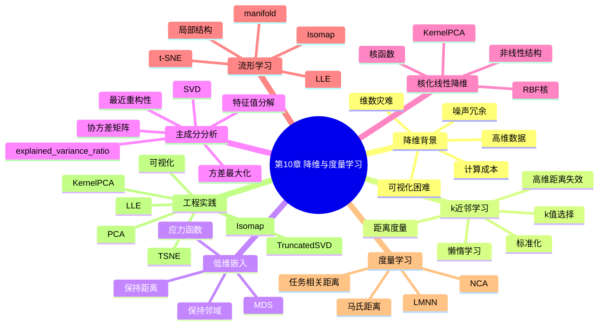

# 第10章 降维与度量学习

## 学习目标
- 能够解释高维数据中的维数灾难及其对距离方法和可视化的影响。
- 能够区分线性降维与非线性流形学习，并给出典型算法选择依据。
- 能够从“最大方差”和“最小重构误差”两种视角解释 PCA。
- 能够结合下游任务表现评估降维是否真正有效，而不只看可视化外观。

## 关键词
- 降维（Dimensionality Reduction）
- 维数灾难（Curse of Dimensionality）
- 主成分分析（PCA）
- 核主成分分析（Kernel PCA）
- 多维缩放（MDS）
- 流形学习（Isomap / LLE）
- t-SNE
- 度量学习（Metric Learning）

## 核心概念与原理
### 关键定义
- **降维**：把高维特征映射到低维表示，同时尽量保留关键结构。
- **嵌入（Embedding）**：低维空间中的新表示坐标。
- **度量学习**：学习更适合任务的距离函数。

### 方法直觉
- 许多高维特征包含冗余与噪声，真正有用的信息常位于更低维流形。
- 降维本质是在“信息保留”和“复杂度降低”之间做权衡。

### 与相近方法的区别
- 与特征选择：降维常构造新特征，特征选择只筛原特征。
- 与聚类：降维强调表示，聚类强调分组，二者常联合使用。

## 关键公式与解释
- PCA 投影：
\[
z=W^Tx
\]
- PCA 方差目标（单主成分）：
\[
\max_{w^Tw=1}\ w^TSw
\]
- 马氏距离：
\[
d_M(x_i,x_j)=\sqrt{(x_i-x_j)^TM(x_i-x_j)}
\]
- 符号解释：\(S\) 为协方差矩阵，\(W\) 为主成分矩阵，\(M\succeq0\) 为度量矩阵。
- 作用：PCA压缩线性冗余，度量学习修正“什么算近”。
- 误用点：降维后只看二维图好看与否，不验证下游任务性能。

## 算法流程 / 方法步骤
1. **目标定义**：输入任务需求（压缩/可视化/加速），输出降维目标维度；目的为避免盲目降维。
2. **数据规范化**：输入原始特征，输出标准化矩阵；目的为统一尺度。
3. **方法选择**：输入结构假设，输出 PCA/KernelPCA/Isomap/LLE/t-SNE；目的为匹配线性或非线性结构。
4. **嵌入学习**：输入训练数据，输出降维映射与低维表示；目的为构建新特征空间。
5. **效果验证**：输入低维特征，输出可视化与下游模型指标；目的为确认降维有效性。

## 实践示例（Python/sklearn）
```python
from sklearn.datasets import load_digits
from sklearn.model_selection import train_test_split
from sklearn.preprocessing import StandardScaler
from sklearn.decomposition import PCA
from sklearn.linear_model import LogisticRegression
from sklearn.pipeline import Pipeline
from sklearn.metrics import accuracy_score

X, y = load_digits(return_X_y=True)
X_train, X_test, y_train, y_test = train_test_split(
    X, y, test_size=0.2, random_state=42, stratify=y
)

model = Pipeline([
    ("scaler", StandardScaler()),
    ("pca", PCA(n_components=0.95, random_state=42)),
    ("clf", LogisticRegression(max_iter=2000))
])
model.fit(X_train, y_train)
pred = model.predict(X_test)
print("accuracy:", accuracy_score(y_test, pred))
```
- 关键参数：`n_components=0.95` 表示保留 95% 方差；可控制压缩强度。
- 结果观察：比较“有无 PCA”下准确率、训练时间、内存占用。

## 常见易错点
- 错因：PCA 前不标准化。纠正建议：先标准化再做协方差分解。
- 错因：把 t-SNE 当通用特征提取器。纠正建议：t-SNE 主要用于可视化探索。
- 错因：在全量数据上先 fit PCA。纠正建议：放入 Pipeline，防止数据泄漏。
- 错因：忽略参数敏感性。纠正建议：对 `n_neighbors`、`perplexity` 等做敏感性实验。

## 练习
1. **概念题**：为什么高维空间下“最近邻”常变得不可靠？  
   参考要点：距离集中现象增强，近远样本差异缩小。
2. **理解题**：PCA 最大方差方向为何能用于信息压缩？  
   参考要点：方差大方向携带更多变化信息，丢失信息更少。
3. **应用题**：文本 TF-IDF 特征降维时，为何常用 TruncatedSVD 而非 PCA？  
   参考要点：保持稀疏结构、避免中心化开销。
4. **综合题（参数分析）**：t-SNE 中 `perplexity` 从 5 改到 50，局部和全局结构展示可能如何变化？  
   参考要点：小 perplexity 更强调局部簇，大 perplexity 更平滑但局部细节可能减弱。

## 小结
- 降维用于压缩、去噪、可视化和加速，不是单纯“降到2维”。
- PCA 是线性基线，流形方法适合非线性结构探索。
- 度量学习与降维都在重塑样本关系空间。
- 降维效果必须通过下游任务和稳定性验证共同判断。

> 建议文件路径：`knowledge_base/machine_learning/10_dimensionality_reduction.md`  
> 适用课程：机器学习导论 / 机器学习  
> 章节定位：以周志华《机器学习》第10章“降维与度量学习”的知识框架为主线，围绕 k近邻学习、低维嵌入、主成分分析 PCA、核化线性降维、流形学习和度量学习建立知识库，并补充 scikit-learn 中 PCA、KernelPCA、TruncatedSVD、MDS、Isomap、LLE、t-SNE 等工程实践。  
> 知识库用途：用于 ML-EduAgent 的课程检索、个性化讲解、题库生成、代码案例生成、OpenMAIC 互动课堂生成。

---

## 0. 章节元信息

```yaml
chapter_id: "10_dimensionality_reduction"
chapter_title: "第10章 降维与度量学习"
course: "机器学习"
difficulty: "中等到偏难"
chapter_standard:
  - 周志华《机器学习》第10章：降维与度量学习
core_sections:
  - k近邻学习
  - 低维嵌入
  - 主成分分析
  - 核化线性降维
  - 流形学习
  - 度量学习
extended_sections:
  - PCA工程实践
  - TruncatedSVD与文本降维
  - KernelPCA
  - MDS
  - Isomap
  - LLE
  - t-SNE可视化
  - 降维结果评估与可视化
prerequisites:
  - 线性代数
  - 向量、矩阵与特征值分解
  - 距离度量
  - 聚类基础
  - k近邻算法
  - 核函数基础
  - 无监督学习基本概念
keywords:
  - 降维
  - dimensionality reduction
  - 维数灾难
  - curse of dimensionality
  - k近邻
  - kNN
  - 低维嵌入
  - embedding
  - 多维缩放
  - MDS
  - 主成分分析
  - PCA
  - principal component analysis
  - 方差最大化
  - 最近重构性
  - 协方差矩阵
  - 特征值分解
  - 奇异值分解
  - SVD
  - explained variance ratio
  - Kernel PCA
  - 核主成分分析
  - TruncatedSVD
  - LSA
  - 流形学习
  - manifold learning
  - Isomap
  - LLE
  - Locally Linear Embedding
  - t-SNE
  - 度量学习
  - metric learning
  - Mahalanobis distance
  - 马氏距离
resource_types:
  - 个性化讲解文档
  - 思维导图
  - 算法流程
  - 公式推导
  - 代码案例
  - 练习题
  - OpenMAIC课堂生成Prompt
  - PBL实践任务
```

---

## 1. 本章学习目标

学完本章后，学生应能够：

1. 解释为什么高维数据会带来维数灾难、计算成本增加、距离失效和可视化困难。
2. 理解降维的基本目标：在尽量保留重要信息的前提下，将高维数据映射到低维空间。
3. 掌握 k近邻学习的基本思想，并理解距离度量对 kNN 的影响。
4. 理解低维嵌入的目标：保持样本之间的距离、邻域关系或几何结构。
5. 掌握多维缩放 MDS 的基本思想：在低维空间中尽量保持样本间距离。
6. 掌握主成分分析 PCA 的两种解释：最大方差投影与最近重构性。
7. 理解 PCA 的数学步骤：中心化、协方差矩阵、特征值分解、主成分选择、投影。
8. 理解核化线性降维的思想：通过核函数在高维特征空间中执行线性降维。
9. 掌握流形学习的基本思想：高维观测数据可能位于低维流形上。
10. 理解 Isomap 和 LLE 的核心流程与适用场景。
11. 理解度量学习的目标：学习更适合任务的距离度量。
12. 能够使用 sklearn 实现 PCA、KernelPCA、TruncatedSVD、MDS、Isomap、LLE、t-SNE，并能解释常见参数含义和降维结果。

---

## 2. 本章知识结构



---

## 3. 为什么需要降维？

现实机器学习任务中，数据经常具有很高维度。例如：

- 图像：一张 \(28\times28\) 灰度图像有 784 个像素特征；
- 文本：词袋模型或 TF-IDF 可能有几万维；
- 用户画像：行为、消费、点击、停留、偏好等特征可能非常多；
- 生物信息学：基因表达数据维度远大于样本数。

高维数据会带来若干问题：

### 3.1 维数灾难

随着维度增加，样本空间体积急剧增大。在有限样本数量下，数据在高维空间中会变得非常稀疏。

这会导致：

1. 需要更多样本才能覆盖空间；
2. 距离度量变得不稳定；
3. 模型更容易过拟合；
4. 计算和存储成本增加；
5. 可视化和解释困难。

### 3.2 噪声和冗余特征

高维特征中可能存在：

- 无关特征；
- 冗余特征；
- 噪声特征；
- 高相关特征。

降维可以去除部分无关或冗余信息，保留主要结构。

### 3.3 可视化需求

人类通常只能直观观察二维或三维数据。降维可以将高维数据映射到 2D 或 3D，用于探索：

- 类别分布；
- 聚类结构；
- 异常点；
- 模型特征表示；
- 样本相似关系。

### 3.4 计算效率

降维后特征数量减少，可以降低后续模型训练和预测成本，尤其对距离计算、聚类、kNN、SVM、神经网络等模型有帮助。

---

## 4. 降维的基本分类

### 4.1 特征选择与特征提取

降维方法可粗略分为两类：

| 类型 | 含义 | 示例 |
|---|---|---|
| 特征选择 | 从原始特征中选择一部分 | 方差过滤、相关性筛选、L1稀疏 |
| 特征提取 | 构造新的低维特征 | PCA、LDA、MDS、Isomap、LLE |

本章主要讨论特征提取型降维。

### 4.2 线性降维与非线性降维

| 类型 | 含义 | 示例 |
|---|---|---|
| 线性降维 | 低维特征是原始特征的线性组合 | PCA、LDA、TruncatedSVD |
| 非线性降维 | 使用非线性映射保留结构 | KernelPCA、Isomap、LLE、t-SNE |

### 4.3 监督降维与无监督降维

| 类型 | 是否使用标签 | 示例 |
|---|---|---|
| 无监督降维 | 不使用类别标签 | PCA、MDS、Isomap、LLE、t-SNE |
| 监督降维 | 使用类别标签 | LDA、度量学习、监督流形学习 |

周志华《机器学习》第10章把降维和度量学习放在一起讨论，原因是二者都与“样本之间的距离和相似性表示”密切相关。

---

## 5. k近邻学习

### 5.1 kNN 基本思想

k近邻（k-Nearest Neighbor, kNN）是一种基于距离的学习方法。给定测试样本 \(x\)，在训练集中找到距离它最近的 \(k\) 个样本，然后根据这 \(k\) 个邻居的标签做预测。

分类任务：

\[
\hat{y} = \arg\max_c \sum_{x_i\in N_k(x)} I(y_i=c)
\]

回归任务：

\[
\hat{y} = \frac{1}{k}\sum_{x_i\in N_k(x)} y_i
\]

其中 \(N_k(x)\) 表示样本 \(x\) 的 \(k\) 个最近邻集合。

### 5.2 kNN 的特点

kNN 是典型的懒惰学习方法：

- 训练阶段几乎不进行显式模型训练；
- 预测阶段需要计算测试样本与训练样本的距离；
- 预测成本较高；
- 对距离度量和特征尺度敏感。

### 5.3 k 值选择

| k 值 | 影响 |
|---|---|
| 较小 | 模型复杂，容易受噪声影响，方差较大 |
| 较大 | 模型更平滑，可能欠拟合，偏差较大 |

常用做法是通过验证集或交叉验证选择 k。

### 5.4 距离度量影响

kNN 的效果高度依赖距离度量。常用距离包括：

- 欧氏距离；
- 曼哈顿距离；
- 闵可夫斯基距离；
- 余弦距离；
- 马氏距离。

特征尺度不同会影响距离计算，因此通常需要标准化。

### 5.5 kNN 与降维的关系

在高维空间中，距离度量可能失去区分度，这会影响 kNN 的邻居选择。降维可以帮助：

1. 去除噪声和冗余特征；
2. 降低距离计算成本；
3. 改善邻域结构；
4. 便于可视化 kNN 的分类边界。

---

## 6. 低维嵌入

低维嵌入（low-dimensional embedding）希望将高维样本：

\[
x_i\in \mathbb{R}^d
\]

映射为低维表示：

\[
z_i\in \mathbb{R}^{d'}
\]

其中：

\[
d' \ll d
\]

理想情况下，低维嵌入应尽可能保留原始数据中的重要结构，例如：

- 样本间距离；
- 邻域关系；
- 类别分布；
- 流形几何；
- 数据主要变化方向。

---

## 7. 多维缩放 MDS

### 7.1 MDS 的基本思想

多维缩放（Multidimensional Scaling, MDS）的目标是：

> 给定样本之间的距离矩阵，在低维空间中找到一组点，使得低维空间中的点间距离尽可能接近原始距离。

设原始空间中样本 \(x_i,x_j\) 的距离为：

\[
dist_{ij}
\]

低维空间中对应点 \(z_i,z_j\) 的距离为：

\[
\|z_i-z_j\|
\]

MDS 希望：

\[
\|z_i-z_j\| \approx dist_{ij}
\]

### 7.2 MDS 的直观例子

假设只知道几个城市之间的距离，MDS 可以尝试在二维平面上放置这些城市点，使平面中的距离尽量接近真实距离。

这说明 MDS 不一定需要原始特征，只需要样本间距离矩阵。

### 7.3 MDS 目标函数

常见形式是最小化应力函数：

\[
stress =
\sum_{i<j}
(\|z_i-z_j\|-dist_{ij})^2
\]

应力越小，说明低维嵌入越好地保留了距离关系。

### 7.4 MDS 的优缺点

优点：

- 只需要距离矩阵；
- 适合可视化相似关系；
- 直观易懂。

局限：

- 计算成本较高；
- 对噪声距离敏感；
- 保持全局距离时可能牺牲局部结构；
- 大规模数据上效率较低。

---

## 8. 主成分分析 PCA

### 8.1 PCA 的基本思想

主成分分析（Principal Component Analysis, PCA）是最经典的线性降维方法。

它希望找到若干个新的正交方向，使数据投影到这些方向后保留尽可能多的信息。

PCA 有两种常见理解：

1. **最大方差解释**：投影后数据方差尽可能大；
2. **最近重构性解释**：用低维表示重构原数据时误差尽可能小。

### 8.2 最大方差解释

设数据已经中心化，即每个特征均值为 0。将样本投影到单位方向 \(w\) 上：

\[
z_i = w^T x_i
\]

投影后方差为：

\[
Var(z)=\frac{1}{m}\sum_{i=1}^{m}(w^Tx_i)^2
\]

PCA 希望找到使投影方差最大的方向：

\[
\max_w w^TXX^T w
\]

约束：

\[
w^Tw=1
\]

求解得到协方差矩阵最大特征值对应的特征向量。

### 8.3 最近重构性解释

PCA 也可以理解为寻找一个低维子空间，使样本投影到该子空间后再重构回原空间时，重构误差最小。

如果用 \(d'\) 个主成分表示数据：

\[
z_i = W^T x_i
\]

重构：

\[
\hat{x}_i = Wz_i = WW^Tx_i
\]

目标是最小化：

\[
\sum_i \|x_i-\hat{x}_i\|^2
\]

该目标最终也会得到协方差矩阵前 \(d'\) 个最大特征值对应的特征向量。

### 8.4 PCA 算法流程

```text
输入：样本矩阵 X，目标维度 d'

1. 对数据进行中心化
2. 计算协方差矩阵
3. 对协方差矩阵进行特征值分解
4. 按特征值从大到小排序
5. 选取前 d' 个特征值对应的特征向量
6. 将原始数据投影到这些特征向量构成的子空间中
7. 得到低维表示 Z
```

### 8.5 PCA 与 SVD

实际工程中，PCA 通常使用奇异值分解（SVD）实现，而不是直接计算协方差矩阵特征分解。

原因：

- 数值稳定性更好；
- 适合高维数据；
- 可以使用随机 SVD 加速；
- 与线性代数库结合更成熟。

### 8.6 explained variance ratio

PCA 中常用解释方差比例判断保留信息量：

\[
explained\_variance\_ratio_i=
\frac{\lambda_i}{\sum_j \lambda_j}
\]

其中 \(\lambda_i\) 是第 \(i\) 个主成分对应的特征值。

累计解释方差比例：

\[
\sum_{i=1}^{d'} explained\_variance\_ratio_i
\]

常见选择：

- 保留 95% 方差；
- 保留 90% 方差；
- 或选择二维 / 三维用于可视化。

### 8.7 PCA 的优点

- 简单、经典、可解释；
- 去除线性冗余；
- 降低噪声；
- 提升计算效率；
- 适合可视化和预处理；
- 可用于数据压缩。

### 8.8 PCA 的局限

1. 只能捕捉线性结构。
2. 对特征尺度敏感，通常需要标准化。
3. 主成分是原特征线性组合，业务解释可能变弱。
4. 最大方差方向不一定是最有分类价值的方向。
5. 对异常值敏感。
6. 无监督 PCA 不使用标签，可能丢失与标签相关但方差较小的信息。

---

## 9. PCA 与 LDA 的区别

虽然 PCA 和 LDA 都可用于降维，但二者目标不同。

| 对比项 | PCA | LDA |
|---|---|---|
| 是否使用标签 | 不使用 | 使用 |
| 学习类型 | 无监督降维 | 监督降维 |
| 目标 | 保留最大方差信息 | 类内小、类间大 |
| 输出维度限制 | 最多可到特征维度 | 最多为类别数 - 1 |
| 适用场景 | 可视化、压缩、去噪 | 分类前的监督降维 |
| 可能问题 | 最大方差未必最利于分类 | 依赖标签质量 |

---

## 10. 核化线性降维

### 10.1 为什么需要核化？

PCA 是线性降维，只能找到线性子空间。当数据结构呈非线性时，PCA 可能无法展开真实结构。

核化思想：

> 先通过非线性映射把数据映射到高维特征空间，再在高维特征空间中执行线性降维。

设非线性映射为：

\[
\phi(x)
\]

则在特征空间中做 PCA。

### 10.2 Kernel PCA

Kernel PCA 使用核函数计算高维特征空间中的内积：

\[
K(x_i,x_j)=\phi(x_i)^T\phi(x_j)
\]

常用核函数：

- 线性核；
- 多项式核；
- RBF / 高斯核；
- sigmoid 核；
- cosine 核。

### 10.3 Kernel PCA 的适用场景

适合：

- 数据具有非线性结构；
- PCA 可视化效果不好；
- 希望通过核函数捕捉复杂模式；
- 样本数量不是特别大。

局限：

- 计算核矩阵成本高；
- 参数选择敏感；
- 新样本映射和逆变换更复杂；
- 解释性弱于 PCA。

---

## 11. 流形学习

### 11.1 流形假设

流形学习基于一个重要假设：

> 高维观测数据可能分布在一个低维流形附近。

例如：

- 一张人脸图像可能有很多像素维度，但变化因素可能主要是姿态、光照、表情；
- 一个三维卷曲曲面上的点虽然嵌入在三维空间，但本质上可以用二维坐标表示。

流形学习希望发现这种隐藏的低维结构。

### 11.2 流形学习与 PCA 的区别

| 对比项 | PCA | 流形学习 |
|---|---|---|
| 结构假设 | 线性子空间 | 非线性低维流形 |
| 保留内容 | 全局方差 | 邻域结构或测地距离 |
| 典型方法 | PCA | Isomap、LLE、t-SNE |
| 优点 | 快速、稳定 | 能揭示非线性结构 |
| 局限 | 非线性能力弱 | 参数敏感、扩展到新样本较难 |

---

## 12. Isomap

### 12.1 基本思想

Isomap 是一种非线性降维方法，可以看作 MDS 的扩展。

PCA 和普通 MDS 使用欧氏距离，但对于弯曲流形，欧氏距离不能正确表示样本在流形上的真实距离。

Isomap 使用近邻图上的最短路径距离来近似流形上的测地距离。

### 12.2 Isomap 算法流程

```text
输入：样本集 X，近邻数 k，目标维度 d'

1. 构建 k近邻图
2. 图中相邻样本之间边权为欧氏距离
3. 计算图中任意两点之间的最短路径距离
4. 用最短路径距离近似流形测地距离
5. 对距离矩阵执行 MDS
6. 得到低维嵌入
```

### 12.3 Isomap 的优点

- 能保持全局流形几何结构；
- 适合单一连续低维流形；
- 对“瑞士卷”这类结构有较好效果。

### 12.4 Isomap 的局限

1. 对近邻数 \(k\) 敏感；
2. 噪声可能破坏近邻图；
3. 数据不连通时最短路径不可用；
4. 多个流形混合时效果可能差；
5. 大规模数据计算成本较高。

---

## 13. LLE 局部线性嵌入

### 13.1 基本思想

LLE（Locally Linear Embedding）假设每个样本及其近邻在局部近似线性。

它试图保持每个样本由其邻居线性重构的关系。

### 13.2 LLE 算法流程

```text
输入：样本集 X，近邻数 k，目标维度 d'

1. 对每个样本找到 k 个近邻
2. 计算该样本由近邻线性重构的权重
3. 在低维空间中寻找嵌入点，使这些重构权重尽可能保持不变
4. 得到低维表示
```

### 13.3 LLE 的重构权重

对样本 \(x_i\)，希望用其近邻重构：

\[
x_i \approx \sum_{j\in N(i)} w_{ij}x_j
\]

约束：

\[
\sum_{j\in N(i)}w_{ij}=1
\]

LLE 在低维空间中保持相同的权重：

\[
z_i \approx \sum_{j\in N(i)}w_{ij}z_j
\]

### 13.4 LLE 的优点

- 能保持局部邻域结构；
- 不需要显式计算全局距离；
- 适合流形局部近似线性的数据。

### 13.5 LLE 的局限

- 对近邻数敏感；
- 对噪声和离群点敏感；
- 对采样密度不均匀数据效果不稳定；
- 结果主要用于可视化和结构探索，不一定适合直接作为分类特征。

---

## 14. t-SNE

### 14.1 基本思想

t-SNE 是一种常用于高维数据可视化的非线性降维方法。它关注局部邻域结构，试图让高维空间中相似的样本在低维空间中仍然靠近。

t-SNE 常用于：

- 图像特征可视化；
- 文本向量可视化；
- 神经网络中间层表示可视化；
- 聚类结构展示。

### 14.2 t-SNE 的特点

优点：

- 可视化效果强；
- 能突出局部簇结构；
- 适合二维、三维展示。

局限：

- 计算成本较高；
- 对 perplexity、learning_rate、初始化和随机种子敏感；
- 不适合严肃解释全局距离；
- 不适合作为通用特征预处理方法；
- 不同运行结果可能有差异。

### 14.3 t-SNE 实践建议

1. 先用 PCA 降到 30-50 维，再用 t-SNE 可视化；
2. 尝试多个 perplexity；
3. 固定 random_state；
4. 不要过度解释簇之间的全局距离；
5. 主要用于可视化探索，而不是直接训练下游模型。

---

## 15. TruncatedSVD 与文本降维

### 15.1 为什么文本数据适合 TruncatedSVD？

文本向量化后常得到高维稀疏矩阵，例如 TF-IDF 特征。PCA 会对数据中心化，可能破坏稀疏性并带来高计算成本。

TruncatedSVD 不对数据中心化，因此可以高效处理稀疏矩阵。

在文本挖掘中，TruncatedSVD 常用于潜在语义分析（Latent Semantic Analysis, LSA）。

### 15.2 与 PCA 的区别

| 对比项 | PCA | TruncatedSVD |
|---|---|---|
| 是否中心化 | 是 | 否 |
| 是否适合稀疏矩阵 | 较弱 | 强 |
| 常见场景 | 数值表格、图像特征 | 文本 TF-IDF、词袋矩阵 |
| 解释 | 主成分方向 | 截断奇异向量 / 潜在语义方向 |

---

## 16. 度量学习

### 16.1 为什么需要度量学习？

很多机器学习方法依赖距离：

- kNN；
- k-means；
- DBSCAN；
- 层次聚类；
- 检索系统；
- 推荐系统；
- 人脸识别；
- 图像相似搜索。

但默认欧氏距离未必适合具体任务。

度量学习的目标是：

> 从数据中学习一个更适合任务的距离度量，使相似样本更近，不相似样本更远。

### 16.2 马氏距离

马氏距离形式：

\[
dist_M(x_i,x_j)
=
\sqrt{(x_i-x_j)^T M (x_i-x_j)}
\]

其中 \(M\) 是半正定矩阵。

如果 \(M=I\)，马氏距离退化为欧氏距离。

若 \(M\) 可分解为：

\[
M = L^T L
\]

则：

\[
dist_M(x_i,x_j)
=
\|Lx_i-Lx_j\|_2
\]

这说明学习马氏距离等价于学习一个线性变换 \(L\)。

### 16.3 度量学习的目标

典型目标：

- 同类样本距离更近；
- 异类样本距离更远；
- 近邻分类效果更好；
- 检索排序更合理；
- 聚类结构更清晰。

### 16.4 常见度量学习思想

| 方法 | 思想 |
|---|---|
| LMNN | 让同类目标近邻更近，异类样本保持间隔 |
| NCA | 直接优化随机近邻分类准确率 |
| ITML | 在距离约束下学习接近先验的度量矩阵 |
| Siamese Network | 使用神经网络学习样本对相似度 |
| Triplet Loss | 让 anchor 更接近 positive，远离 negative |

### 16.5 度量学习与降维的关系

如果马氏矩阵 \(M=L^TL\)，且 \(L\) 是低秩矩阵，则度量学习也可以实现降维。

因此，降维和度量学习都可以理解为：

> 学习一个更好的表示空间，使样本关系更符合任务需求。

---

## 17. 降维算法对比

| 方法 | 类型 | 是否线性 | 是否使用标签 | 主要保留结构 | 适用场景 | 局限 |
|---|---|---|---|---|---|---|
| PCA | 特征提取 | 线性 | 否 | 最大方差 | 压缩、去噪、可视化 | 只能捕捉线性结构 |
| TruncatedSVD | 特征提取 | 线性 | 否 | 奇异向量结构 | 稀疏文本矩阵 | 不中心化，解释与PCA不同 |
| KernelPCA | 特征提取 | 非线性 | 否 | 核空间主成分 | 非线性结构 | 参数敏感、计算成本高 |
| MDS | 嵌入 | 通常非线性优化 | 否 | 样本间距离 | 距离矩阵可视化 | 大规模较慢 |
| Isomap | 流形学习 | 非线性 | 否 | 测地距离 | 单一连续流形 | 近邻图敏感 |
| LLE | 流形学习 | 非线性 | 否 | 局部线性重构 | 局部流形结构 | 对噪声敏感 |
| t-SNE | 可视化 | 非线性 | 否 | 局部邻域 | 高维特征2D可视化 | 不宜解释全局距离 |
| LDA | 监督降维 | 线性 | 是 | 类间大、类内小 | 分类前降维 | 维度受类别数限制 |
| 度量学习 | 表示学习 | 线性或非线性 | 通常使用标签 | 任务相关距离 | 检索、kNN、聚类 | 训练复杂、需标签或约束 |

---

## 18. sklearn 实践：PCA

```python
from sklearn.datasets import load_digits
from sklearn.preprocessing import StandardScaler
from sklearn.decomposition import PCA

X, y = load_digits(return_X_y=True)

X_scaled = StandardScaler().fit_transform(X)

pca = PCA(n_components=2, random_state=42)
X_pca = pca.fit_transform(X_scaled)

print("降维后形状:", X_pca.shape)
print("解释方差比例:", pca.explained_variance_ratio_)
print("累计解释方差:", pca.explained_variance_ratio_.sum())
```

---

## 19. sklearn 实践：选择 PCA 维度

```python
from sklearn.datasets import load_digits
from sklearn.preprocessing import StandardScaler
from sklearn.decomposition import PCA
import numpy as np

X, y = load_digits(return_X_y=True)
X_scaled = StandardScaler().fit_transform(X)

pca = PCA(n_components=0.95, random_state=42)
X_reduced = pca.fit_transform(X_scaled)

print("原始维度:", X_scaled.shape[1])
print("保留95%方差所需维度:", X_reduced.shape[1])
print("累计解释方差:", np.sum(pca.explained_variance_ratio_))
```

---

## 20. sklearn 实践：PCA + 分类器

```python
from sklearn.datasets import load_digits
from sklearn.model_selection import train_test_split
from sklearn.pipeline import Pipeline
from sklearn.preprocessing import StandardScaler
from sklearn.decomposition import PCA
from sklearn.linear_model import LogisticRegression
from sklearn.metrics import accuracy_score, classification_report

X, y = load_digits(return_X_y=True)

X_train, X_test, y_train, y_test = train_test_split(
    X, y, test_size=0.2, random_state=42, stratify=y
)

pipe = Pipeline([
    ("scaler", StandardScaler()),
    ("pca", PCA(n_components=0.95, random_state=42)),
    ("clf", LogisticRegression(max_iter=2000))
])

pipe.fit(X_train, y_train)
pred = pipe.predict(X_test)

print("accuracy:", accuracy_score(y_test, pred))
print(classification_report(y_test, pred))
```

注意：在监督学习流程中，PCA 应放入 Pipeline，避免先在全数据上 fit PCA 造成数据泄漏。

---

## 21. sklearn 实践：TruncatedSVD 文本降维

```python
from sklearn.datasets import fetch_20newsgroups
from sklearn.feature_extraction.text import TfidfVectorizer
from sklearn.decomposition import TruncatedSVD
from sklearn.pipeline import Pipeline
from sklearn.linear_model import LogisticRegression
from sklearn.model_selection import train_test_split
from sklearn.metrics import classification_report

categories = ["sci.space", "rec.sport.baseball", "comp.graphics"]

data = fetch_20newsgroups(
    subset="all",
    categories=categories,
    remove=("headers", "footers", "quotes")
)

X_train, X_test, y_train, y_test = train_test_split(
    data.data, data.target, test_size=0.2, random_state=42, stratify=data.target
)

pipe = Pipeline([
    ("tfidf", TfidfVectorizer(stop_words="english", max_features=5000)),
    ("svd", TruncatedSVD(n_components=100, random_state=42)),
    ("clf", LogisticRegression(max_iter=1000))
])

pipe.fit(X_train, y_train)
pred = pipe.predict(X_test)

print(classification_report(y_test, pred, target_names=data.target_names))
```

---

## 22. sklearn 实践：KernelPCA

```python
from sklearn.datasets import make_circles
from sklearn.preprocessing import StandardScaler
from sklearn.decomposition import KernelPCA

X, y = make_circles(n_samples=500, factor=0.3, noise=0.05, random_state=42)
X_scaled = StandardScaler().fit_transform(X)

kpca = KernelPCA(
    n_components=2,
    kernel="rbf",
    gamma=10,
    random_state=42
)

X_kpca = kpca.fit_transform(X_scaled)

print("降维后形状:", X_kpca.shape)
```

---

## 23. sklearn 实践：MDS

```python
from sklearn.datasets import load_digits
from sklearn.preprocessing import StandardScaler
from sklearn.manifold import MDS

X, y = load_digits(return_X_y=True)

# 为了速度，只取部分样本
X = X[:300]
y = y[:300]

X_scaled = StandardScaler().fit_transform(X)

mds = MDS(
    n_components=2,
    random_state=42,
    normalized_stress="auto"
)

X_mds = mds.fit_transform(X_scaled)

print("降维后形状:", X_mds.shape)
```

---

## 24. sklearn 实践：Isomap

```python
from sklearn.datasets import load_digits
from sklearn.preprocessing import StandardScaler
from sklearn.manifold import Isomap

X, y = load_digits(return_X_y=True)

X = X[:500]
y = y[:500]

X_scaled = StandardScaler().fit_transform(X)

isomap = Isomap(
    n_neighbors=10,
    n_components=2
)

X_iso = isomap.fit_transform(X_scaled)

print("降维后形状:", X_iso.shape)
```

---

## 25. sklearn 实践：LLE

```python
from sklearn.datasets import load_digits
from sklearn.preprocessing import StandardScaler
from sklearn.manifold import LocallyLinearEmbedding

X, y = load_digits(return_X_y=True)

X = X[:500]
y = y[:500]

X_scaled = StandardScaler().fit_transform(X)

lle = LocallyLinearEmbedding(
    n_neighbors=12,
    n_components=2,
    method="standard",
    random_state=42
)

X_lle = lle.fit_transform(X_scaled)

print("降维后形状:", X_lle.shape)
```

---

## 26. sklearn 实践：t-SNE 可视化

```python
from sklearn.datasets import load_digits
from sklearn.preprocessing import StandardScaler
from sklearn.decomposition import PCA
from sklearn.manifold import TSNE

X, y = load_digits(return_X_y=True)

X_scaled = StandardScaler().fit_transform(X)

# 先用 PCA 降到 50 维，减少噪声并加速 t-SNE
X_pca = PCA(n_components=50, random_state=42).fit_transform(X_scaled)

tsne = TSNE(
    n_components=2,
    perplexity=30,
    learning_rate="auto",
    init="pca",
    random_state=42
)

X_tsne = tsne.fit_transform(X_pca)

print("降维后形状:", X_tsne.shape)
```

---

## 27. 降维工程实践建议

### 27.1 一般流程

```text
明确目的
→ 数据清洗
→ 特征标准化
→ 选择降维算法
→ 调整目标维度和参数
→ 可视化或下游任务评估
→ 解释结果
```

### 27.2 按目标选择算法

| 目标 | 推荐方法 |
|---|---|
| 压缩数值特征 | PCA |
| 保留大部分方差 | PCA(n_components=0.95) |
| 高维稀疏文本降维 | TruncatedSVD |
| 非线性结构探索 | KernelPCA / Isomap / LLE |
| 高维特征二维可视化 | PCA + t-SNE |
| 加速下游模型 | PCA / TruncatedSVD |
| 改善 kNN / 聚类距离 | PCA / 度量学习 |
| 有标签且用于分类 | LDA / 度量学习 |

### 27.3 数据泄漏注意

如果降维用于监督学习管线，必须只在训练集上 fit 降维器，再 transform 测试集。

推荐使用 Pipeline：

```python
Pipeline([
    ("scaler", StandardScaler()),
    ("pca", PCA(n_components=0.95)),
    ("clf", LogisticRegression())
])
```

错误做法是先在全量数据上 PCA，再划分训练测试集。这会导致测试集信息泄漏。

### 27.4 可视化解释注意

1. 二维降维图不能完全代表高维真实结构；
2. t-SNE 中簇之间距离不一定具有全局意义；
3. PCA 方向可解释为方差最大方向，但不一定对应业务含义；
4. 不同随机种子可能改变 t-SNE 结果；
5. 可视化结果应结合标签、业务和定量指标分析。

---

## 28. 常见易错点

1. 把降维等同于特征选择。特征选择保留原特征，降维常构造新特征。
2. 忘记标准化，导致 PCA 被尺度大的特征主导。
3. 认为 PCA 保留最大方差就一定最适合分类。最大方差方向不一定最有判别性。
4. 误以为 PCA 是非线性方法。PCA 是线性降维。
5. 用 t-SNE 的二维图解释全局距离，容易误判。
6. 在全数据上 fit PCA 再划分训练测试集，造成数据泄漏。
7. 认为降维后维度越低越好。维度过低可能丢失重要信息。
8. 对稀疏文本矩阵直接用 PCA，可能效率低且破坏稀疏性。
9. 忽略近邻参数对 Isomap、LLE 的影响。
10. 把 Isomap/LLE/t-SNE 当作通用下游特征预处理方法，它们更常用于探索和可视化。
11. 忽略异常值对 PCA 的影响。
12. 认为度量学习和降维完全无关。低秩马氏度量可看作一种表示学习和降维。

---

## 29. 面向不同学生画像的学习建议

### 29.1 数学基础较弱

推荐路径：

```text
为什么要降维
→ PCA直观理解
→ 二维投影可视化
→ t-SNE可视化
→ 再看公式
```

资源形式：

- 图解；
- 类比“压缩照片”；
- 少量公式；
- 可视化案例。

### 29.2 有 Python 基础但线代弱

推荐路径：

```text
先跑 PCA 代码
→ 查看 explained_variance_ratio_
→ 再跑 PCA + LogisticRegression
→ 最后理解协方差矩阵和特征向量
```

资源形式：

- sklearn 代码；
- 参数解释；
- 可视化图；
- 实验对比。

### 29.3 准备考试

推荐路径：

```text
kNN
→ MDS
→ PCA最大方差解释
→ PCA最近重构解释
→ KernelPCA
→ Isomap
→ LLE
→ 度量学习
```

资源形式：

- 公式卡片；
- 算法流程；
- 简答题；
- 判断题；
- 计算题。

### 29.4 想做项目实践

推荐路径：

```text
手写数字数据
→ PCA压缩
→ PCA + 分类器
→ t-SNE可视化
→ TruncatedSVD文本降维
→ 实验报告
```

资源形式：

- PBL 项目；
- Pipeline；
- 可视化图；
- 模型对比表。

---

## 30. 练习题库

### 30.1 选择题

**1. 降维的主要目的不包括？**

A. 降低特征维度  
B. 去除冗余和噪声  
C. 方便可视化  
D. 保证训练集准确率一定为 100%  

答案：D

**2. PCA 的主要思想是？**

A. 最大化投影方差  
B. 随机删除样本  
C. 使用多数投票  
D. 只保留类别标签  

答案：A

**3. PCA 属于哪类方法？**

A. 线性无监督降维  
B. 非线性监督分类  
C. 强化学习  
D. 决策树集成方法  

答案：A

**4. TruncatedSVD 相比 PCA 的一个重要特点是？**

A. 不适合文本数据  
B. 不中心化数据，因此可较好处理稀疏矩阵  
C. 只能用于图像  
D. 必须使用标签  

答案：B

**5. Isomap 使用什么近似流形上的测地距离？**

A. k近邻图上的最短路径距离  
B. 随机森林特征重要性  
C. 交叉熵损失  
D. 贝叶斯后验概率  

答案：A

**6. t-SNE 最常用于？**

A. 高维数据二维可视化  
B. 替代所有分类器  
C. 计算信息增益  
D. 训练决策树  

答案：A

### 30.2 判断题

1. PCA 是监督降维方法。  
答案：错误。PCA 不使用标签，是无监督降维方法。

2. PCA 前通常需要对特征进行标准化。  
答案：正确。

3. KernelPCA 可以通过核函数处理非线性结构。  
答案：正确。

4. t-SNE 图中两个簇之间距离越远，必然表示高维空间中全局距离越远。  
答案：错误。t-SNE 更强调局部结构，不宜过度解释全局距离。

5. 在监督学习管线中，PCA 应只在训练集上 fit。  
答案：正确。

### 30.3 简答题

**1. 什么是维数灾难？**

参考答案：随着特征维度增加，样本空间体积急剧增大，有限样本会变得稀疏，距离度量可能失去区分度，模型更容易过拟合，计算和存储成本也会上升。这些问题统称为维数灾难。

**2. PCA 的最大方差解释是什么？**

参考答案：PCA 希望寻找一组正交方向，使数据投影到这些方向后方差尽可能大。方差越大，说明该方向保留的数据变化信息越多。第一主成分是投影方差最大的方向，第二主成分是在与第一主成分正交约束下投影方差最大的方向。

**3. PCA 和 LDA 有什么区别？**

参考答案：PCA 是无监督降维，不使用类别标签，目标是保留最大方差信息；LDA 是监督降维，使用类别标签，目标是使类内样本更接近、类间样本更分离。PCA 更适合压缩、去噪和可视化，LDA 更适合分类前降维。

**4. Isomap 和 LLE 的主要区别是什么？**

参考答案：Isomap 通过近邻图最短路径近似流形测地距离，再使用 MDS 保持全局几何结构；LLE 假设局部邻域近似线性，先计算每个样本由近邻重构的权重，再在低维空间中保持这些重构关系。Isomap 更关注全局测地距离，LLE 更关注局部线性结构。

**5. 什么是度量学习？**

参考答案：度量学习是从数据中学习一个更适合任务的距离度量，使相似样本更近、不相似样本更远。典型形式是学习马氏距离矩阵，也可以通过神经网络学习非线性表示空间。

### 30.4 计算题

**1. 已知 PCA 前三个主成分解释方差比例分别为 0.50、0.25、0.10，保留前三个主成分的累计解释方差是多少？**

\[
0.50+0.25+0.10=0.85
\]

即保留 85% 的方差信息。

**2. 若原始数据维度为 100，PCA 后维度为 10，降维比例是多少？**

保留维度比例：

\[
\frac{10}{100}=0.1
\]

维度减少比例：

\[
1-0.1=0.9
\]

即维度减少 90%。

**3. 两个样本 \(x=(1,2)\)，\(z=(4,6)\)，在欧氏距离下距离是多少？**

\[
dist(x,z)=\sqrt{(1-4)^2+(2-6)^2}
=\sqrt{9+16}=5
\]

**4. 若马氏矩阵 \(M=I\)，马氏距离与什么距离等价？**

当 \(M=I\) 时：

\[
dist_M(x,z)=\sqrt{(x-z)^T I (x-z)}
=\|x-z\|_2
\]

因此等价于欧氏距离。

### 30.5 编程题

**题目：使用降维方法完成手写数字数据可视化与分类对比。**

要求：

1. 加载 `load_digits` 数据集；
2. 使用 StandardScaler 标准化；
3. 使用 PCA 降到 2 维并可视化；
4. 使用 PCA 保留 95% 方差后接 LogisticRegression 分类；
5. 使用 t-SNE 进行二维可视化；
6. 对比原始特征分类和 PCA 后分类的准确率；
7. 分析降维对可视化、训练速度和准确率的影响。

---

## 31. OpenMAIC 课堂生成 Prompt

```text
请基于以下内容生成一节面向本科机器学习学生的互动课堂。

【课程】
机器学习

【章节】
第10章 降维与度量学习

【学习主题】
从 PCA 到流形学习与度量学习

【学生画像】
学生已经学习过聚类、支持向量机和神经网络，有 Python 基础，但线性代数基础一般，容易混淆 PCA、MDS、Isomap、LLE 和 t-SNE 的区别。希望通过图文讲解、二维可视化、算法流程、代码案例和练习题掌握降维方法。

【知识库范围】
1. 高维数据与维数灾难
2. k近邻学习与距离度量
3. 低维嵌入与 MDS
4. PCA：最大方差解释和最近重构性解释
5. PCA 的协方差矩阵、特征值分解、SVD 实现
6. KernelPCA 与核化线性降维
7. 流形学习：Isomap、LLE、t-SNE
8. 度量学习与马氏距离
9. sklearn 工程实践：PCA、TruncatedSVD、KernelPCA、MDS、Isomap、LLE、TSNE

【生成要求】
1. 生成 8-10 页 slides；
2. 用图示解释维数灾难和降维的必要性；
3. 用动画式步骤解释 PCA 的投影过程；
4. 用二维图示解释 PCA、Isomap、LLE 的区别；
5. 用表格对比 PCA、KernelPCA、MDS、Isomap、LLE、t-SNE；
6. 生成 6 道选择题、2 道简答题、4 道计算题、1 道编程题；
7. 生成一个 sklearn PCA + t-SNE 可视化代码案例；
8. 生成一个手写数字降维与分类 PBL 项目；
9. 难度控制在本科机器学习中等水平。
```

---

## 32. PBL 实践任务

### 任务名称

基于降维方法的手写数字可视化与分类实验

### 任务背景

学生需要使用 sklearn 的手写数字数据集，比较 PCA、t-SNE 和分类器结合的效果，理解降维在可视化、压缩和下游任务中的作用。

### 任务要求

1. 加载 `load_digits` 数据集；
2. 对特征进行标准化；
3. 使用 PCA 降到 2 维，绘制不同数字类别的散点图；
4. 查看 PCA 的解释方差比例；
5. 使用 PCA 保留 95% 方差后接 LogisticRegression；
6. 对比原始特征和 PCA 后特征的分类准确率；
7. 使用 t-SNE 对 PCA 预降维后的特征可视化；
8. 尝试不同 perplexity 参数；
9. 分析 PCA 和 t-SNE 可视化结果差异；
10. 写出实验总结。

### 输出成果

- 实验代码；
- PCA 解释方差结果；
- PCA 二维可视化图；
- t-SNE 二维可视化图；
- 分类准确率对比表；
- 对降维方法优缺点的分析；
- 实验总结报告。

---

## 33. 知识库检索关键词

```text
降维
dimensionality reduction
维数灾难
curse of dimensionality
k近邻
kNN
距离度量
低维嵌入
embedding
多维缩放
MDS
stress
主成分分析
PCA
Principal Component Analysis
最大方差
最近重构性
协方差矩阵
特征值分解
SVD
奇异值分解
explained_variance_ratio
PCA可视化
KernelPCA
核主成分分析
核函数
RBF核
TruncatedSVD
LSA
稀疏矩阵降维
流形学习
manifold learning
Isomap
测地距离
最短路径
Locally Linear Embedding
LLE
局部线性嵌入
t-SNE
TSNE
perplexity
度量学习
metric learning
马氏距离
Mahalanobis distance
LMNN
NCA
PCA + 分类器
PCA + t-SNE
```

---

## 34. 参考来源说明

本知识库依据以下资料整理：

1. 周志华《机器学习》第10章：降维与度量学习
2. scikit-learn 官方文档：Decomposing signals in components / PCA / KernelPCA / TruncatedSVD
3. scikit-learn 官方文档：Manifold learning / Isomap / LocallyLinearEmbedding / TSNE / MDS
4. scikit-learn 官方文档：PCA API 与 explained_variance_ratio_
5. Tenenbaum, de Silva, Langford: A Global Geometric Framework for Nonlinear Dimensionality Reduction
6. Roweis & Saul: Nonlinear Dimensionality Reduction by Locally Linear Embedding
7. van der Maaten & Hinton: Visualizing Data using t-SNE
8. Weinberger & Saul: Distance Metric Learning for Large Margin Nearest Neighbor Classification
